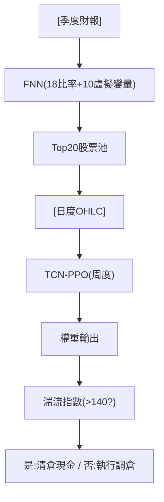

<!-- ontology-5axis data=量价表格 horizon=中长周期 paradigm=强化学习 alpha=组合执行优化 autonomy=人机协同可解释 -->

# FNN+DRL组合框架 解構

> **發布**：2026-01-23 · （無 venue）
> **QuantML 導讀**：[基于“基本面筛选+DRL动态调仓”的端到端量化交易系统](https://mp.weixin.qq.com/s?__biz=Mzg2MzAwNzM0NQ==&mid=2247493072&idx=1&sn=74a101095cbabbee30cc57b739db21ba&chksm=ce7d82cef90a0bd88ae17960eda986156f600a5479a76f0006b62486c045178ca14bfb3a406c#rd)
> **核心定位**：落點於「量价表格 × 中长周期 × 强化学习 × 组合执行优化 × 人机协同可解释」。解了傳統DRL直接在全樣本上優化權重時遭遇的維度災難與價格噪聲過擬合，以及傳統MV模型對參數估計過度敏感的Prior Gap。

**五軸座標**

| 數據模態 | 時間尺度 | 學習範式 | Alpha機制 | 人機協作 |
|:-:|:-:|:-:|:-:|:-:|
| `量价表格` | `中长周期` | `强化学习` | `组合执行优化` | `人机协同可解释` |

**Status:** v0.5 — 基於 QuantML 導讀 + 原論文（如有）。benchmark 細節待升 v1。
**TL;DR:** ① 兩階段架構：FNN季度初選過濾噪聲，TCN-PPO周度優化權重。② 核心 trick：獎勵錨定等權基準的相對超額收益，並引入湍流指數觸發極端行情清倉。③ 對「组合执行优化」軸的關鍵價值在於將Alpha生成（基本面）與執行優化（價格動能）解耦，降低策略空間維度。④ 完整系統 APV 5.354 / SR 1.53，遠超 S&P 100 的 0.765。

**X-Ray.** 本框架本質是「降維篩選 + 策略梯度」的工程折衷。傳統DRL在N維資產空間中直接輸出權重，梯度極易被無效資產的價格噪聲淹沒；FNN將動作空間壓縮至20只，實質是將組合優化問題從連續高維降為低維稀疏控制，這解釋了為何單純DRL優化全樣本僅獲 APV 1.883。獎勵函數引入相對EW基準，是用基準錨定（Anchor）穩定策略梯度，避免智能體在低波動環境中過度探索。失效邊界明確：依賴季度財報頻率導致結構性延遲，湍流指數閾值140為硬編碼規則，缺乏軟切換適應性。對量化讀者的意義在於驗證了「資產質量主導執行效率」的Pareto前沿，適合作為中頻組合的衛星Alpha模塊，而非全市場替代方案。

## §1 · 架構 / Core Mechanism
**1.1 三大改動 vs 前作**
| 維度 | 前作/基線架構 | 本框架改動 | 工程意圖 |
|---|---|---|---|
| 決策流程 | 單階段DRL直接優化全樣本權重 | 兩階段解耦：FNN季度篩選 → TCN-PPO周度調倉 | 壓縮動作空間，隔離基本面與價格噪聲 |
| 獎勵設計 | 絕對對數收益率 $r_t$ | 相對等權超額收益 $r_t + \gamma (r_t - r_t^{EW})$ | 錨定市場平均，穩定策略梯度更新幅度 |
| 風控機制 | 無硬編碼極端行情處理 | 湍流指數 > 140 觸發次日全倉現金 | 規避系統性崩盤，降低尾部回撤 |

**1.2 ⚡ Eureka 一句話 trick**
「基本面定池，價格定權；用相對基準錨定獎勵，用硬閾值切斷尾部。」

**1.3 信息流 ASCII 圖**

## §2 · 數學層
📌 **Napkin Formula**
$$R_t = r_t + \gamma (r_t - r_t^{EW})$$
複雜度：TCN前向傳播 $O(T \cdot C \cdot K)$，PPO策略更新標準O(N)。

**直覺**：$\gamma$ 項將智能體的優化目標從「絕對漲幅」轉為「跑贏無腦等權」。這迫使策略在市場普跌時收斂至保守倉位，在自身表現優於EW時放大倉位，實質是將風險厭惡內生化至獎勵函數中。

**Loss/訓練細節**：FNN使用Adam優化器，Grid Search選出兩層隱藏層（30/15節點）與Sigmoid激活。DRL採用PPO Clip限制更新步長，對比SAC/DDPG後選定PPO-CTCN為穩定解。訓練採用滾動窗口：FNN為32季訓練/4季驗證/1季測試；DRL為3年固定訓練/1季測試/1季模擬。

## §3 · 數據層
- **市場/時段**：S&P 100成分股，數據區間2009年Q1至2021年Q4，實證測試期2018年Q1至2021年Q4。
- **頻率/來源**：季度財務比率（Macrotrends），日度價格（Yahoo Finance）。
- **樣本與假設**：禁止融資融券與賣空，現金作為資產項。交易成本設定為0.2%佣金。滾動窗口設計避免前瞻性偏差，但未披露成分股退市與權重再平衡的滑點處理。

## §4 · 代碼層
| 欄位 | 狀態 |
|---|---|
| Repo | TBD |
| Checkpoint | TBD |
| License | TBD |
| 複現難度 | Medium（需對齊季度財報發布日與DRL環境狀態張量） |
| 數據可得性 | 公開（Macrotrends + Yahoo Finance），但需手動清洗缺失值與行業虛擬變量 |

## §5 · 評測 / Benchmark
| 數據集/市場 | Metric | 前SOTA/基線 | 本方法 | Δ |
|---|---|---|---|---|
| S&P 100 | SR | 0.765 | 1.53 | +0.765 |
| Group 1 (EW, 鎖定) | APV | 2.452 | 2.810 (含季調) | +0.358 |
| Group 1 (EW, 鎖定) | SR | 1.045 | 1.206 (含季調) | +0.161 |
| Group 2 (Rank 21-40, DRL) | APV | 未披露 | 1.644 | 未披露 |
| 全樣本 (DRL only) | APV | 未披露 | 1.883 | 未披露 |
| SAC-CTCN | CR | 未披露 | 1.988 | 未披露 |
| 湍流指數關閉 | MDD | 49.8% | 35.6% (開啟後) | -14.2% |
| 獎勵函數 γ=0 | APV | (γ=0基準) | (γ=1) | +59.6% |
| 信息延遲至季中 | APV | (準時基準) | (延遲) | -51.3% |

**解讀**：
- **真能力**：完整系統 SR 1.53 對比 S&P 100 的 0.765，以及 Group 1 含季調 APV 2.810 對比鎖定 APV 2.452，證明「基本面動態篩選 + 周度優化」的協同效應真實存在。周度調倉在捕捉趨勢與控制交易成本間取得平衡，每日調倉因成本與噪聲失效。
- **潛在偏差/未計成本**：+59.6% 的 APV 提升主要來自獎勵函數形狀改變（Reward Shaping），屬訓練穩定性增益而非純Alpha。0.2% 的交易成本假設對中盤股偏樂觀，若實際滑點與買賣價差上升，周度頻率的淨值優勢將被侵蝕。-51.3% 的延遲測試暴露模型對財報發布窗口期的強依賴，屬結構性風險而非過擬合。

## §6 · 失效與隱含假設
**6.1 論文自述 limitations**
- 依賴季度財務數據，無法捕捉季內突發宏觀事件或盈利修正。
- 靜態20只股票池限制分散化能力，未探討動態池大小優化。
- 0.2% 佣金設定未涵蓋市場衝擊成本與融資成本。

**6.2 推斷的隱含假設**
- **Regime依賴**：假設基本面質量因子在1-3年維度與價格動能正相關；在價值/成長風格極端切換期，FNN篩選可能滯後。
- **容量/成本**：S&P 100 流動性假設成立，但擴展至中微盤將面臨0.2%成本失效。
- **數據泄漏**：滾動窗口設計合理，但財報發布日與股價反應的錯配（信息發布延遲測試已證實）是內生缺陷。
- **Survivorship**：未說明成分股調出/退市時的權重處理，實盤中需額外處理流動性枯竭風險。

## §7 · 對比 & 面試 Tip
| 同軸對手 | 關鍵差異軸 | Open? | Status |
|---|---|---|---|
| 傳統 MV / Black-Litterman | 參數估計敏感性 vs 數據驅動非線性 | Open | 基線對照 |
| 純 DRL (EIIE-CNN) | 全樣本高維噪聲 vs 兩階段降維 | Open | 被超越 |
| 因子擇時 (Factor Timing) | 線性加權 vs 策略梯度連續控制 | Open | 互補 |

🎤 **Interview Tip**
- **正確答**：「解耦篩選與優化降低了DRL的動作空間維度，相對獎勵錨定穩定了策略梯度，但硬編碼湍流閾值與季度數據延遲是實盤落地的主要摩擦點。」
- **錯答**：「DRL可以完全替代基本面分析，只要訓練足夠長就能學到所有因子。」（違反導讀結論：選股貢獻權重約13倍於單純優化）

**7.1 可證偽預測帶日期**
若實盤交易成本超過導讀設定的0.2%或基本面數據發布延遲超過1季，該框架的周度調倉淨值優勢將衰減至低於 S&P 100 的 0.765。驗證窗口：2026-Q2。

## §8 · For the Reader
- **因子研究員**：驗證FNN選出的18個財務比率與傳統多因子模型（如質量/價值）的重疊度，可將FNN輸出轉化為離散因子打分，接入現有因子組合框架。
- **組合配置/PM**：20只股票池的集中度較高，建議作為衛星策略（Satellite Sleeve）與核心Beta倉位搭配，利用其 SR 1.53 的風險調整收益對沖組合尾部風險。
- **RL 策略工程師**：湍流指數 > 140 是硬規則，實盤中易產生閾值震盪。可嘗試用 Hierarchical RL 或 Gating Network 學習軟切換機制，將風控內生於策略網絡。

## References
- 原論文/框架：FNN+DRL组合框架（基于“基本面筛选+DRL动态调仓”的端到端量化交易系统）
- QuantML 導讀鏈接：[基于“基本面筛选+DRL动态调仓”的端到端量化交易系统](https://mp.weixin.qq.com/s?__biz=Mzg2MzAwNzM0NQ==&mid=2247493072&idx=1&sn=74a101095cbabbee30cc57b739db21ba&chksm=ce7d82cef90a0bd88ae17960eda986156f600a5479a76f0006b62486c045178ca14bfb3a406c#rd)
- Lineage：EIIE (Jiang et al., 2017) → TCN (Bai et al., 2018) → PPO (Schulman et al., 2017)