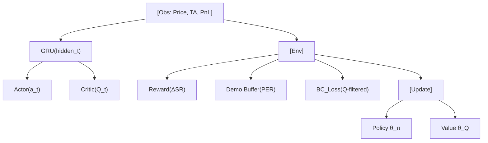

<!-- ontology-5axis data=量价表格 horizon=高频日内 paradigm=强化学习 alpha=端到端表征 autonomy=Agent自主演进 -->

# iRDPG 解構

> **發布**：2025-06-23 · （無 venue）
> **QuantML 導讀**：[自适应量化交易：一种模仿深度强化学习方法](https://mp.weixin.qq.com/s?__biz=Mzg2MzAwNzM0NQ==&mid=2247490817&idx=1&sn=9fc46d08b2b3e2a45a4ae7980a3be2aa&chksm=ce7e7a1ff909f30993b56163a0be219dac2bdef34bcf5ea24df0ac33db4bcc4895ad4d0e2716#rd)
> **核心定位**：將交易重構為 POMDP，以 RDPG 為引擎、模仿學習為導航，破解高摩擦環境下 RL 的探索-利用困境。落點於 Agent 自主演進軸，補齊了傳統 TA 泛化差與純 RL 實盤損耗高的 prior gap。

**五軸座標**

| 數據模態 | 時間尺度 | 學習範式 | Alpha機制 | 人機協作 |
|:-:|:-:|:-:|:-:|:-:|
| `量价表格` | `高频日内` | `强化学习` | `端到端表征` | `Agent自主演进` |

**Status:** v0.5 — 基於 QuantML 導讀 + 原論文（如有）。benchmark 細節待升 v1。
**TL;DR:** ① 將序貫交易建模為 POMDP，結合 RDPG 與雙軌模仿學習（示範回放+行為克隆）。② 核心 trick 為 Q-Filter 控制 BC Loss 激活條件，避免盲目模仿理想化目標。③ 對 Agent 自主演進軸★：把 RL 從「無頭蒼蠅式隨機探索」轉為「站在經典策略肩膀上的定向進化」。④ 導讀未給量化結果。

**X-Ray.** 本質是將人類先驗（Dual Thrust 線路與盤中極值）安全注入 RL 的架構範式。它解了兩個工程坑：一是實盤摩擦下純 RL 探索成本過高，二是傳統指標跨品種失效。但它的 envelope 打不開高頻微結構與容量瓶頸：分鐘級簡化行動空間（僅多空切換，無倉位管理）、GRU 序列依賴帶來推理延遲、且 BC 依賴「事後諸葛」極值信號，若未嚴格切分訓練/測試窗口，極易引入前瞻偏差。對量化讀者的意義不在於直接部署，而在於提供了一套「先驗注入+價值過濾」的標準接口，可複用於任何高摩擦序貫決策場景。

## §1 · 架構 / Core Mechanism
**1.1 三大改動 vs 前作**
| 維度 | 前作（DDPG / 純 RDPG） | iRDPG | 工程意義 |
|---|---|---|---|
| 環境建模 | MDP（全觀測假設） | POMDP（價格+指標+賬戶PnL） | 承認市場部分可觀測性，降低狀態誤判 |
| 探索機制 | 隨機噪聲/ε-greedy | 示範緩衝區（PER）+ 混合採樣 | 用歷史高質樣本錨定初始策略分佈 |
| 優化導航 | 純 Reward 驅動 | Q-Filter 行為克隆（BC） | 僅在 Critic 確認專家更優時激活 BC Loss |

**1.2 ⚡ Eureka 一句話 trick**
Q-Filter 將行為克隆從「強制模仿」降級為「條件引導」，只有當 Critic 估算的專家動作價值高於當前動作時，才計算 BC Loss，防止代理被不切實際的「完美交易」帶偏。

**1.3 信息流 ASCII**

## §2 · 數學層
📌 **Napkin Formula**
$$O_t = (P_t, TA_t, \Delta PnL_t), \quad a_t \in \{-1, +1\}, \quad R_t = \Delta SR_t$$
$$\mathcal{L}_{BC} = \|a_t - a_t^{\text{expert}}\|^2 \cdot \mathbb{I}\big(Q(s_t, a_t^{\text{expert}}) > Q(s_t, a_t)\big)$$
**直覺**：微分夏普比率將單步收益與長期風險調整目標對齊；Q-Filter 確保 BC 僅在當前價值評估支持時才介入，維持 RL 的主導權。
**訓練細節**：Actor-Critic 交替更新，GRU 維護時間依賴，PER 按 TD-error 優先採樣示範與自探索混合批次。

## §3 · 數據層
- **規模/頻率/市場**：中國股指期貨（IF、IC）分鐘級數據。
- **來源與設定**：回測環境計入手續費與滑點；訓練集僅 IF，測試集覆蓋 IF 與 IC。
- **樣本外與容量假設**：樣本量未披露；行動空間簡化為連續概率輸出後取 argmax 為多空，無倉位規模優化，隱含容量充足假設。

## §4 · 代碼層
| 欄位 | 內容 |
|---|---|
| Repo | TBD |
| Checkpoint | TBD |
| License | TBD |
| 複現難度 | 中（GRU+AC+PER+BC+Q-Filter 邏輯鏈完整，需自行實現 ΔSR 與 Q-Filter 掩碼） |
| 數據可得性 | IF/IC 分鐘線（券商/數據商），需自行構建 Dual Thrust 示範軌跡 |

## §5 · 評測 / Benchmark
| 數據集/市場 | Metric | 前SOTA | 本方法 | Δ |
|---|---|---|---|---|
| IF / IC | Tr | 未披露 | 未披露 | 未披露 |
| IF / IC | Sr | 未披露 | 未披露 | 未披露 |
| IF / IC | Vol | 未披露 | 未披露 | 未披露 |
| IF / IC | Mdd | 未披露 | 未披露 | 未披露 |

**解讀**：導讀僅提供定性對比（iRDPG 全面優於 Long/Short & Hold、DDPG 與 Dual Thrust；純 RDPG 難以盈利；IF 訓練→IC 測試仍正收益）。Δ 的真實 capability 在於**跨市場泛化與風險控制**（Vol/Mdd 改善），而非絕對收益爆發。潛在過擬合/偏差：BC 使用「一天內最低/最高價」作為專家信號，若回測未嚴格隔離盤中信息，可能混入前瞻偏差；成本未量化披露，實盤滑點可能吞噬分鐘級頻繁切換的利潤。

## §6 · 失效與隱含假設
**6.1 論文自述 limitations**
- 行動空間簡化，未處理持倉規模與市場容量。
- 依賴回測環境的手續費/滑點設定，未提供實盤延遲與流動性衝擊模型。
- 示範數據來源單一（僅 Dual Thrust），可能限制策略多樣性。

**6.2 推斷的隱含假設**
- **Regime 依賴**：IF/IC 流動性與微結構相似，換至商品期貨或現貨可能失效。
- **容量/成本**：分鐘級頻繁切換在實盤面臨滑點與衝擊成本，未披露 breakeven 閾值。
- **數據泄漏**：BC 的「事後諸葛」極值信號若未嚴格按時間戳切分，訓練集會吸收未來信息。
- **Survivorship**：僅覆蓋主力合約，未處理換月跳空與流動性枯竭。

## §7 · 對比 & 面試 Tip
| 同軸對手 | 關鍵差異軸 | Open? | Status |
|---|---|---|---|
| DDPG / TD3 | 無記憶結構 / 無先驗注入 | 開源 | 成熟基線 |
| SAC / PPO | 隨機策略 / 熵正則探索 | 開源 | 主流 RL |
| Dual Thrust | 靜態技術指標 / 無序貫優化 | 閉源/自研 | 傳統 TA |

🎤 **Interview Tip**
- ✅ 正確答：「Q-Filter 是價值感知的門控機制，確保 BC 僅在 Critic 確認專家動作更優時才計算梯度，防止模仿學習覆蓋 RL 的長期價值估計。」
- ❌ 錯答：「行為克隆會強制代理完全複製專家交易，從而快速學會盈利。」

**7.1 可證偽預測**：至 `2025-12-31`，若將 iRDPG 直接部署於 tick 級數據且推理延遲 >50ms，GRU 序列依賴將導致信號滯後，實盤 Sharpe 較回測衰減 >30%，且需改用向量化 Transformer 或狀態壓縮模塊才能維持穩定性。

## §8 · For the Reader
- **因子研究員**：將 Q-Filter 機制移植至 Alpha 信號注入流程，用 Critic 價值評估過濾低信噪比因子，避免獎勵黑客（Reward Hacking）。
- **高頻執行**：分鐘級簡化行動空間無法直接用於 HFT，但 PER+Demo Buffer 的混合採樣策略可用於訂單簿不平衡預測的冷啟動。
- **組合配置**：將 iRDPG 視為 regime-adaptive 超額收益層；監控 BC Loss 與主 Reward 的 divergence，作為策略失效的早期預警指標。
- **RL 策略/研究學生**：本架構提供了一套「先驗示範+價值過濾」的標準模板，可複用於任何高摩擦序貫決策；重點復現 Q-Filter 掩碼邏輯與 ΔSR 的遞歸計算。

## References
- QuantML 導讀：[自适应量化交易：一种模仿深度强化学习方法](https://mp.weixin.qq.com/s?__biz=Mzg2MzAwNzM0NQ==&mid=2247490817&idx=1&sn=9fc46d08b2b3e2a45a4ae7980a3be2aa&chksm=ce7e7a1ff909f30993b56163a0be219dac2bdef34bcf5ea24df0ac33db4bcc4895ad4d0e2716#rd)
- Lineage: DDPG (Lillicrap et al., 2015) → RDPG (Haarnoja et al. / 變體) → Prioritized Experience Replay (Schaul et al., 2015) → Behavior Cloning (Pomerleau, 1991)
- Framework: iRDPG (2025)