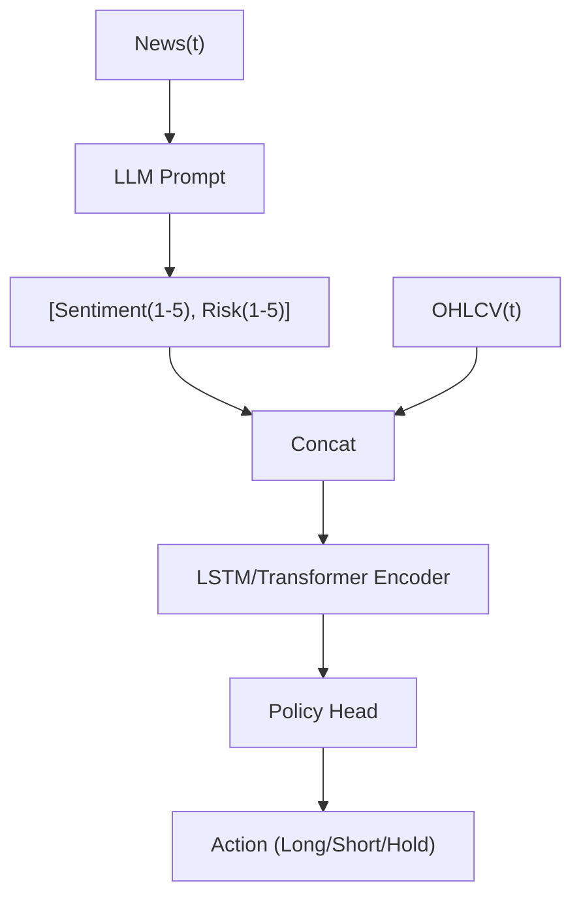

<!-- ontology-5axis data=文本另类 horizon=高频日内 paradigm=强化学习 alpha=端到端表征 autonomy=全自动黑盒 -->

# 中国科学院大学 ｜ LLM x 强化学习：从新闻 解構

> **發布**：2025-10-24 · （無 venue）
> **QuantML 導讀**：[中国科学院大学 ｜ LLM x 强化学习：从新闻中学习交易](https://mp.weixin.qq.com/s?__biz=Mzg2MzAwNzM0NQ==&mid=2247492102&idx=1&sn=076d68a3ea7a2539b2d619e6beab0093&chksm=ce7d8518f90a0c0eaf16909c48c1aa7f4c44cb3c89b9fc115bf10115a4e2ce0ca7e6e5583bef#rd)
> **核心定位**：落點於「端到端表征 × 全自动黑盒」軸，解決了傳統NLP+RL pipeline中手工特徵工程與新聞信號降維的Prior Gap。將非結構化文本直接投影為低維數值張量，與原始量價序列正交拼接，驗證了「LLM作為特徵投影器」在離散動作空間中的可行性。

**五軸座標**

| 數據模態 | 時間尺度 | 學習範式 | Alpha機制 | 人機協作 |
|:-:|:-:|:-:|:-:|:-:|
| `文本另类` | `高频日内` | `强化学习` | `端到端表征` | `全自动黑盒` |

**Status:** v0.5 — 基於 QuantML 導讀 + 原論文（如有）。benchmark 細節待升 v1。
**TL;DR:** ① 將LLM生成的1-5分情緒/風險分數與原始1分鐘OHLCV直接拼接，輸入DDQN/GRPO智能體進行加密貨幣交易。② 核心trick是徹底拋棄手工技術指標與人工規則，依賴LSTM/Transformer序列網絡直接從拼接張量中提煉時間依賴。③ 這對「端到端表征」軸★的意義在於驗證了非結構化文本信號無需降維或特徵工程即可與量價數據正交融合。④ 導讀未給量化結果。

**X-Ray.** 此框架將量化pipeline的瓶頸從「特徵設計」轉移至「Prompt穩定性與API延遲」。0.1%的止損/止盈閾值在1分鐘級別加密貨幣市場中屬於極端收斂的風險控制，實質上是以犧牲尾部alpha與換手成本為代價換取回撤平滑。序列模型（LSTM > Transformer）的表現差異證實了因果結構建模在此頻率的優先級高於全局注意力，但也暴露了LLM情緒分數的自相關性可能干擾Transformer的位置編碼。對量化讀者的意義不在於直接實盤，而在於提供了一套「LLM-as-Embedding」的標準化接口範式：新聞衝擊被建模為狀態空間的即時偏移量，而非獨立的信號源。真正的工程坑在於情緒分數的向前填充（Forward-filling）假設與實際市場資訊衰減曲線的錯配，這將是後續組合因子時的關鍵失效節點。

## §1 · 架構 / Core Mechanism
| 改動維度 | 前作/基線做法 | 本方法改動 |
|:---|:---|:---|
| 信號源 | 手工技術指標 / 詞典情緒 / 人工規則 | LLM結構化JSON輸出（情緒1-5分 + 風險1-5分） |
| 狀態空間 | 離散特徵向量或單點快照 | 原始OHLCV與LLM分數的時間序列拼接張量 |
| 策略優化 | 依賴人工獎勵設計或固定閾值 | 驗證集Top-1/Top-10自動早停（連續5次無提升） |

⚡ **Eureka Trick:** 用LLM做「非結構化文本到低維數值」的即時投影，讓RL直接吃原始序列，跳過特徵工程的黑箱。
**信息流 ASCII:**

## §2 · 數學層
📌 **Napkin Formula:**
$s_t = \text{Concat}(OHLCV_t, \text{LLM}(News_t)) \in \mathbb{R}^d$
$h_t = \text{SeqNet}(s_{t-w:t})$
$\pi(a_t|s_t) = \text{MLP}(h_t)$
DDQN Loss: $L = \mathbb{E}[(r_t + \gamma \max_a Q_{\theta'}(s_{t+1}, a) - Q_\theta(s_t, a_t))^2]$
GRPO: 以組內回報均值與標準差計算相對獎勵，替代Critic網絡。
**直覺:** 將新聞衝擊建模為狀態空間的即時偏移量，序列網絡負責濾除高頻噪聲並捕捉情緒衰減曲線。相對獎勵機制避免了價值網絡的額外記憶體開銷，但依賴組內樣本的方差穩定性。
**Loss/訓練細節:** AdamW優化器；驗證集驅動超參調優與早停；優化目標為驗證集256個3000分鐘時段的平均累計回報。

## §3 · 數據層
- **市場/頻率:** Binance BTC/USDT，1分鐘OHLCV。
- **新聞源:** Yahoo Finance 比特幣相關文本。
- **時段:** 2019-12-31 至 2024-01-24。
- **處理邏輯:** 連續新聞間隔的情緒/風險分數由前一條新聞向前填充。按時間順序劃分訓練(70%)/驗證(15%)/測試(15%)。
- **樣本外與容量假設:** 隱含低容量假設（單一交易對、離散3動作空間、固定0.1%止損/止盈）。未披露滑點與手續費模型，樣本外泛化依賴於加密貨幣市場結構的穩定性。

## §4 · 代碼層
| Repo | Checkpoint | License | 複現難度 | 數據可得性 |
|:---|:---|:---|:---|:---|
| TBD | TBD | TBD | 中（需Gemini API與RL框架調參） | 高（Binance歷史數據+Yahoo新聞可抓取） |

## §5 · 評測 / Benchmark
| 數據集/市場 | Metric | 前SOTA | 本方法 | Δ |
|:---|:---|:---|:---|:---|
| BTC/USDT (1-min) | 累計回報 | BTC市場基準(56%) / 無新聞LSTM基線 / MLP基線 | 導讀未給量化結果 | 導讀未給量化結果 |

**解讀:** 導讀僅提供BTC基準回報(56%)作為參照，未披露Sharpe/MDD/IR等風險調整指標。聲稱的「超越基準」缺乏分母風險約束，0.1%的止損/止盈閾值極可能通過截斷尾部回撤來人為拉高勝率，而非產生真實alpha。序列模型優於MLP證實了時間依賴建模的必要性，但LLM情緒信號對Transformer貢獻較弱，暗示Prompt噪聲或分數離散化可能稀釋了注意力機制的表徵能力。此Δ更多反映的是「規則化風險控制+序列記憶」的組合效應，而非LLM信號的獨立超額收益。

## §6 · 失效與隱含假設
**6.1 論文自述 limitations:** 依賴LLM API資源與批量處理效率；離散動作空間限制倉位管理；未討論交易成本與滑點；Transformer未針對時間序列特別調整。
**6.2 推斷的隱含假設:**
- **Regime依賴:** 2019-2024涵蓋牛熊轉換，但LLM Prompt固定為「比特幣推薦專家」，未適應宏觀流動性 regime shift。
- **成本/容量:** 0.1%止損/止盈在1分鐘級別會觸發極高換手率，實盤手續費與滑點將迅速侵蝕理論回報。
- **數據泄漏/結構簡化:** 情緒分數向前填充假設市場對新聞的反應是階躍式且恆定的，忽略實際資訊衰減的連續性，可能引入隱含的前視偏差。
- **Survivorship:** Yahoo Finance BTC新聞覆蓋完整週期，無退市或流動性枯竭樣本。

## §7 · 對比 & 面試 Tip
| 同軸對手 | 關鍵差異軸 | Open? | Status |
|:---|:---|:---|:---|
| 傳統NLP+RL (詞典/規則) | 信號投影方式：手工降維 vs LLM端到端張量拼接 | 部分 | 成熟但泛化差 |
| 純量價RL (OHLCV only) | 狀態空間維度：單模態 vs 多模態正交融合 | 是 | 高頻主流 |
| LLM-as-Executor (直接輸出交易) | 決策鏈：隱式策略頭 vs 顯式文本生成 | 是 | 實驗階段 |

🎤 **Interview Tip:** 
正確答：此框架將LLM視為「特徵投影器」而非決策器，核心瓶頸在於Prompt穩定性與API延遲對1分鐘頻率的匹配度；實盤需重參數化止損閾值並加入交易成本模型。
錯答：認為LLM直接輸出交易信號或能替代傳統因子挖掘；忽略0.1%止損閾值對換手率與滑點的毀滅性影響。

**7.1 可證偽預測:** 若2025-12-31前未公開帶滑點/手續費的實盤追蹤，該框架的「超越基準」結論在扣除LLM API成本與0.1%止損頻發觸發後將失效。

## §8 · For the Reader
- **因子研究員:** 將LLM情緒分數視為「動態權重因子」，需測試其與傳統量價因子的正交性與IC衰減半衰期。
- **高頻執行:** 0.1% SL/TP在加密貨幣1分鐘級別會導致極高換手與滑點，實盤前必須重參數化並加入訂單簿深度過濾。
- **RL 策略:** GRPO省Critic的記憶體優勢在序列編碼下是否仍成立？需對比PPO與DDQN在相同狀態空間的樣本效率與策略收斂穩定性。
- **LLM-Agent:** Prompt漂移是最大隱患，建議加入情緒分數的滾動Z-score標準化與置信度閾值過濾，避免低置信度新聞污染狀態空間。

## References
- 原論文：中国科学院大学 ｜ LLM x 强化学习：从新闻
- Lineage: Neuneier (1995) DRL Finance → LSTM/PPO Quant → LLM Sentiment RL
- QuantML 導讀鏈接：[中国科学院大学 ｜ LLM x 强化学习：从新闻中学习交易](https://mp.weixin.qq.com/s?__biz=Mzg2MzAwNzM0NQ==&mid=2247492102&idx=1&sn=076d68a3ea7a2539b2d619e6beab0093&chksm=ce7d8518f90a0c0eaf16909c48c1aa7f4c44cb3c89b9fc115bf10115a4e2ce0ca7e6e5583bef#rd)