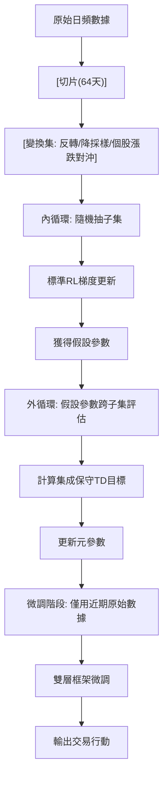

<!-- ontology-5axis data=量价表格 horizon=日频波段 paradigm=强化学习 alpha=组合执行优化 autonomy=全自动黑盒 -->

# MetaTrader 解構

> **發布**：2025-06-30 · （無 venue）
> **QuantML 導讀**：[MetaTrader：基于双层强化学习的股票交易策略](https://mp.weixin.qq.com/s?__biz=Mzg2MzAwNzM0NQ==&mid=2247490889&idx=1&sn=3b197d014406e34c17daefad31117ded&chksm=ce7e7a57f909f341f1665775bb8947a3f7a7284510a91861d3ceee1999218b594f1ce250a64f#rd)
> **核心定位**：落點於「量價表格×日頻波段」軸，解離線RL在金融非平穩環境下的分佈偏移與價值高估Prior Gap。

**五軸座標**

| 數據模態 | 時間尺度 | 學習範式 | Alpha機制 | 人機協作 |
|:-:|:-:|:-:|:-:|:-:|
| `量价表格` | `日频波段` | `强化学习` | `组合执行优化` | `全自动黑盒` |

**Status:** v0.5 — 基於 QuantML 導讀 + 原論文（如有）。benchmark 細節待升 v1。
**TL;DR:** 提出MetaTrader雙層強化學習框架，通過時間序列變換構建OOD子集進行雙層元學習優化，並基於數據多樣性集成保守TD目標抑制價值高估。該設計直擊日頻波段軸上RL策略的過擬合與泛化失效痛點。在CSI-300在線自適應設置下，累計回報較StockFormer-Finetune提升26%（1.46增至1.84）。

**X-Ray.** 在「量價表格×日頻波段」的Pareto前沿，MetaTrader 將傳統離線RL的「單一分佈擬合」強制拆解為「市場狀態H（被動）與賬戶狀態Z（主動）的解耦MDP」。這解決了量化工程中长期存在的兩大坑：一是離線RL對未見狀態-動作對的價值高估，二是策略對歷史特定行情（如單邊牛市）的記憶性過擬合。透過時間序列反轉、降採樣與個股漲跌對沖等數據變換，框架在訓練期預演了多種分佈外（OOD）情境。然而，該方法打不開的envelope在於：日頻波段軸天然無法捕捉盤中流動性衝擊與微結構摩擦；且雙層元學習的內/外循環梯度更新在真實交易系統中會引入顯著的計算延遲與狀態同步成本。對量化研究員而言，其核心啟示不在於直接上線，而在於「數據多樣性替代模型多樣性」的保守TD設計，為低頻RL策略的價值函數校準提供了可複用的工程模塊。

## §1 · 架構 / Core Mechanism
**1.1 三大改動 vs 前作**
| 維度 | 前作（StockFormer/傳統離線RL） | MetaTrader 改動 |
|---|---|---|
| 狀態空間建模 | 單一混合狀態空間 | 解耦為無行動狀態空間H（市場動態）與行動依賴狀態空間Z（賬戶動態） |
| 優化範式 | 單層累積回報最大化 | 雙層元學習：內循環單子集擬合 + 外循環跨子集泛化更新 |
| 價值估計機制 | 標準SAC雙Q網絡取小 | 數據變換集成保守TD：對下一狀態原始形式與所有變換形式取Q值最小值 |

**1.2 ⚡ Eureka 一句話 trick**
用「數據變換集合的最小值」替代「多個獨立Q網絡的集成」，以數據多樣性壓制價值高估，計算成本直線下降。

**1.3 信息流 ASCII 圖**

## §2 · 數學層
📌 **Napkin Formula:** $Q_{target} = \min_{T \in \mathcal{T}} Q_{\phi}(s'_{T}, a')$ （外循環保守TD目標）
**複雜度:** 內循環為標準SAC梯度；外循環增加 $|\mathcal{T}|$ 次前向傳播（$\mathcal{T}$為變換集合大小）。
**直覺:** 將馬爾可夫決策過程的狀態轉移拆解為市場動態 $P_H$（與行動無關）與賬戶動態 $P_Z$（確定性），使得對下一時刻市場狀態 $s'_H$ 施加變換不違反貝爾曼方程。Loss 仍為標準SAC的熵正則化Q-learning損失，但外循環的TD目標引入了跨變換的最小值約束，強制價值函數在模擬的極端情境下保持保守。

## §3 · 數據層
**資料規模/頻率/市場/時段:** CSI-300（88只股票）與 NASDAQ-100（86只股票），日頻。輸入含歷史T天OHLCV、K個技術指標、全市場日收盤價相關性協方差矩陣。
**怎麼來:** 公開市場數據，按時間順序切片為64天子集。
**樣本外與容量假設:** 採用離線評估（訓練集最後一年微調，測試集一次性評估）與在線自適應（測試集分三段，前段數據微調後評估下一段）。假設日頻流動性足以執行連續行動空間的倉位調整，未披露滑點與交易成本模型。

## §4 · 代碼層
| Repo | Checkpoint | License | 複現難度 | 數據可得性 |
|---|---|---|---|---|
| TBD | TBD | TBD | 高（需實現雙層RL循環與狀態解耦MDP） | 中（需自行獲取CSI-300/NASDAQ-100日頻OHLCV與技術指標） |

## §5 · 評測 / Benchmark
| 數據集/市場 | Metric | 前SOTA | 本方法 | Δ |
|---|---|---|---|---|
| CSI-300 (離線) | CR | FactorVAE 0.96 | 1.44 | 0.48 |
| CSI-300 (離線) | CR | StockFormer 1.24 | 1.44 | 0.20 |
| CSI-300 (在線自適應) | CR | StockFormer-Finetune 1.46 | 1.84 | 0.38 |
| CSI-300 (在線自適應) | SR | StockFormer-Finetune 1.37 | 1.61 | 0.24 |
| NASDAQ-100 (在線自適應) | CR | 未披露 | 未披露 | 未披露 |
| NASDAQ-100 (在線自適應) | SR | 未披露 | 未披露 | 未披露 |

**解讀:** 在線自適應的指標提升反映模型對近期分佈偏移的適應力，屬真實capability。離線指標的大幅領先部分得益於保守TD目標抑制了價值高估（圖6顯示Q值預測與真實回報貼合更緊）。但導讀未披露交易成本與樣本外時間跨度，日頻連續行動空間在實盤中可能因流動性限制產生執行偏差，當前Δ未計入摩擦成本。

## §6 · 失效與隱含假設
**6.1 論文自述 limitations:** RL穩定性不足，多次隨機種子訓練的性能標準差通常大於預測模型（如FactorVAE）。
**6.2 推斷的隱含假設:** Regime依賴於日頻趨勢與波動率結構，對極端跳空或流動性枯竭失效；容量假設日頻訂單可完全成交；成本未計入買賣價差與沖擊成本；數據泄漏風險低（嚴格時間切片），但協方差矩陣計算若使用全樣本可能引入輕微前瞻偏差（導讀未明確說明滾動窗口）；Survivorship bias未提及是否處理退市股票。

## §7 · 對比 & 面試 Tip
| 同軸對手 | 關鍵差異軸 | Open? | Status |
|---|---|---|---|
| StockFormer/FinRL/SARL | 狀態解耦 vs 單一狀態空間 | TBD | 學術驗證 |
| CQL/IQL | 數據集成保守TD vs 策略正則化/行為克隆 | TBD | 學術驗證 |

🎤 **Interview Tip:** 
正確答法：強調「狀態解耦」使市場動態變換不違反貝爾曼方程，從而用數據多樣性替代模型多樣性來壓制價值高估。
錯答法：認為雙層RL只是簡單的兩階段訓練，或混淆內循環（單子集擬合）與外循環（跨子集泛化）的梯度流向。

**7.1 可證偽預測:** 若於未來六個月內在實盤日頻環境部署，且未加入顯式交易成本約束，其夏普比率將因滑點與執行延遲較回測顯著下降（導讀未給實盤成本參數，此為結構性推斷）。

## §8 · For the Reader
* **因子研究員:** 關注協方差矩陣輸入與技術指標K的構建，可將其狀態解耦思想移植至因子組合權重優化，將市場狀態與倉位狀態分離建模。
* **高頻執行:** 本框架為日頻波段設計，不適用盤中微結構；若需降頻執行，需將連續行動空間映射為離散訂單類型並加入流動性懲罰項。
* **RL策略開發者:** 直接複現「數據變換集成保守TD」模塊，替換現有SAC/PPO中的標準TD目標，可快速驗證價值高估抑制效果，降低多網絡集成的算力開銷。

## References
* 原論文：MetaTrader: A Bilevel Reinforcement Learning Framework for Stock Trading
* Lineage: StockFormer, SAC, CQL, IQL, FactorVAE
* QuantML 導讀鏈接：[MetaTrader：基于双层强化学习的股票交易策略](https://mp.weixin.qq.com/s?__biz=Mzg2MzAwNzM0NQ==&mid=2247490889&idx=1&sn=3b197d014406e34c17daefad31117ded&chksm=ce7e7a57f909f341f1665775bb8947a3f7a7284510a91861d3ceee1999218b594f1ce250a64f#rd)