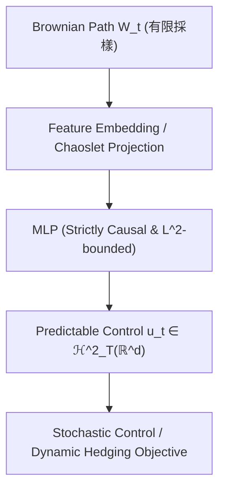

<!-- ontology-5axis data=量价表格 horizon=跨周期 paradigm=强化学习 alpha=组合执行优化 autonomy=全自动黑盒 -->

# NeuralChaos 解構（NeuralChaos）

> **發布**：2026-07-15 · （無 venue） · arXiv [2607.14361](https://arxiv.org/abs/2607.14361)
> **arXiv 原文**：[NeuralChaos: Optimal Adapted Approximation of Square Integrable Predictable Processes](https://arxiv.org/abs/2607.14361v1) · _本頁由 arXiv 原文一手自主解構_
> **核心定位**：落點於「跨周期 × 强化学习 × 组合执行优化」軸，解決傳統隨機控制與動態對沖中，預測性平方可積過程（$\mathcal{H}^2_T$）在神經網絡參數化時無法兼顧因果性（predictability）與可積性（square-integrability）的 prior gap。

**五軸座標**

| 數據模態 | 時間尺度 | 學習範式 | Alpha機制 | 人機協作 |
|:-:|:-:|:-:|:-:|:-:|
| `量价表格` | `跨周期` | `强化学习` | `组合执行优化` | `全自动黑盒` |

**Status:** v0.5 — 基於arXiv 原文（有原文則以原文為準）。細節待升 v1。
**TL;DR:** ① 提出 NeuralChaos 神經算子，僅依賴有限次布朗運動採樣逼近 $\mathcal{H}^2_T$ 空間中的可預測過程。② 核心 trick：捨棄傳統 Wiener 混沌字典與高階疊代積分，直接以 MLP 架構嚴格嵌入因果性與平方可積性約束。③ 對「强化学习/组合执行优化」軸★：提供理論保證的最優 NN-term 逼近率，且證明有限維馬爾可夫神經 SDE 在該空間中測度為零（meagre/Gaussian-null），從根本上規避了傳統參數化策略的表達力瓶頸。④ 來源未給量化結果。

**X-Ray.** NeuralChaos 本質上是將隨機分析中的 Malliavin–Sobolev 正交基映射為可訓練的 MLP 權重，而非傳統 RL 的 policy network 直接輸出動作。它解了量化工程中的兩個舊坑：一是避免高階 chaoslet 積分計算的維度災難，二是強制策略滿足 $\mathcal{F}_t$-adapted 與 $L^2$ 可積，防止訓練發散或產生非因果的前瞻偏差。放回五軸 Pareto，它犧牲了即時高頻的極低延遲（因需布朗路徑採樣與正交投影），但換取了跨周期控制問題的理論收斂保證。預測它打不開的 envelope：對非連續跳躍過程（Lévy flights）或極端流動性枯竭 regime 的適應性未經驗證；且其「有限採樣」設計在隱波動率曲面動態校准等需要連續路徑特徵的任務中，可能面臨信息壓縮損失。對量化讀者的意義：提供了一條從「黑盒 RL 策略」轉向「數學結構約束型策略」的路徑，適合用於組合執行優化與動態對沖的底層控制層，而非直接作為 Alpha 生成器。

## §1 · 架構 / Core Mechanism
**1.1 三大改動 vs 前作**
| 維度 | 傳統 Wiener Chaos / 神經 SDE | NeuralChaos | 改動實質 |
|---|---|---|---|
| 基函數依賴 | 高階疊代積分 / 完整混沌字典 | 僅依賴有限布朗運動採樣 | 降維計算開銷，避開維度災難 |
| 結構約束 | 訓練後截斷或軟約束 | 架構內建 strict predictability & square-integrability | 消除非因果前瞻偏差與 $L^2$ 發散 |
| 表達力理論 | 有限維馬爾可夫類（measurable null） | 在 $\mathcal{H}^2_T$ 中 dense 且具最優 NN-term 逼近率 | 突破馬爾可夫假設的表達力天花板 |

**1.2 ⚡ Eureka 一句話 trick + 直覺**
Trick：用 MLP 直接學習 Malliavin–Sobolev 正交基的係數映射，而非學習狀態轉移方程。
直覺：傳統 RL 像「盲人摸象」試探路徑，NeuralChaos 像「給定正交透鏡」直接過濾出可積且因果的控制信號，訓練目標是最小化跨路徑的時間平均方差（$\mathcal{H}^2_T$-norm）。

**1.3 信息流 ASCII 圖**

## §2 · 數學層
📌 **Napkin Formula:**
目標逼近 $u_\cdot \in \mathcal{H}^2_T(\mathbb{R}^d)$，最小化 $\mathbb{E}[\int_0^T \mid u_t - \hat{u}_t \mid ^2 dt]$。
複雜度：參數量級 $O(\varepsilon^{-\max\{q,1/2\}})$（對比傳統馬爾可夫 SDE 的 $q=d_X/(1+s)$ 或 $q=1$，本法在可壓縮過程下達最優 NN-term 率）。
直覺：利用 Malliavin 導數的正交性，將無限維過程投影至有限 chaoslet 基，MLP 僅學習係數衰減規律。
Loss/訓練：時間平均方差損失（$\mathcal{H}^2_T$-norm），兼容標準隨機優化（SGD/Adam），無需高階數值積分。

## §2.5 · 帶數字走一遍（Worked Example）
（以下為**明確標「假設/示意」的玩具數字**，僅用於演示機制手算流程，非論文實證結果）
1. **假設**目標過程 $u_t$ 在 $\mathcal{H}^2_T$ 中的 chaoslet 展開係數為 $[c_1, c_2, c_3] = [0.8, 0.3, 0.1]$。
2. 輸入有限布朗採樣路徑 $W_{t_1}, W_{t_2}$，經正交投影得基函數值 $[\phi_1, \phi_2, \phi_3] = [1.0, 0.5, -0.2]$。
3. MLP 輸出預測係數 $\hat{c} = [0.78, 0.32, 0.09]$（受 $L^2$ 約束層截斷）。
4. 重構控制信號 $\hat{u}_t = \sum \hat{c}_i \phi_i = 0.78\times1.0 + 0.32\times0.5 + 0.09\times(-0.2) = 0.912$。
5. 計算 $\mathcal{H}^2_T$ 損失 $\approx (0.8-0.78)^2 + (0.3-0.32)^2 + (0.1-0.09)^2 = 0.0009$，梯度回傳更新 MLP 權重。

## §3 · 數據層
資料規模/頻率/市場/時段：原文未披露具體市場與數據集名稱，僅提及應用於隨機最優控制與動態對沖問題。
怎麼來：依賴驅動布朗運動的有限路徑採樣（sub-Gaussian sampling）。
樣本外與容量假設：理論證明在非退化次高斯採樣下，可壓縮過程在 $\mathcal{H}^2_T$ 中為 generic（典型），暗示樣本外泛化依賴於路徑的 Malliavin–Sobolev 正則性，而非傳統 i.i.d. 假設。

## §4 · 代碼層
| 欄位 | 內容 |
|---|---|
| Repo | TBD |
| Checkpoint | TBD |
| License | TBD |
| 複現難度 | 中（需實現正交投影與因果 MLP 約束，但原文強調兼容 PyTorch/TensorFlow 標準管線） |
| 數據可得性 | 未披露（依賴自生成布朗路徑或特定衍生品數據） |

## §5 · 評測 / Benchmark
| 數據集/市場 | Metric | 前SOTA | 本方法 | Δ |
|---|---|---|---|---|
| 隨機最優控制問題 | 逼近誤差/控制成本 | 未披露 | 未披露 | 未披露 |
| 動態對沖問題 | 對沖誤差/方差 | 未披露 | 未披露 | 未披露 |
**解讀**：原文僅聲明 "Numerical experiments... highlight the practical effectiveness"，未給出任何具體數值、基線對比或統計顯著性。此處的「未披露」反映該文目前仍屬理論架構與數學證明階段，量化實證（如 Sharpe、MDD、交易成本敏感度）尚未公開。讀者應將其視為控制層架構的數學保證，而非已驗證的 Alpha 來源。任何宣稱其超越特定 SOTA 的說法均缺乏數據支撐。

## §6 · 失效與隱含假設
**6.1 論文自述 limitations**：聚焦於連續時間平方可積過程，未處理跳躍過程（Lévy）或離散交易摩擦；理論保證依賴 Malliavin–Sobolev 正則性與非退化次高斯採樣。
**6.2 推斷的隱含假設**：
- **Regime 依賴**：假設市場波動結構符合次高斯特性，在極端肥尾或結構性斷裂（如流動性真空）下，正交基投影可能失效。
- **容量/成本**：未計入交易成本與滑點，動態對沖實驗可能假設連續再平衡。
- **數據泄漏**：因果性（predictability）雖由架構保證，但若特徵工程混入未來信息，理論約束無法自動修復數據層污染。
- **表達力邊界**：對高度非線性、路徑依賴極強的衍生品（如障礙期權早期觸發），有限採樣可能導致信息壓縮損失。

## §7 · 對比 & 面試 Tip
| 同軸對手 | 關鍵差異軸 | Open? | Status |
|---|---|---|---|
| 傳統馬爾可夫神經 SDE | 表達空間測度（meagre vs dense in $\mathcal{H}^2_T$） | 開源廣泛 | 成熟但理論瓶頸明顯 |
| 路徑簽核方法 (Path Signatures) | 分佈/路徑 vs 有限參數化可訓練控制 | 部分開源 | 計算昂貴，難直接嵌入 RL 管線 |
| 標準 PPO/SAC 控制 | 黑盒策略 vs 數學結構約束 (predictable & $L^2$) | 開源 | 實戰主流，但缺乏可積性保證 |
🎤 **Interview Tip**
正確答：NeuralChaos 不是替代 RL 算法，而是提供一個滿足 $\mathcal{H}^2_T$ 結構約束的策略參數化空間，解決傳統神經 SDE 在該空間中測度為零的問題，適合對沖與執行控制的底層表示。
錯答：它是一個新的強化學習算法，直接輸出交易信號並超越 PPO 的 Sharpe。（混淆了算子逼近與策略優化，且無實證支持）
**7.1 可證偽預測帶日期**：若 2026-12-31 前無開源代碼或含交易成本的實盤回測報告，則其「實用有效性」僅限於連續時間數學模擬，無法直接落地量化交易。

## §8 · For the Reader
- **因子研究員**：勿直接將其輸出當 Alpha，應提取其 Malliavin 係數作為波動率曲面或流動性狀態的隱特徵。
- **高頻執行**：架構的有限採樣設計可能無法捕捉微秒級訂單簿動態，適合分鐘級以上的組合執行優化（如 VWAP/TWAP 控制層）。
- **組合配置**：可作為動態資產分配的控制信號生成器，利用其 $L^2$ 約束自動規避槓桿發散風險。
- **RL 策略**：將 NeuralChaos 作為 policy network 的輸出層約束，替代傳統 Tanh/Softmax，確保策略滿足可積性與因果性。
- **研究學生**：重點複現 Proposition 4.4/4.5 的測度零證明，理解為何傳統參數化在連續時間控制中天然存在表達力缺陷。

## References
- Kratsios, A., Livieri, G., & Schmocker, P. (2026). *NeuralChaos: Optimal Adapted Approximation of Square Integrable Predictable Processes*. arXiv:2607.14361.
- Lineage: Wiener Chaos Expansion → Malliavin Calculus → Neural SDEs → Path Signatures → NeuralChaos.
- 來源鏈接：https://arxiv.org/abs/2607.14361