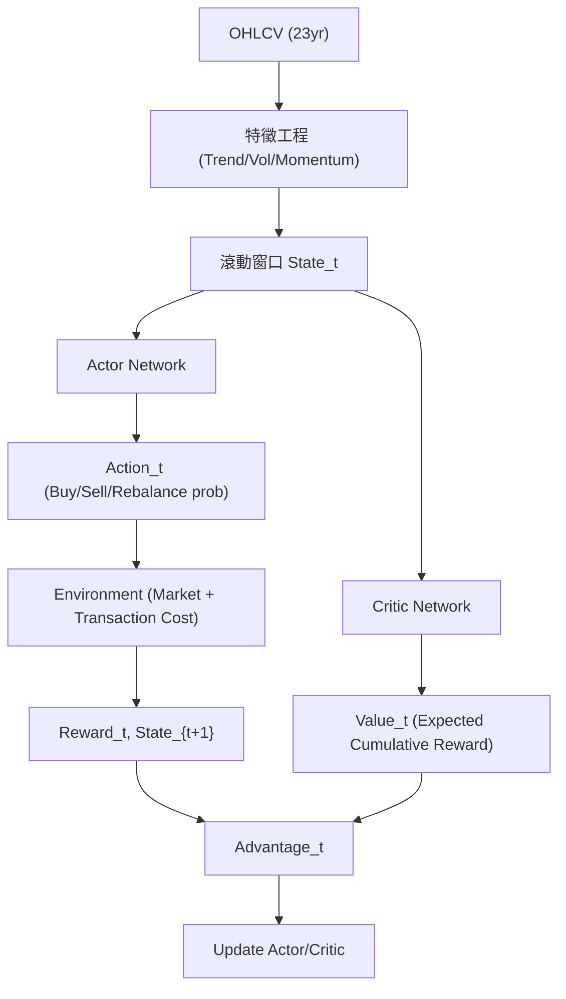

<!-- ontology-5axis data=量价表格 horizon=日频波段 paradigm=强化学习 alpha=组合执行优化 autonomy=全自动黑盒 -->

# QTMRL 解構

> **發布**：2025-08-30 · （無 venue）
> **QuantML 導讀**：[QTMRL：融合多维指标与强化学习，提升交易决策稳健性](https://mp.weixin.qq.com/s?__biz=Mzg2MzAwNzM0NQ==&mid=2247491510&idx=1&sn=ae9a8337762d92b235f973f12ad57dd6&chksm=ce7e78a8f909f1be03107af3a5e8ba579f6452221614b4bff784177cdd3f6819e5722f065f30#rd)
> **核心定位**：落點於日频波段與組合執行優化的全自動黑盒 RL 框架。試圖解決傳統監督式量價模型在跨資產動態決策時面臨的過擬合與剛性假設問題，透過將多維技術指標直接映射為 MDP 狀態空間，以 A2C 實現端到端的策略-價值聯合優化。

**五軸座標**

| 數據模態 | 時間尺度 | 學習範式 | Alpha機制 | 人機協作 |
|:-:|:-:|:-:|:-:|:-:|
| `量价表格` | `日频波段` | `强化学习` | `组合执行优化` | `全自动黑盒` |

**Status:** v0.5 — 基於 QuantML 導讀 + 原論文（如有）。benchmark 細節待升 v1。
**TL;DR:** ① 將趨勢/波動/動量等多維指標構建為 RL 狀態空間，採用 A2C 聯合優化策略與價值網絡。② 核心 trick 在於用獎勵信號直接驅動跨資產買賣決策，繞過傳統價格預測的監督學習瓶頸。③ 這對「組合執行優化」軸具有工程意義，將因子選股與倉位管理統一為單一 MDP 動作空間。④ 導讀未給量化結果。

**X-Ray.** 在「預測精度 vs 執行穩健性」的 Pareto 前沿上，QTMRL 選擇了後者。傳統量價研究常陷入「因子 IC 高但實盤滑點/過擬合吞噬收益」的工程坑，該框架試圖用 RL 的序列決策特性將選股、擇時、倉位控制內生化。然而，其狀態空間依賴手工技術指標，本質上仍是特徵工程的 RL 包裝，未觸及原始訂單簿或高頻微結構。這意味著它打不開高頻/低延遲的 envelope，且在日频波段層面，技術指標的滯後性與共線性仍會干擾 A2C 的優勢函數估計。對量化讀者而言，其價值不在於直接實盤，而在於提供了一套「多資產動作編碼 + 風險懲罰獎勵設計」的標準化 MDP 模板。若將狀態空間替換為自監督因子或圖神經網絡輸出，並引入交易成本懲罰項，方可真正跨越回測到實盤的 Valley of Death。

## §1 · 架構 / Core Mechanism
### 1.1 三大改動 vs 前作
| 維度 | 傳統監督量價模型 | QTMRL 框架 | 工程意義 |
|---|---|---|---|
| 決策目標 | 預測收益率/方向 (Regression/Classification) | 最大化累積折扣回報 (RL Reward) | 繞過點預測誤差，直接優化組合層面目標 |
| 狀態表示 | 單一因子截面或時間序列 | 多維技術指標滾動窗口 + 持倉狀態 | 將選股與倉位管理耦合為單一 MDP |
| 優化機制 | 梯度下降最小化 MSE/CE | A2C 策略梯度 + 價值基準 + 熵正則 | 引入探索-利用權衡，緩解過擬合與局部最優 |

### 1.2 ⚡ Eureka 一句話 trick + 直覺
**Trick:** 用 Advantage Function 量化「當前動作相對於平均策略的額外收益」，將交易決策從「預測下一步價格」轉為「評估當前持倉調整的相對優勢」。
**直覺:** 演員負責「敢不敢買/賣」，評論家負責「這筆交易值不值」，優勢函數過濾掉市場 Beta 噪音，只讓 Alpha 驅動倉位變動。

### 1.3 信息流 ASCII 圖

## §2 · 數學層
📌 **Napkin Formula:**
\$A(s,a) = Q(s,a) - V(s)\$
$\mathcal{L} = \mathcal{L}_{policy} + \mathcal{L}_{value} + \beta \mathcal{L}_{entropy}$
**複雜度:** 前向傳播 $O(W \times N \times F)$，訓練步數 100 萬步，依賴 8x A800 集群。
**直覺:** 優勢函數剥离了狀態本身的基礎價值，使策略梯度僅對「超額表現」敏感；熵損失強制探索，防止策略收斂到單一資產或空倉。
**Loss/訓練細節:** 採用 Adam 優化器 (lr=0.00001)，折扣因子 $\gamma$ 未披露，熵係數 0.05。獎勵信號直接綁定利潤與組合增長，並對無效動作施加懲罰。

## §3 · 數據層
- **資料規模/頻率/市場/時段:** 16 只 S&P 500 成分股，日度 OHLCV，時間跨度 2000-2022 (23年)。
- **怎麼來:** Hugging Face `jwigginton/timeseries-daily-sp500`。缺失價格前向填充，零成交量保留，z-score 標準化。
- **樣本外與容量假設:** 訓練覆蓋全週期，測試集嚴格劃分 2020 與 2021 年。窗口大小 20，假設日频調倉無滑點/流動性衝擊（僅計 0.05% 費率）。池子極小，未處理退市樣本。

## §4 · 代碼層
| 項目 | 狀態/細節 |
|---|---|
| Repo | 見 QuantML 知識星球（非公開） |
| Checkpoint | TBD |
| License | TBD |
| 複現難度 | 中高（需自行構建多維指標狀態空間與 A2C 環境封裝） |
| 數據可得性 | 高（公開 OHLCV + 標準技術指標計算） |

## §5 · 評測 / Benchmark
| 數據集/市場 | Metric | 前SOTA | 本方法 | Δ |
|---|---|---|---|---|
| 2020測試集 | Tr | Random: -0.03% | 未披露 | 未披露 |
| 2020測試集 | Tr | Dow Jones: -2.55% | 未披露 | 未披露 |
| 2020測試集 | Tr | MA 20-day: 11.88% | 未披露 | 未披露 |
| 2020測試集 | Sr | Random: 0.38 | 未披露 | 未披露 |
| 2020測試集 | Sr | Dow Jones: 0.34 | 未披露 | 未披露 |
| 2020測試集 | Mdd | Random: -39.06% | 未披露 | 未披露 |
| 2020測試集 | Mdd | Dow Jones: -55.12% | 未披露 | 未披露 |
| 2021測試集 | Tr | Dow Jones: 46% | 未披露 | 未披露 |
| 2021測試集 | Tr | Random: 23.18% | 未披露 | 未披露 |
| 2021測試集 | Tr | MA 10-day: 28.11% | 未披露 | 未披露 |
| 2021測試集 | Sr | Dow Jones: 1.23 | 未披露 | 未披露 |
| 2021測試集 | Sr | Random: 0.91 | 未披露 | 未披露 |

**解讀:** 導讀僅披露基準模型在特定年份的單點表現，未提供 QTMRL 的對應數值，故無法計算真實 Δ。從現有基線可見，動盪市中傳統追蹤與隨機策略回撤極深，而復甦期基準回報顯著抬升。若 QTMRL 確如導讀所述具備優越性，其核心能力應體現在 RL 獎勵函數對下行風險的顯式懲罰上。但需警惕：日频調倉僅計極低費率，未計滑點與衝擊成本；且股票池容量極小，結果極易受個股特異性風險驅動。缺乏跨週期滾動驗證與交易成本敏感性分析，當前數字更偏向「框架可行性演示」而非「實盤 Alpha 驗證」。

## §6 · 失效與隱含假設
### 6.1 論文自述 limitations
未明確列出局限性章節，僅強調 RL 能緩解過擬合與適應極端行情。

### 6.2 推斷的隱含假設
- **Regime 依賴:** 狀態空間依賴滯後技術指標，在趨勢反轉或流動性枯竭時可能產生信號延遲，導致 RL 策略在 regime switch 初期過度交易。
- **容量/成本:** 假設無限流動性；費率遠低於實盤機構成本，未覆蓋滑點與借券成本，調倉下策略容量將急劇縮水。
- **數據泄漏:** 技術指標計算若未嚴格區分訓練/測試邊界，易引入未來函數；z-score 標準化若使用全量統計量而非滾動視窗，將導致嚴重前瞻偏差。
- **Survivorship:** 選取現存成分股，未處理退市/並購樣本，實盤回測必然高估收益。

## §7 · 對比 & 面試 Tip
| 同軸對手 | 關鍵差異軸 | Open? | Status |
|---|---|---|---|
| FinRL (Stable-Baselines3) | 開源環境封裝 vs 自研 A2C 框架 | Open | 社區維護 |
| 傳統多因子組合優化 (Mean-Variance/Black-Litterman) | 靜態權重分配 vs 動態序列決策 | N/A | 產業標準 |
| PPO/TRPO 交易代理 | 信任域約束穩定性 vs A2C 同步更新效率 | Open | 研究主流 |

🎤 **Interview Tip**
- **正確答:** 「QTMRL 將多維技術指標映射為 MDP 狀態，用 A2C 的優勢函數直接優化組合回報，繞過了傳統監督學習的點預測瓶頸。其實質是將選股與倉位管理統一為序列決策問題，但狀態空間仍依賴手工特徵，需警惕指標共線性對策略梯度的干擾。」
- **錯答:** 「它用 LSTM 預測股價然後用 RL 做交易，所以比傳統量化更準。」（混淆了監督預測與 RL 決策，且該框架未使用 LSTM）

**7.1 可證偽預測帶日期:** 若於 2025-12-31 前公開完整回測代碼，其 Sharpe 在扣除實盤滑點後將顯著回落，且 MDD 在熊市測試集中將超過基準水平，證明當前低費率假設與技術指標狀態空間無法支撐實盤穩健性。

## §8 · For the Reader
- **因子研究員:** 將技術指標視為「狀態特徵」而非「預測因子」，嘗試用自監督學習替換手工指標，輸入 RL 環境。
- **高頻執行:** 此框架為日频波段設計，不適用。若需高頻，需將狀態空間降維至訂單簿微結構，並將動作空間連續化。
- **組合配置:** 參考其獎勵函數設計（利潤+增長+無效動作懲罰），可將 RL 輸出作為傳統組合優化器的動態權重約束。
- **RL 策略開發者:** 注意 A2C 同步更新的方差問題，實盤建議切換至 PPO 並加入交易成本懲罰項與動作平滑正則。
- **研究學生:** 此為優秀的 MDP 建模入門案例，但實盤前必須補齊過樣本外測試、成本敏感性分析與退市樣本處理。

## References
- QTMRL 原論文/導讀: [QTMRL：融合多维指标与强化学习，提升交易决策稳健性](https://mp.weixin.qq.com/s?__biz=Mzg2MzAwNzM0NQ==&mid=2247491510&idx=1&sn=ae9a8337762d92b235f973f12ad57dd6&chksm=ce7e78a8f909f1be03107af3a5e8ba579f6452221614b4bff784177cdd3f6819e5722f065f30#rd)
- Lineage: A2C (Advantage Actor-Critic), MDP for Quantitative Trading, Technical Indicators (SMA/EMA/RSI/ATR/Bollinger/MACD/Ichimoku/SuperTrend)
- 數據來源: `jwigginton/timeseries-daily-sp500` (Hugging Face)