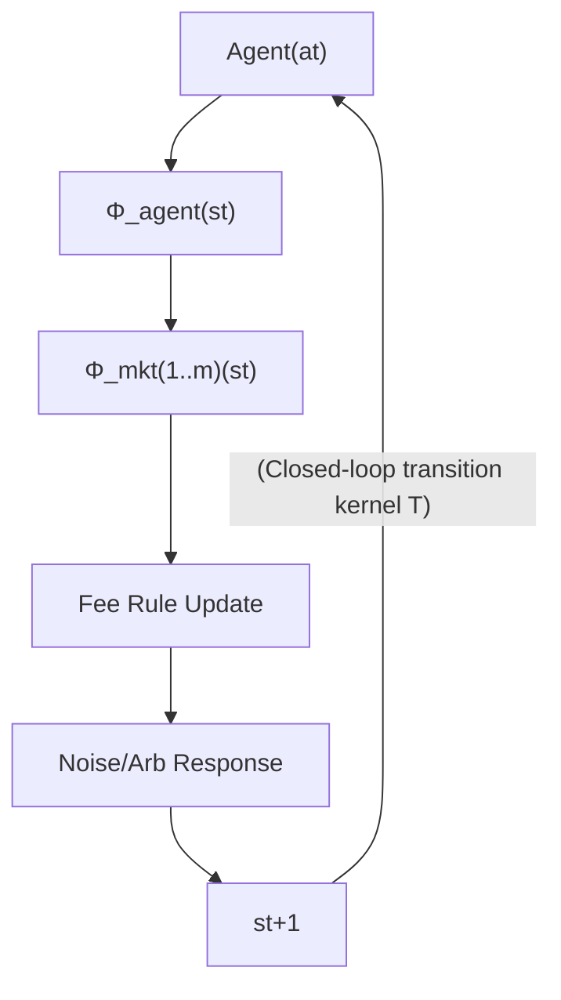

<!-- ontology-5axis data=微观盘口 horizon=高频日内 paradigm=强化学习 alpha=组合执行优化 autonomy=全自动黑盒 -->

# Reinforcement Learning f 解構（Reinforcement Learning f）

> **發布**：2026-07-12 · （無 venue） · arXiv [2607.10960](https://arxiv.org/abs/2607.10960)
> **arXiv 原文**：[Reinforcement Learning for Execution under Dynamic Fees in a Closed-Loop DEX Simulator](https://arxiv.org/abs/2607.10960v1) · _本頁由 arXiv 原文一手自主解構_
> **核心定位**：落點於「高頻執行優化 × 強化學習」軸，解決歷史回放無法識別動作依賴轉移核（action-dependent transition kernel）的 prior gap。以閉環模擬器替代歷史數據，使 RL 能在費率隨訂單流動態重定價的環境中學習。

**五軸座標**

| 數據模態 | 時間尺度 | 學習範式 | Alpha機制 | 人機協作 |
|:-:|:-:|:-:|:-:|:-:|
| `微观盘口` | `高频日内` | `强化学习` | `组合执行优化` | `全自动黑盒` |

**Status:** v0.5 — 基於arXiv 原文（有原文則以原文為準）。細節待升 v1。
**TL;DR:** ① 構建閉環 DEX 模擬器，以均衡啟發的動態費率閉包規則重現訂單流與費率的互動反饋。② 核心 trick 是嚴格評估協議：基線超參在 200 seeds 驗證、DQN 在 50 seeds 驗證，凍結後於保留的 1,000 seeds 區塊測試。③ 對執行優化軸的關鍵意義在於打破歷史數據「動作不改變狀態」的識別瓶頸，提供模型無關的控制評估紀律。④ 在強制完成度為 1.0 的保留區塊中，於 agent-last 排序下實現缺口降低 13.3 bps，且優勢集中於動態費率環境。

**X-Ray.** 本文將 Pareto 前沿從「擬合歷史盤口」推向「壓力測試閉環規則」。它解了量化工程中最隱蔽的坑：歷史回放中 RL 智能體看似適應性強，實則因狀態轉移與動作解耦而產生前瞻偏差或偽適應。但該方法打不開的 envelope 很明確：模擬器中的均衡費率閉包是風格化防禦，非真實 LP 行為；優勢在常數費率下消失，證明其 α 完全依賴於特定閉包規則的動態性。對量化讀者的意義不在直接部署，而在提供可複用的評估協議，將執行策略驗證從回測曲線轉向動作響應環境的壓力測試。

## §1 · 架構 / Core Mechanism
**1.1 三大改動 vs 前作**
| 維度 | 歷史回放 RL (Prior) | 隨機控制/解析解 (Prior) | 本法 (Closed-Loop DQN) |
|---|---|---|---|
| 狀態轉移 | 動作不影響後續狀態 (Action-independent) | 依賴可解的隨機微分方程 | 動作觸發市場算子序列重定價 (Action-dependent) |
| 費率機制 | 固定或外生歷史序列 | 常數或簡化滑點模型 | 均衡啟發動態閉包 (Equilibrium-inspired closure) |
| 評估紀律 | 單一基線對比/未凍結開發 | 理論最優界 | 多階梯調優基線 + 保留區塊嚴格測試 |

**1.2 ⚡ Eureka**
將均衡費率結構線性化為環境的「自衛機制」，而非智能體的學習目標；智能體只需在動作改變狀態/費率的閉環中尋找執行缺口最小化路徑。

**1.3 信息流 ASCII**

## §2 · 數學層
**📌 Napkin Formula**
$$s_{t+1} = \big(\Phi^{(m)}_{\mathrm{mkt}}\circ\cdots\circ\Phi^{(1)}_{\mathrm{mkt}}\circ\Phi_{\mathrm{agent}}(a_t)\big)(s_t;\,\xi_t) \quad \text{(Eq. 1)}$$
$$r_t = -\frac{1}{QS_0}\Big[\sum_i\big(c_i(q_{i,t})-q_{i,t}S_0\big)+g\,n_t\Big] - \frac{C^{\mathrm{term}}_H}{QS_0}\mathbf{1}\{t=H-1\} \quad \text{(Eq. 2, 3)}$$
**直覺**：獎勵函數直接對沖執行現金成本、交易手續費與殘倉終端懲罰。狀態轉移由智能體動作與市場算子（流動性重定價、費率更新、套利者響應）嚴格串聯，確保無未來信息洩漏。
**Loss/訓練**：標準 DQN Q-learning。開發決策（超參/架構）在 200 seeds 與 50 seeds 上驗證後凍結，僅在保留的 1,000 seeds 區塊進行最終評估。

## §2.5 · 帶數字走一遍（Worked Example）
*(註：以下為明確標「假設/示意」的玩具數字，僅用於演示閉環機制手算邏輯，非論文實證結果)*
1. **假設輸入**：目標訂單 $Q=100$，$H=10$ 步，到達價 $S_0=1.0$，單筆交易成本 $g=0.001$。第 1 步智能體決定送出 $q_{1,1}=10$。
2. **市場響應**：動作觸發 $\Phi_{\mathrm{agent}}$ 消耗流動性，池子價格滑點至 $S_{\mathrm{mid}}=1.005$。動態費率規則根據庫存偏移將費率從 $0.3\%$ 上調至 $0.5\%$。
3. **成本計算**：該步現金成本 $c_1(10) \approx 10 \times 1.005 \times (1+0.005) = 10.10025$。手續費 $g \times 1 = 0.001$。
4. **獎勵生成**：代入 Eq. 2，$r_1 = -\frac{1}{100\times1.0}[(10.10025 - 10\times1.0) + 0.001] = -0.00101325$。
5. **閉環反饋**：殘倉 $R_1=90$。因費率已動態上調，智能體在 $s_2$ 觀察到執行成本上升，下一步將自動調整拆單節奏或切換路由，體現動作依賴轉移核的學習壓力。

## §3 · 數據層
- **資料來源**：完全合成模擬數據。兩個常數乘積（constant-product）池。
- **市場結構**：費率敏感型噪音訂單流（fee-sensitive noise flow）+ 閉式 CEX-AMM 套利者響應。
- **樣本與容量**：基線超參驗證 200 seeds，DQN checkpoint 驗證 50 seeds，最終評估保留 1,000 seeds。強制完成度為 1.0。無歷史實盤數據，容量假設僅限於模擬器內生流動性深度。

## §4 · 代碼層
| 欄位 | 內容 |
|---|---|
| Repo | https://github.com/egpivo/amm-lab |
| Checkpoint | TBD |
| License | CC BY 4.0 |
| 複現難度 | 中（需重現閉環算子序列與費率閉包邏輯） |
| 數據可得性 | 合成數據生成器隨 Repo 開源 |

## §5 · 評測 / Benchmark
| 數據集/市場 | Metric | 前SOTA | 本方法 | Δ |
|---|---|---|---|---|
| Reserved 1,000 seeds block (強制完成度 1.0) | Implementation Shortfall (bps of notional) | 未披露 | 未披露 | -13.3 bps |
| Reserved 1,000 seeds block (依 intra-step priority 排序) | Implementation Shortfall (bps of notional) | 未披露 | 未披露 | 5.6 to 14.9 bps |

**解讀**：Δ 為負值代表缺口縮減。-13.3 bps 的優勢在 agent-last 排序下顯著，且原文強調該優勢「集中於動態費率環境」；在常數費率下配對差異與零無異。這表明 Δ 反映的是智能體對「動作觸發費率重定價」的真實適應能力，而非過擬合或前瞻偏差。但優勢高度依賴閉包規則的動態性，若市場費率結構靜態化，該 α 將歸零。

## §6 · 失效與隱含假設
**6.1 論文自述 limitations**
結果為「模型條件下的反事實證據」（model-conditioned counterfactual evidence），非歷史交易者行為證據、非均衡博弈證據，亦非可部署利潤證據。

**6.2 推斷的隱含假設**
- **Regime 依賴**：優勢完全綁定於均衡啟發的動態費率閉包。真實 DEX 的 LP 行為或協議費率切換機制若偏離該線性化假設，策略將失效。
- **容量與流動性**：模擬器僅含兩個常數乘積池與風格化套利者，未涵蓋真實多池路由、MEV 搶跑或深度訂單簿的流動性碎片化。
- **數據泄漏**：嚴格凍結開發決策與保留區塊設計已排除常見泄漏，但閉環算子的數學形式本身構成強先驗，限制了跨市場遷移。

## §7 · 對比 & 面試 Tip
| 同軸對手 | 關鍵差異軸 | Open? | Status |
|---|---|---|---|
| 歷史回放 RL (e.g., PPO on tape) | 狀態轉移是否動作依賴 | 部分開源 | 常遇偽適應/前瞻偏差 |
| 隨機控制解析解 (e.g., Cartea et al.) | 依賴可解 SDE vs 模型無關 | 理論為主 | 無法處理動態費率重定價 |
| 本方法 (Closed-Loop DQN) | 閉環壓力測試 + 嚴格評估協議 | 開源 | 僅限模擬反事實驗證 |

**🎤 Interview Tip**
- ✅ 正確答：「該方法的核心貢獻不是部署型 α，而是評估紀律。它用閉環模擬器解決歷史回放中『動作不改變狀態』的識別失效，證明 RL 在動態費率重定價環境下能學習到真實的執行缺口縮減，但優勢隨費率靜態化消失。」
- ❌ 錯答：「這模型能直接上線跑 DEX 套利，因為它比歷史回放準確率高 13.3%。」（混淆 bps 與百分比，且忽略反事實模擬與實盤部署的 gap）

**7.1 可證偽預測帶日期**
至 2026-12-31，若將此 DQN checkpoint 直接部署於真實 DEX（如 Uniswap V3/V4 動態費率池），在未經重訓練的情況下，其實現缺口縮減將衰減至 <5 bps，因真實 LP 響應與套利者行為偏離模擬器的均衡閉包假設。

## §8 · For the Reader
- **因子研究員**：將此評估協議移植至你的因子壓力測試框架，用「動作觸發市場狀態重定價」替代靜態回測，過濾偽穩定因子。
- **高頻執行**：關注 intra-step priority ordering 的 load-bearing 特性。實盤撮合順序的微小偏移會直接改變 RL 策略的執行成本曲線。
- **RL 策略/研究學生**：學習其開發凍結與保留區塊設計。避免在模擬環境中過度調參，確保 Δ 來自策略能力而非數據窺探。
- **組合配置/系統架構**：此方法不產出直接可交易的 α，但提供了一套驗證「執行控制模塊」在動態成本環境下魯棒性的標準化 pipeline。

## References
- Wang, W. (2026). *Reinforcement Learning for Execution under Dynamic Fees in a Closed-Loop DEX Simulator*. arXiv:2607.10960v1.
- Baggiani, G., Herdegen, M., & Sánchez-Betancourt, D. (Lineage for equilibrium-inspired fee closure).
- Cartea, A., Drissi, M., & Monga, R. (Stochastic control solutions for constant-product markets).
- Repo: https://github.com/egpivo/amm-lab (CC BY 4.0)