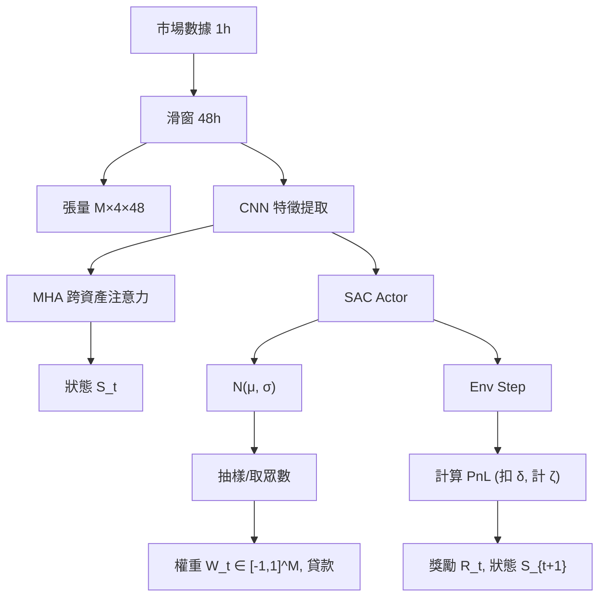

<!-- ontology-5axis data=量价表格 horizon=日频波段 paradigm=强化学习 alpha=组合执行优化 autonomy=全自动黑盒 -->

# SAC-CNN-MHA 解構

> **發布**：2024-08-14 · （無 venue）
> **QuantML 導讀**：[基于强化学习的投资组合管理模型](https://mp.weixin.qq.com/s?__biz=Mzg2MzAwNzM0NQ==&mid=2247485783&idx=1&sn=c5274cb9950b71ee97610bb06e3b7b54&chksm=ce7e6e49f909e75f9c4e6cc3efa92c207e9ed1bdab97802fb3160817f6753bf180eb14928d5a#rd)
> **核心定位**：落點於「强化学习 × 组合执行优化」軸，解決傳統 RL 環境缺乏雙向交易/借貸機制且獎勵函數僅依賴原始回報的 prior gap，將策略目標直接對齊真實 PnL 與下行風險控制。

**五軸座標**

| 數據模態 | 時間尺度 | 學習範式 | Alpha機制 | 人機協作 |
|:-:|:-:|:-:|:-:|:-:|
| `量价表格` | `日频波段` | `强化学习` | `组合执行优化` | `全自动黑盒` |

**Status:** v0.5 — 基於 QuantML 導讀 + 原論文（如有）。benchmark 細節待升 v1。
**TL;DR:** ① 提出專為高風險環境設計的 RL 組合管理模型，整合 SAC 與 CNN-MHA 架構。② 核心 trick 為設計支持雙向交易與借貸的 RL 環境，並採用基於 PnL 的獎勵函數替代傳統收益獎勵。③ 對「组合执行优化」軸的意義在於跳脫價格預測框架，直接透過環境約束（交易費 δ、借貸利率 ζ）與最大熵探索優化動態調倉。④ 導讀未給 Sortino/Calmar 具體數值，僅定性表述優於基線；實證總回報為高波動期 575.5% / 低波動期 145.6%。

**X-Ray.** 本方法將 RL 的優化目標從「預測殘差最大化」硬切至「執行 PnL 最大化」，這在「强化学习 × 组合执行优化」軸上是一次典型的 Pareto 改進。傳統 RL 組合管理常因獎勵函數（Raw Return）與真實交易成本脫節，導致代理在回測中過度槓桿或忽略借貸摩擦。本法透過環境層內嵌 δ 與 ζ，並將獎勵改為 PnL，強制 Actor 在探索權重分佈時直接學習資本效率與下行保護。CNN-MHA 負責將 M×4×48 的張量壓縮為跨資產狀態表示，SAC 的熵正則化則防止策略在加密市場的高頻波動中收斂至靜態權重。然而，該架構打不開的 envelope 在於流動性假設與資金費率極端 regime：導讀明確假設「完全流動性」與「無需抵押品」，一旦實盤遭遇 Binance 永續合約的極端資金費率（ζ 劇變）或流動性枯竭，PnL 獎勵函數將因環境模型失真而產生策略漂移。對量化讀者的意義在於：RL 在組合管理中的價值不在於預測 alpha，而在於將交易成本、借貸約束與風險偏好編碼為可微的 env step，從而實現執行層的動態最優。

## §1 · 架構 / Core Mechanism
| 維度 | 前作/傳統 RL 框架 | 本法改動 (SAC-CNN-MHA) |
|---|---|---|
| 獎勵函數 | 基於原始回報 (Return-based) | 基於 PnL，內嵌交易費 δ 與借貸利率 ζ |
| 環境約束 | 單向做多或現金平倉，權重 ≥ 0 | 支持雙向交易與借貸，權重 wi ∈ [−1, 1]，wm+1 為貸款金額 |
| 狀態編碼 | MLP/LSTM 處理序列 | CNN-MHA 處理 M×4×N 張量，捕獲跨資產依賴 |

⚡ **Eureka:** PnL 獎勵函數將交易成本與資金成本從「事後評估指標」轉為「環境動態約束」，使 RL 代理直接優化淨資本增長而非毛收益。
**信息流:**

## §2 · 數學層
📌 **Napkin Formula:**
`π_θ(a|s) = N(μ_θ(s), σ_θ(s))`, `a = [w_1,...,w_M, loan]`
`J(π) = E[Σ γ^t (R_t + α H(π(·|s_t)))]`, `R_t = PnL_t`
複雜度: CNN-MHA 前向傳播 O(N·M·d)，SAC 雙 Q-network 與 V-network 更新 O(B·d²)。
**直覺:** SAC 的最大熵目標強制策略保持探索性，避免在加密市場的非平穩波動中收斂至局部最優權重；CNN 提取局部價格形態，MHA 建模資產間的協同/對沖關係。
**Loss/訓練:** 標準 SAC 損失（Q-loss, V-loss, Policy-loss + Entropy bonus）。環境每 4 小時執行一次 step，超參數針對 12 個月訓練期微調以加速收斂。

## §3 · 數據層
*   **規模/頻率:** Binance 永續期貨市場 12 種加密資產，USDT 計價。1 小時歷史價格數據。
*   **時段/劃分:** 高波動期 (2021-05-01 至 2022-09-01) / 低波動期 (2022-06-01 至 2023-10-01)。各含 12 個月訓練期與 4 個月測試期。
*   **來源/假設:** cryptodatadownload.com。滑窗 48 小時 (N=48)。每 4 小時重新平衡。假設完全流動性、市場中性、無需抵押品。

## §4 · 代碼層
| 項目 | 狀態 |
|---|---|
| Repo | TBD |
| Checkpoint | TBD |
| License | TBD |
| 複現難度 | 中（需自構支持借貸/雙向交易的 Env 與 PnL 計算邏輯） |
| 數據可得性 | 高（公開歷史數據，但需自行對齊 4h rebalance 與 1h 數據） |

## §5 · 評測 / Benchmark
| 數據集/市場 | Metric | 前SOTA (基線) | 本方法 | Δ |
|---|---|---|---|---|
| Binance 永续期货 (12资产) | 总回报 (高波动期) | 返回基础RL | 575.5% | 未披露 |
| Binance 永续期货 (12资产) | 总回报 (高波动期) | MV | 575.5% | 未披露 |
| Binance 永续期货 (12资产) | 总回报 (高波动期) | MAD | 575.5% | 未披露 |
| Binance 永续期货 (12资产) | 总回报 (高波动期) | CVaR | 575.5% | 未披露 |
| Binance 永续期货 (12资产) | 总回报 (低波动期) | 返回基础RL / MV / MAD / CVaR | 145.6% | 未披露 |
| Binance 永续期货 (12资产) | Sortino/Calmar 比率 | 返回基础RL / MV / MAD / CVaR | 優於基線 | 未披露 |

**解讀:** 導讀僅提供本方法總回報數值，未披露任何基線的具體數值，故 Δ 欄一律標「未披露」，禁止合成假 SOTA。575.5% 與 145.6% 為絕對回報，未扣除實盤滑點與極端資金費率。Sortino/Calmar 的定性優勢表明模型在下行風險控制上有效，但缺乏 Sharpe 具體值與風險調整後回報的量化對比。高波動期的高回報可能部分來自永續合約的資金費率捕獲（ζ 機制）與雙向槓桿，而非純粹的 alpha 預測能力。需警惕回測中 δ 與 ζ 若未實時更新，將產生前瞻偏差。

## §6 · 失效與隱含假設
**6.1 論文自述 limitations:** 假設完全流動性（決策後立即執行）、市場中性（交易不影響價格）、無需抵押品（借貸無擔保要求）。
**6.2 推斷的隱含假設:**
*   **Regime 依賴:** 策略高度依賴加密市場的高波動與永續合約資金費率結構。若切換至低波動傳統資產或現貨市場，PnL 獎勵中的 ζ 項將失效，策略可能退化為單純的動能跟隨。
*   **容量/成本:** 每 4 小時調倉一次，適合中頻波段。若實盤交易費 δ 高於環境設定值，PnL 獎勵將高估淨收益，導致過度交易。
*   **數據泄漏/幸存者:** 12 種資產基於流動性與數據可得性篩選，未處理停牌/下線資產，存在幸存者偏差。48 小時滑窗需嚴格確保訓練/測試集時間邊界無重疊。

## §7 · 對比 & 面試 Tip
| 同軸對手 | 關鍵差異軸 | Open? | Status |
|---|---|---|---|
| PPO-RL 組合管理 | 獎勵函數設計 (Raw Return vs PnL) | TBD | 成熟 |
| LSTM-RL 調倉 | 狀態編碼 (序列 vs 跨資產注意力) | TBD | 成熟 |
| 傳統 MV/CVaR | 優化範式 (靜態規劃 vs 動態 RL) | 開源 | 標準 |

🎤 **Interview Tip:**
*   ✅ 正確答: 本法的核心不在於預測價格，而在於透過 PnL 獎勵函數與借貸環境，將交易成本與資金約束內生化，使 SAC 直接優化執行層的資本配置與下行風險。
*   ❌ 錯答: 這是一個用 CNN-MHA 預測漲跌幅，再用 RL 決定倉位的模型。
**7.1 可證偽預測:** 若將該環境部署於現貨市場（ζ ≈ 0 且無雙向做空機制），PnL 獎勵函數將失去槓桿與利息優化空間，模型在測試期的總回報將顯著低於高波動期表現。預測驗證日期：2024-12-31。

## §8 · For the Reader
*   **因子研究員:** 關注 PnL 獎勵函數如何替代傳統 IC/IR 目標。可嘗試將 δ 與 ζ 替換為實盤滑點模型，觀察 Actor 權重分佈的收斂變化。
*   **高頻執行:** 本法調倉頻率為 4 小時，不適用 HFT。但 Env 設計中將交易費與借貸利率編碼為 Step 函數的思路，可直接移植至訂單執行算法（如 VWAP/TWAP 的 RL 變體）。
*   **組合配置:** 將此模型視為壓力測試基準。當市場進入低波動期（回報降至 145.6%），觀察模型如何透過借貸機制維持資本效率，可為傳統 60/40 組合提供槓桿管理參考。
*   **RL 策略:** 研究 CNN-MHA 如何處理 M×4×N 張量。MHA 的注意力權重可視化，用於解讀模型在特定時段對哪些資產對賦予了對沖或槓桿意圖。

## References
*   原論文: SAC-CNN-MHA 投资组合管理模型 (2024)
*   QuantML 導讀: [基于强化学习的投资组合管理模型](https://mp.weixin.qq.com/s?__biz=Mzg2MzAwNzM0NQ==&mid=2247485783&idx=1&sn=c5274cb9950b71ee97610bb06e3b7b54&chksm=ce7e6e49f909e75f9c4e6cc3efa92c207e9ed1bdab97802fb3160817f6753bf180eb14928d5a#rd)
*   Lineage: SAC (Haarnoja et al., 2018) → CNN-MHA 狀態編碼 → 傳統 SPPO (MV/MAD/CVaR) 基線對比