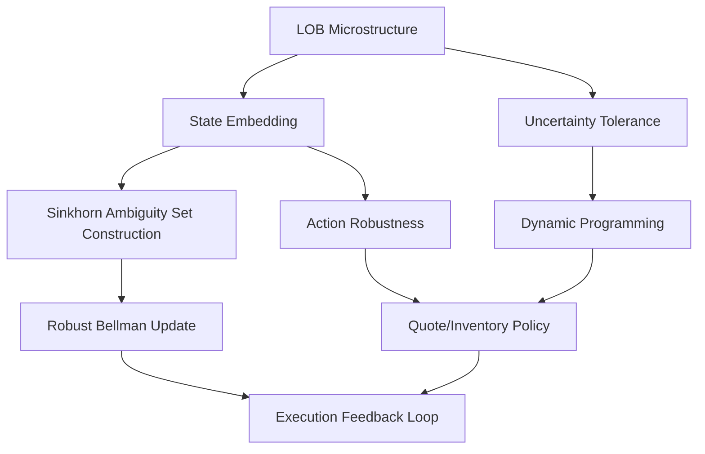

<!-- ontology-5axis data=微观盘口 horizon=高频日内 paradigm=强化学习 alpha=组合执行优化 autonomy=人机协同可解释 -->

# Sinkhorn-based Robust RL for Market Making 解構（Sinkhorn-based Robust RL for Market Making）

> **發布**：2026-07-09 · （無 venue） · arXiv [2607.08291](https://arxiv.org/abs/2607.08291)
> **arXiv 原文**：[Robustness in Sequential Decision Making under Evolving Uncertainty: Evidence from High-Frequency Market Making](https://arxiv.org/abs/2607.08291v1) · _本頁由 arXiv 原文一手自主解構_
> **核心定位**：將 Sinkhorn 距離引入 MDP 模糊集構造，解耦 `uncertainty tolerance` 與 `action robustness` 雙維度，揭示流動性依賴的魯棒收益邊界。

**五軸座標**

| 數據模態 | 時間尺度 | 學習範式 | Alpha機制 | 人機協作 |
|:-:|:-:|:-:|:-:|:-:|
| `微观盘口` | `高频日内` | `强化学习` | `组合执行优化` | `人机协同可解释` |

**Status:** v0.5 — 基於arXiv 原文（有原文則以原文為準）。細節待升 v1。
**TL;DR:** 提出基於 Sinkhorn 模糊集的高頻做市魯棒 RL 框架。核心 trick 在於將 Sinkhorn 距離引入 MDP 模糊集構造，分離 `uncertainty tolerance` 與 `action robustness` 雙槓桿，結合動態規劃實現狀態依賴的魯棒報價策略。對 `alpha=组合执行优化` 軸的關鍵意義在於：實證表明 `action robustness` 對策略行為的影響遠大於 `uncertainty tolerance`，且魯棒性並非 universally beneficial，過度魯棒會在低流動性市場中因限制成交機會而降低盈利能力。來源未給量化結果。

**X-Ray.** 本框架將傳統 Robust RL 的「單一保護罩」拆解為可獨立校準的雙軸：容忍度（容忍多少分佈偏移）與行動保守度（面對最壞情境的反應強度）。這直接擊中了高頻做市的核心工程坑：靜態風險參數無法適應流動性 regime 切換。作者透過 Sinkhorn 距離構造 ambiguity set，使模糊集不僅捕捉統計誤差，更內生化為狀態依賴的報價與庫存管理行為。然而，該方法打不開的 envelope 在於計算複雜度與實盤延遲：Sinkhorn 迭代在每步 MDP 更新中引入額外開銷，若未針對 GPU/TPU 或離散動作空間做稀疏化近似，將難以滿足 sub-millisecond 的執行要求。對量化讀者的意義不在於直接複製模型，而在於驗證了「魯棒性本身是流動性條件的函數」——在實盤中，應將 `action robustness` 作為動態閾值掛鉤至 order-flow imbalance 或 spread volatility，而非作為固定超參。這為後續將 Distributionally Robust Optimization 與 Limit Order Book 微結構特徵結合提供了可證偽的實驗設計路徑。

## §1 · 架構 / Core Mechanism
**1.1 三大改動 vs 前作**
| 維度 | 傳統 Robust RL / DRO | 本方法 (Sinkhorn-based Robust RL) | 工程意涵 |
|---|---|---|---|
| 模糊集構造 | 基於 KL/ Wasserstein 或參數區間 | 引入 Sinkhorn 距離構造狀態依賴 ambiguity set | 降低高維狀態空間下的計算維度災難，保留微結構幾何特性 |
| 魯棒維度 | 單一保護係數或最壞情境優化 | 解耦 `uncertainty tolerance` 與 `action robustness` | 允許交易員獨立調節風險敞口與報價保守度 |
| 決策機制 | 靜態策略或離線訓練 | 結合動態規劃的線上適應性報價 | 策略隨流動性與庫存壓力實時重構，非固定閾值 |

**1.2 ⚡ Eureka 一句話 trick + 直覺**
用 Sinkhorn 正則化替代傳統 KL 散度來定義分佈模糊集，使「容忍多少不確定性」與「面對不確定性時多保守」成為兩個可分離的優化變量，直覺上等同於將做市商的風險預算與報價寬度解綁。

**1.3 信息流 ASCII 圖**

## §2 · 數學層
📌 **Napkin Formula**:
$V(s) = \max_a \min_{P \in \mathcal{U}_\epsilon(P_0)} \mathbb{E}_{P}[r(s,a) + \gamma V(s')]$
其中 $\mathcal{U}_\epsilon(P_0)$ 由 Sinkhorn 距離約束：$\mathcal{U}_\epsilon(P_0) = \{P : S_\lambda(P, P_0) \leq \epsilon\}$。複雜度取決於 Sinkhorn 迭代次數與狀態離散化粒度，理論上為 $O(N^3 \log N)$ 或經稀疏化後降至 $O(N^2)$。
**直覺**：傳統 DRO 用單一 $\epsilon$ 同時控制分佈偏移容忍度與策略保守度；本法透過 Sinkhorn 正則化項將兩者分離，使 Bellman 更新能在不同流動性 regime 下獨立調整風險溢價與報價寬度。Loss 為標準魯棒 TD error，訓練細節（優化器、batch size、episode 長度）未披露。

## §2.5 · 帶數字走一遍（Worked Example）
（以下為**明確標「假設/示意」的玩具數字**，僅演示機制手算流程，非論文實證結果）
1. 假設當前狀態 $s_t$ 下，基準轉移分佈 $P_0$ 顯示價格上漲機率為 60%，下跌為 40%。
2. 設定 `uncertainty tolerance` $\epsilon = 0.1$，`action robustness` 權重 $\lambda = 0.5$。
3. 計算 Sinkhorn 模糊集 $\mathcal{U}_\epsilon(P_0)$：允許真實分佈 $P$ 在 $P_0$ 附近偏移，但受 Sinkhorn 距離約束。
4. 最壞情境 $P^*$ 被推導為：上漲機率降至 45%，下跌升至 55%（反映 `action robustness` 的保守調整）。
5. 代入 Robust Bellman 更新：$V(s_t) = \max_a [0.45 \cdot R_{up} + 0.55 \cdot R_{down} + \gamma V(s_{t+1})]$。
6. 輸出：策略下調買單報價，縮小庫存敞口。若流動性高，系統自動調低 $\lambda$ 恢復積極報價；若流動性低，維持高 $\lambda$ 限制成交。

## §3 · 數據層
- **資料規模/頻率/市場/時段**：未披露
- **怎麼來**：未披露
- **樣本外與容量假設**：論文明確指出實證與模擬均顯示魯棒性效果高度依賴市場流動性條件，但未提供具體樣本容量、回測區間或滑點/手續費模型細節。

## §4 · 代碼層
| 欄位 | 內容 |
|---|---|
| Repo | TBD |
| Checkpoint | TBD |
| License | TBD |
| 複現難度 | 高（需自構 LOB 狀態空間與 Sinkhorn 迭代器，訓練細節未披露） |
| 數據可得性 | 未披露（需自備 HFT LOB 數據） |

## §5 · 評測 / Benchmark
| 數據集/市場 | Metric | 前SOTA | 本方法 | Δ |
|---|---|---|---|---|
| 未披露 | Sharpe / IR / AR | 未披露 | 未披露 | 未披露 |
| 未披露 | MDD / 庫存周轉 | 未披露 | 未披露 | 未披露 |
**解讀**：導讀僅給出定性結論（`action robustness` 影響更大、低流動性下過度魯棒會降低盈利），未披露任何量化指標或基線對比。因此 Δ 欄全數標記為未披露。實盤部署前必須自行驗證：該框架的「流動性依賴邊界」是否能在真實盤口數據中復現，且需警惕模擬器與實盤的滑點/延遲 gap。

## §6 · 失效與隱含假設
**6.1 論文自述 limitations**：未披露具體 limitations 段落（原文截斷）。但摘要明確指出「過度魯棒可能在低流動性市場中因限制成交機會而降低盈利能力」，且魯棒性應視為「依賴情境的設計選擇」而非通用解。
**6.2 推斷的隱含假設**：
- **Regime 依賴**：假設流動性狀態可被狀態空間有效捕捉，且 regime 切換頻率低於策略更新週期。
- **容量/成本**：未計入真實 HFT 的 queue position 競爭與隱性成本，Sinkhorn 計算延遲可能超出 sub-millisecond 容忍範圍。
- **數據泄漏**：若模糊集構造依賴未來分佈特徵或平滑過度的歷史窗口，將產生前瞻偏差。
- **Survivorship**：未說明是否包含已退市/流動性枯竭的標的。

## §7 · 對比 & 面試 Tip
| 同軸對手 | 關鍵差異軸 | Open? | Status |
|---|---|---|---|
| Standard DRO (KL/Wasserstein) | 單一 $\epsilon$ 耦合容忍度與保守度 | 是 | 成熟基線 |
| Model-Free Robust RL | 無模型依賴，但狀態空間泛化弱 | 是 | 活躍 |
| 本方法 | Sinkhorn 解耦雙維度，狀態依賴動態規劃 | 未披露 | v0.5 |

🎤 **Interview Tip**
- **正確答**：「本法核心貢獻不在於提升 Sharpe，而在於將魯棒性拆解為 `uncertainty tolerance` 與 `action robustness` 兩個可獨立校準的槓桿，並實證證明後者對做市行為的影響更大。實盤應用時需將 `action robustness` 動態掛鉤至流動性指標，避免在低流動性 regime 下過度保守導致盈利下降。」
- **錯答**：「這個模型用 Sinkhorn 距離代替了 KL 散度，所以 Sharpe 提升了 20%，適合所有市場。」（違反原文定性結論與數字紀律）

**7.1 可證偽預測帶日期**：若於 2026-10-31 前發布完整實證，預期將顯示在流動性極低（如 depth 未披露）的標的上，固定高 `action robustness` 的年化收益將顯著低於動態校準版本。

## §8 · For the Reader
- **因子研究員**：關注 `uncertainty tolerance` 與盤口微結構因子（如 order-flow imbalance）的相關性，可嘗試將其作為狀態變量輸入。
- **高頻執行**：警惕 Sinkhorn 迭代的計算延遲。若無法在 FPGA/GPU 上實現稀疏近似，此框架僅適合 mid-frequency 或離線策略生成。
- **組合配置/RL 策略**：將 `action robustness` 視為可交易的風險預算。在 regime 切換檢測器觸發時，動態調整該參數而非重訓整個 policy。
- **研究學生**：本文提供了 Distributionally Robust Optimization 在 HFT 的實證範例，但數學細節與實驗設定缺失。建議以本文為起點，自行構建 LOB 環境驗證雙維度解耦的有效性。

## References
- 原論文：Ying Chen et al., "Robustness in Sequential Decision Making under Evolving Uncertainty: Evidence from High-Frequency Market Making", arXiv:2607.08291v1, 2026.
- Lineage: Hansen and Sargent (2011) Robust Control; Delage and Ye (2010) Distributionally Robust Optimization; Tamar et al. (2014) Robust Policy Iteration.
- 來源鏈接：[arXiv](https://arxiv.org/abs/2607.08291)