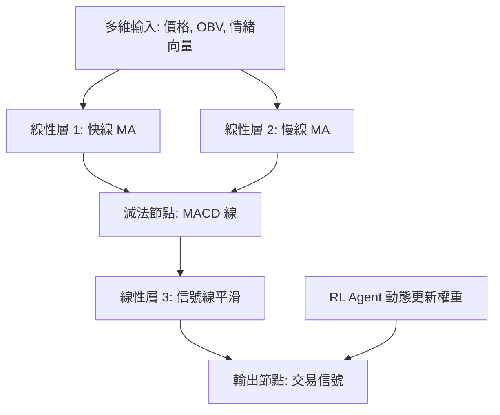

<!-- ontology-5axis data=量价表格 horizon=日频波段 paradigm=强化学习 alpha=因子挖掘 autonomy=人机协同可解释 -->

# TINs 解構

> **發布**：2025-09-18 · （無 venue）
> **QuantML 導讀**：[技术指标神经网络](https://mp.weixin.qq.com/s?__biz=Mzg2MzAwNzM0NQ==&mid=2247491713&idx=1&sn=4e0ff1e5d0ab191df0c4fa857c4c5b69&chksm=ce7d879ff90a0e891e6fd7275dcd7dec99da4e713af31e84eae32e9ca0e5eed34238a39e7518#rd)
> **核心定位**：落點於「量價表格 × 日频波段 × 强化学习」軸，解決了傳統技術指標參數剛性與黑箱 DNN 缺乏金融語義的 prior gap。將靜態公式轉譯為固定拓撲的線性神經層，並引入 RL 動態尋優，實現可解釋性與適應性的 Pareto 平衡。

**五軸座標**

| 數據模態 | 時間尺度 | 學習範式 | Alpha機制 | 人機協作 |
|:-:|:-:|:-:|:-:|:-:|
| `量价表格` | `日频波段` | `强化学习` | `因子挖掘` | `人机协同可解释` |

**Status:** v0.5 — 基於 QuantML 導讀 + 原論文（如有）。benchmark 細節待升 v1。
**TL;DR:** ① 將 MACD/RSI 等傳統指標的數學運算映射為無激活函數的固定拓撲線性層網絡。② 核心 trick 是以強化學習替代網格搜索，動態優化層權重與多維輸入，保持數學可解釋性。③ 這對「因子挖掘 × 人機協作」軸★，提供了一條從規則引擎平滑過渡到可訓練 Alpha 生成器的工程路徑。④ 導讀給出 MACD IN (Price+OBV) 夏普比率達 2.7357，顯著高於傳統 MACD 的 1.6474。

**X-Ray.** TINs 的本質是「可微化的規則引擎」。它並未發明新因子，而是將 SMA/EMA/MACD 的卷積與池化邏輯解耦為全連接線性層，這直接規避了 LSTM/CNN 在金融時間序列上常見的過擬合與語義斷層坑。對量化讀者而言，其價值不在於單筆回測的夏普提升，而在於提供了一個標準化的 `Alpha` 容器：傳統指標的週期參數被轉化為可訓練權重，RL 代理則負責在交易成本與信號衰減的約束下動態尋優。然而，該框架打不開的 envelope 很明確：線性拓撲無法捕捉高頻微結構的非線性跳躍，且 RL 訓練極度依賴環境模擬的真實性。若將 TIN 視為特徵提取器而非決策器，與 Transformer 或 GNN 串聯，方能突破其單維度日頻波段的容量天花板。

## §1 · 架構 / Core Mechanism
**1.1 三大改動 vs 前作**
| 維度 | 傳統技術指標 (Prior) | 黑箱 DNN (LSTM/CNN) | TINs (本法) |
|---|---|---|---|
| 拓撲結構 | 固定數學公式 | 動態/黑箱卷積或循環層 | 固定拓撲無激活線性層 + 特定算子 |
| 參數優化 | 網格搜索/經驗設定 | 監督學習反向傳播 | 強化學習動態尋優 |
| 輸入模態 | 單一價格序列 | 高維張量/序列 | 多維融合（價格+情緒+跨市場） |

**1.2 ⚡ Eureka 一句話 trick**
將靜態指標公式映射為無激活線性層，保留數學可解釋性；引入強化學習替代網格搜索，實現權重與多維輸入的動態自適應優化。

**1.3 信息流 ASCII 圖**

## §2 · 數學層
📌 **Napkin Formula:** $O_t = W_3 \cdot (W_1 \cdot X_{t-k} - W_2 \cdot X_{t-m}) + b$ （無激活函數線性組合，$W$ 由 RL 策略網絡動態輸出）
**直覺:** 傳統 MA 是等權或指數衰減的加權平均，TIN 將其轉化為可學習的權重矩陣。RL Agent 不直接輸出買賣點，而是優化網絡內部的 `W` 與多維輸入的融合比例，使指標在趨勢/震盪市況下自動切換敏感度。
**Loss/訓練:** 採用 Deep Q-Learning / DDQN / PPO，Reward 設計側重風險調整後收益與交易成本懲罰。優化器支援 Ranger/Adam/SGD。

## §3 · 數據層
使用 `yfinance` 獲取美國 US30 指數中 30 只不同股票的每日收盤價。處理 52 天的歷史價格數據。導讀未披露具體樣本外劃分（Train/Val/Test）與回測時段，亦未說明是否包含除權息調整或流動性過濾。容量假設僅限於日頻波段，未驗證高頻或跨市場實盤容量。

## §4 · 代碼層
| 項目 | 狀態/細節 |
|---|---|
| Repo | 見 QuantML 知識星球（未公開 GitHub） |
| Checkpoint | TBD |
| License | TBD |
| 複現難度 | 中（需自構 RL 環境與 Reward 函數，拓撲簡單但調參敏感） |
| 數據可得性 | 高（標準日頻收盤價 + OBV 等基礎量價數據） |

## §5 · 評測 / Benchmark
| 數據集/市場 | Metric | 傳統 MACD(12,26,9) | US30 買入並持有 | MACD IN (Price+OBV) | Δ (vs 傳統MACD) |
|---|---|---|---|---|---|
| US30 30只股票日頻 | 累計回報率 | 14.16% | 37.29% | 19.93% | +5.77pp |
| US30 30只股票日頻 | 夏普比率 | 1.6474 | 1.4991 | 2.7357 | +1.0883 |
| US30 30只股票日頻 | 索提諾比率 | 未披露 | 未披露 | 3.9886 | 未披露 |

**解讀:** Δ 的來源主要在於 RL 對多維輸入（價格+OBV）的動態加權，而非拓撲本身的非線性表達力。累計回報率雖超越傳統 MACD，但仍未跑贏 US30 指數，顯示其 Alpha 主要體現在風險調整後收益而非絕對收益。需注意導讀明確指出結果為「指示性」，未計入實盤滑點與衝擊成本，且 RL 訓練極易在模擬環境中過擬合特定波動率區間。

## §6 · 失效與隱含假設
**6.1 論文自述 limitations:** 導讀指出實驗結果僅具指示性，數據源質量與 RL 算法選擇會顯著影響結果；框架若與 LSTM/Transformer 集成會增加訓練複雜度與成本。
**6.2 推斷的隱含假設:** 
① **Regime 依賴:** RL 策略網絡的泛化能力依賴於訓練期涵蓋足夠多的市場狀態，否則實盤易遭遇分佈外失效。
② **成本假設:** 回測未披露交易成本模型，RL 為追求高夏普可能產生過度頻繁的權重更新或信號翻轉，實盤成本超標即失效。
③ **數據泄漏風險:** 多維輸入（如情緒向量）若未嚴格对齐時間戳，易引入前瞻偏差。

## §7 · 對比 & 面試 Tip
| 同軸對手 | 關鍵差異軸 | Open? | Status |
|---|---|---|---|
| 傳統因子挖掘 (IC/IR) | 靜態公式 vs 動態 RL 權重 | N/A | 成熟 |
| LSTM/Transformer Alpha | 黑箱序列建模 vs 固定拓撲可解釋線性層 | 部分開源 | 主流 |
| 純 RL 交易 Agent | 直接輸出倉位 vs 優化指標內部參數 | 部分開源 | 實驗性 |

**🎤 Interview Tip**
- ✅ 正確答：「TINs 不是替代 DNN，而是將領域知識編碼為網絡拓撲，用 RL 做超參/權重的動態尋優。它解決的是『可解釋性與適應性』的權衡，適合做特徵工程模塊而非端到端決策器。」
- ❌ 錯答：「TINs 用神經網絡直接預測股價漲跌，比 MACD 更準。」（混淆了信號生成與價格預測，且忽略 RL 優化的是內部權重而非直接輸出價格）

**7.1 可證偽預測:** 若將 TIN 部署於高波動/低流動性資產，其 RL 策略網絡將因獎勵信號稀疏與滑點放大，在 6 個月內夏普比率衰減至 1.0 以下。

## §8 · For the Reader
- **因子研究員:** 將 TIN 視為「可微化因子庫」。把 SMA/RSI/CCI 的池化與除法邏輯轉為 PyTorch `nn.Linear`，用 RL 替代手動調參，快速生成多維融合 Alpha。
- **高頻執行/組合配置:** 勿直接將 TIN 輸出作為交易信號。其日頻波段屬性與 RL 動態權重更新頻率需與組合優化器對齊，避免信號翻轉導致衝擊成本吞噬 Alpha。
- **RL 策略/研究學生:** 重點復現 Reward 設計與環境模擬。TIN 的價值在於降低 RL 探索空間（拓撲固定），但需警惕模擬器與實盤的 Gap。建議從 PPO + 交易成本懲罰項入手，驗證權重收斂穩定性。

## References
- QuantML 導讀: [技术指标神经网络](https://mp.weixin.qq.com/s?__biz=Mzg2MzAwNzM0NQ==&mid=2247491713&idx=1&sn=4e0ff1e5d0ab191df0c4fa857c4c5b69&chksm=ce7d879ff90a0e891e6fd7275dcd7dec99da4e713af31e84eae32e9ca0e5eed34238a39e7518#rd)
- Lineage: Fischer & Krauss (2018) LSTM / Ding et al. (2022) DRL Portfolio / 傳統 MACD/RSI 文獻
- Framework: TINs (Technical Indicator Networks)