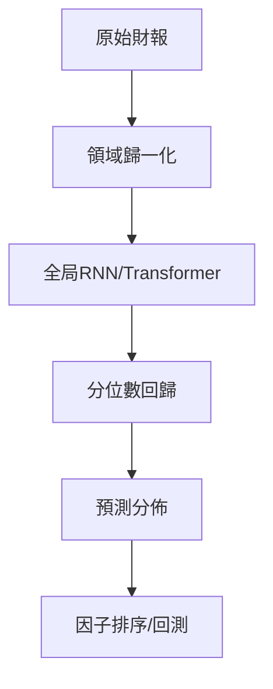

<!-- ontology-5axis data=量价表格 horizon=中长周期 paradigm=监督回归 alpha=因子挖掘 autonomy=人机协同可解释 -->

# 基于机器学习的公司基本面预测 解構

> **發布**：2024-11-12 · （無 venue）
> **QuantML 導讀**：[基于机器学习的公司基本面预测](https://mp.weixin.qq.com/s?__biz=Mzg2MzAwNzM0NQ==&mid=2247487659&idx=1&sn=a5e58be53ad9ded8c2b383712e2a41d5&chksm=ce7e77b5f909fea33898437a56cdedce2d8b6f96b5acc5c258cd153c80b0b86aa4aeff69f255#rd)
> **核心定位**：落點於「监督回归 × 因子挖掘」軸，填補了傳統統計模型在財報序列非平穩性與不確定性校準上的工程斷層，將全局深度學習的參數共享機制轉化為可解釋的概率分佈輸出。

**五軸座標**

| 數據模態 | 時間尺度 | 學習範式 | Alpha機制 | 人機協作 |
|:-:|:-:|:-:|:-:|:-:|
| `量价表格` | `中长周期` | `监督回归` | `因子挖掘` | `人机协同可解释` |

**Status:** v0.5 — 基於 QuantML 導讀 + 原論文（如有）。benchmark 細節待升 v1。
**TL;DR:** 系統評估 22 種模型預測公司基本面的性能，證明全局深度學習模型在不确定性估计与因子回测中显著优于传统统计方法。核心 trick 為領域特定歸一化結合概率分位數回歸，打破局部建模的樣本稀疏瓶頸。這對「因子挖掘」軸的關鍵意義在於：將點預測升級為校準過的條件分佈，使風險預算可直接對接組合優化器。關鍵實證數字：基於自動化 GRU 預測的組合在每年重新平衡時，最終投資組合價值比參考指數在大约十年后高出10个百分点。

**X-Ray.** 本文實質是將時間序列預測的 Pareto 前沿從「點估計精度」推向「分佈校準度」。舊工程坑在於財報數據的跨公司量級差異與非平穩性，作者用領域特定歸一化（損益表/總收入、資產負債表/總資產）硬解了尺度爆炸問題，而非依賴黑盒標準化。預測打不開的 envelope 在於靜態上下文變量幾乎無增益，且模型對 regime shift（如 2020年第二季度 疫情衝擊）缺乏內生博弈適應力。對量化讀者的意義：基本面 Alpha 的邊界不在於誰的 sMAPE 更低，而在於誰能輸出可加權的 nCRPS 分佈；全局 RNN 的參數池本質是跨公司隱式因子，但需警惕波動率擴張期的風險溢價誤判。

## §1 · 架構 / Core Mechanism
| 改動維度 | 前作/基線做法 | 本法設計 | 工程意圖 |
|---|---|---|---|
| 數據表示 | 通用 Yeo-Johnson 幂變換 | 領域特定歸一化（零均值單位方差） | 抵消財報指標數量級差異，保留業務相對比例 |
| 預測範式 | 確定性點預測 | 概率分位數回歸 + 蒙特卡洛 Dropout | 直接擬合條件分佈邊界，量化預測不確定性 |
| 建模範圍 | 局部單公司建模 | 全局跨公司時序共同表示學習 | 以參數共享解決樣本有限問題，提升分佈校準度 |

⚡ **Eureka:** 全局模型通過學習大量公司的時序分佈，天然具備校準預測方差的能力，無需額外複雜的貝葉斯層或集成技巧。
**信息流 ASCII:**

## §2 · 數學層
📌 **Napkin Formula:** `CRPS = ∫ (E(x) - 1{x≥y})² dx`，取負號記為 nCRPS（較低值較好）。
**直覺:** 分位數回歸跳過高斯誤差假設，直接優化預測區間的覆蓋率；全局網絡的隱藏狀態 `H_t` 實質是跨公司財務動能的壓縮表示。
**Loss/訓練:** 驗證分割排除 10% 的公司；採用滾動原點模擬，初始 16 個季度不斷擴展至 55 個季度；深度學習模型透過蒙特卡洛 Dropout 生成 100 個樣本以逼近經驗分佈。

## §3 · 數據層
- **規模/頻率:** 2527 家公司，季度頻率。
- **市場/時段:** 轉換為歐元計價，2009 年第一季度至 2023 年第三季度。
- **來源:** S&P Global 商業數據源整合，需大量手動預處理。
- **樣本外與容量假設:** 固定起點 2009 Q1 的擴展視窗驗證；排除市值低於 10 億歐元企業及房地產/金融業；容量假設隱含於中大型股池，未披露具體資金承載上限。

## §4 · 代碼層
| Repo | Checkpoint | License | 複現難度 | 數據可得性 |
|---|---|---|---|---|
| TBD | TBD | TBD | 中高（需財報清洗與領域歸一化邏輯） | 低（依賴付費 S&P Global 數據） |

## §5 · 評測 / Benchmark
| 數據集/市場 | Metric | 前SOTA | 本方法 | Δ |
|---|---|---|---|---|
| 2527家公司/全球 | MSE(確定性) | ARMA(4, 4) / Prophet (高方差) | LSTM / GRU | 未披露 |
| 2527家公司/全球 | sMAPE(確定性) | 未披露 | ARMean(1) | 未披露 |
| 2527家公司/全球 | nCRPS(概率) | 傳統統計模型 | LSTM / GRU | 未披露 |
| 模擬組合/全球 | 終值超額 | MSCI世界參考指數 | GRU預測組合(營業利潤/年調倉) | 高出10个百分点 |

**解讀論斷:** 確定性指標中，簡單局部模型 ARMean(1) 在 sMAPE 上勝出，印證基本面序列存在強均值回歸特性；全局深度學習的真實 capability 體現在 nCRPS 與 MSE 上，證明其分佈校準優於傳統方法。回測超額收益（高出10个百分点）未扣除交易成本與滑點，且波動性與 Beta 高於指數，部分收益可能來自 2019年 後波動率擴張的風險溢價，而非純 Alpha。

## §6 · 失效與隱含假設
**6.1 論文自述 limitations:** 靜態上下文變量幾乎無增益；疫情期間（2020年第二季度 至 2020年底）預測失效；不同 regime 下最佳模型組合不同。
**6.2 推斷的隱含假設:** 依賴財報披露的滯後一致性；排除金融/地產假設行業動態可分離；人類分析師預期存在「自我實現的預言」反饋循環，模型未內生化此博弈動態；容量假設隱含於中大型股池，未驗證小盤股流動性承載力。

## §7 · 對比 & 面試 Tip
| 同軸對手 | 關鍵差異軸 | Open? | Status |
|---|---|---|---|
| 傳統因子模型(EV/EBIT) | 靜態規則 vs 動態概率分佈 | N/A | 成熟 |
| 人類分析師預測 | 專家先驗/反饋循環 vs 純數據驅動 | N/A | 成熟 |
| 局部時間序列模型 | 單公司擬合 vs 全局跨公司表示學習 | N/A | 成熟 |

🎤 **Interview Tip:** 
正確答：「基本面預測的本質是捕捉非平穩財報序列的條件分佈，全局模型通過參數共享解決樣本稀疏問題，但需警惕 regime shift 下的分佈偏移。」
錯答：「深度學習能完全取代分析師，因為 sMAPE 更低。」

**7.1 可證偽預測:** 若未來宏觀環境未顯著回落，該組合在扣除實際交易成本後將難以維持高出10个百分点的終值優勢。

## §8 · For the Reader
- **因子研究員:** 關注領域歸一化邏輯，可嘗試將分位數回歸輸出直接對接組合優化器的風險矩陣，替代傳統歷史波動率。
- **組合配置:** 警惕「人類分析師預測」的博弈效應，模型輸出需與共識預期差（Surprise）結合使用，避免順周期踩踏。
- **研究學生:** 複現難點在於財報清洗與滾動原點驗證集劃分，建議先跑通 ARMean(1) 基線再上全局模型，避免過擬合幻覺。

## References
- 原論文: 基于机器学习的公司基本面预测 (2024)
- Lineage: Alberg & Lipton (2018) LFMs / Sant & Zaman (1996) / Mauboussin (2002) / Guerard et al. (2015)
- QuantML 導讀鏈接: [基于机器学习的公司基本面预测](https://mp.weixin.qq.com/s?__biz=Mzg2MzAwNzM0NQ==&mid=2247487659&idx=1&sn=a5e58be53ad9ded8c2b383712e2a41d5&chksm=ce7e77b5f909fea33898437a56cdedce2d8b6f96b5acc5c258cd153c80b0b86aa4aeff69f255#rd)