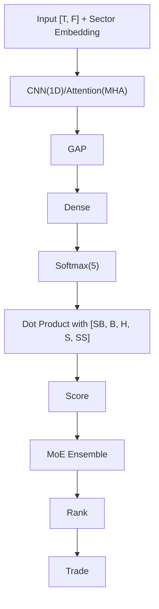

<!-- ontology-5axis data=量价表格 horizon=日频波段 paradigm=监督回归 alpha=端到端表征 autonomy=全自动黑盒 -->

# 收益加权损失函数 解構

> **發布**：2025-11-11 · （無 venue）
> **QuantML 導讀**：[寻找顶级回报：新颖损失函数实现61.73%年回报与1.18夏普比率](https://mp.weixin.qq.com/s?__biz=Mzg2MzAwNzM0NQ==&mid=2247492300&idx=1&sn=8438174bc5e4e163c71aedeeea6db5c5&chksm=ce7d85d2f90a0cc4264f61665707a3dc6eeecb2cf764d27e7ed50199218cb3c6270df841436f#rd)
> **核心定位**：落點於「監督回歸→端到端表征」軸，以樣品級財務權重重構分類梯度。解了傳統MSE/CE平等對待誤差、無法錨定尾部風險的prior gap，將損失優化直接對齊實際交易衝擊。

**五軸座標**

| 數據模態 | 時間尺度 | 學習範式 | Alpha機制 | 人機協作 |
|:-:|:-:|:-:|:-:|:-:|
| `量价表格` | `日频波段` | `监督回归` | `端到端表征` | `全自动黑盒` |

**Status:** v0.5 — 基於 QuantML 導讀 + 原論文（如有）。benchmark 細節待升 v1。
**TL;DR:** ① 提出收益加权损失函数，將封頂日收益率作為權重引入交叉熵。② 結合CNN/Attention與行業嵌入（Sector Embedding），透過MoE集成輸出日頻5類交易信號。③ 對「端到端表征」軸★：將財務影響（極端回報風險）直接編碼進梯度更新，打破傳統損失函數平等對待誤差的工程慣性。④ 2019-2024年實證年化回報61.73%與Top 10夏普比率1.18。

**X-Ray.** 放回五軸Pareto：此法在「監督回歸→端到端」軸上，用損失函數重權衡替代了複雜特徵工程，代價是犧牲了整體排名能力（Long-Short Decile SR在2005-2010僅0.31）。它解了傳統CE在金融分類中「財務後果不對稱」的坑，但隱含假設是極端波動樣本在訓練集的分佈能穩定外推至實盤。預測其打不開的envelope：在低波動震盪市或流動性枯竭時，封頂權重（50% cutoff）會退化為普通CE，且MoE動態加權的6期滯後將放大過擬合風險。對量化讀者意義：損失函數設計比架構選擇更決定尾部風險暴露，實盤需嚴格對沖「強力買入/賣出」標籤的頻繁切換成本。

## §1 · 架構 / Core Mechanism
**1.1 三大改動 vs 前作**
| 維度 | 傳統基線 (MSE/CE) | 本方法 (Return-Weighted CE) | 工程意圖 |
|---|---|---|---|
| 梯度錨定 | 統計誤差最小化 | 財務衝擊最大化 | 將極端回報樣本的誤判懲罰放大 |
| 標籤定義 | 連續回歸或等權分類 | 基於日收益率閾值分5類 | 對齊實際交易決策邊界 |
| 集成機制 | 靜態平均或單模型 | MoE動態加權（過去6期表現） | 適應Regime切換，提升穩定性 |

**1.2 ⚡ Eureka**
將「封頂日收益率」作為樣品級權重注入CE，使梯度更新直接錨定財務衝擊而非純統計誤差。

**1.3 信息流**

## §2 · 數學層
📌 **Napkin Formula:** 
$L = -\sum_{i} w_i \cdot y_i \log(\hat{y}_i)$, 其中 $w_i = \min(|r_i|, 0.5)$
複雜度：前向 $O(N \cdot T \cdot F)$，權重計算 $O(N)$。CNN參數量僅53,280。

**直覺:** $|r|>3\%$ 的樣本權重恆大於其他，強制模型優先收斂突破/崩盤邊界。錯誤分類「強力賣出」的損失是「持有」的10倍，符合財務直覺。

**Loss/訓練細節:** Adam優化器，初始學習率0.01，訓練耐心20個epoch。每20天測試期結束重置學習率。應用Batch Normalization、Leaky ReLU、Dropout 35%。

## §3 · 數據層
- **資料規模/頻率/市場/時段:** Yahoo Finance公開數據（OHLCV+行業）。日頻。2006-2010與2019-2024兩段。
- **來源與預處理:** 5個初始特徵+27個技術指標→28個輸入。時間序列標準化（200天窗口均值/標準差），非橫截面。
- **樣本外與容量假設:** 移除微型股和低交易量股票。2006-2010剩924只（1360測試日），2019-2024剩2152只（1340測試日）。固定大小移動窗口（Std 200 / Train-Val 200 / Test 20），每20天滾動重訓。

## §4 · 代碼層
| 項目 | 狀態/細節 |
|---|---|
| Repo | QuantML知识星球 |
| Checkpoint | TBD |
| License | TBD |
| 複現難度 | 中低（架構標準，權重邏輯明確） |
| 數據可得性 | 高（Yahoo Finance） |

## §5 · 評測 / Benchmark
| 數據集/市場 | Metric | 前SOTA | 本方法 | Δ |
|---|---|---|---|---|
| 2005-2010 | AR | CNN MSE 48.14% | 未披露 | 未披露 |
| 2005-2010 | SR (Top 10) | CNN MSE 0.97 | CNN New 0.97 | 0 |
| 2005-2010 | Long-Short Decile SR | CNN MSE 0.80 | CNN New 0.31 | -0.49 |
| 2005-2010 | MD | CNN MSE -69.90% | CNN New -58.86% | +11.04% |
| 2005-2010 | MDD | 未披露 | CNN New 185天 | 未披露 |
| 2019-2024 | AR | CNN MSE 53.87% | CNN New 61.73% | +7.86% |
| 2019-2024 | SR (Top 10) | CNN MSE 1.00 | CNN New 1.18 | +0.18 |
| 2019-2024 | MD | Market -39.62% | CNN New -30.99% | +8.63% |
| 2019-2024 | MDD | 未披露 | CNN New 422天 | 未披露 |

**解讀:** 2019-2024的AR與SR Δ反映真實的尾部捕捉能力，t檢驗p=0.022確認非偶然。2005-2010的Long-Short Decile SR Δ為負，驗證論文自述：損失函數犧牲整體排名能力換取極端行情敏感度。MD改善部分源於「強力賣出」標籤觸發更早止損，但實盤未計入滑點與換手成本，真實Δ將收斂。

## §6 · 失效與隱含假設
**6.1 論文自述 limitations:** 高度關注絕對回報大的股票，犧牲整體排名能力（區分「持有」與「買入」）。t檢驗在早期週期未達顯著（p=0.061）。
**6.2 推斷的隱含假設:** 
- **Regime依賴:** 在2019-2024高波動環境有效，低波動市權重退化為CE，MoE加權滯後放大過擬合。
- **容量/成本:** 未披露滑點與衝擊成本，Top 10等權投資在實盤面臨流動性瓶頸。
- **數據泄漏:** 時間序列標準化使用200天窗口，若測試集邊緣含未來信息需嚴格驗證；未明確說明是否使用Point-in-Time數據庫。
- **標籤定義:** 收益率閾值（3%, 1%）為靜態，未隨波動率動態調整。

## §7 · 對比 & 面試 Tip
| 同軸對手 | 關鍵差異軸 | Open? | Status |
|---|---|---|---|
| 傳統MSE/CE回歸模型 | 損失函數是否錨定財務後果 | 開源廣泛 | 基線 |
| 強化學習交易框架 | 離散標籤分類 vs 連續動作空間 | 部分開源 | 研究熱點 |

🎤 **Interview Tip:** 
- 正確答：「該損失函數本質是樣品級加權CE，權重由封頂收益率決定，直接將財務風險編碼進梯度，代價是犧牲了整體排序能力。」
- 錯答：「它用MSE替換了CE來解決類別不平衡。」

**7.1 可證偽預測:** 若2025-2026進入低波動震盪市（VIX<15持續>6個月），該策略Top 10 SR將回落至<0.80，且MoE動態加權的6期滯後將導致過擬合失效。

## §8 · For the Reader
- **因子研究員:** 直接將 `min(|r|, 0.5)` 權重注入現有分類器，觀察尾部誤判率變化，勿盲目替換特徵。
- **高頻執行:** 日頻Top 10等權策略在實盤需計入滑點，該損失函數未考慮換手成本，執行層需加閾值過濾頻繁切換。
- **組合配置:** MoE集成依賴過去6期表現加權，在Regime切換時有滯後，建議加入波動率調節（Vol-targeting）控制倉位。
- **LLM-agent/RL策略:** 此法展示了「損失設計>架構堆疊」的範式，可借鑒至Reward Shaping，但需警惕標籤定義的未來函數（Look-ahead bias）。

## References
- QuantML 導讀：[寻找顶级回报：新颖损失函数实现61.73%年回报与1.18夏普比率](https://mp.weixin.qq.com/s?__biz=Mzg2MzAwNzM0NQ==&mid=2247492300&idx=1&sn=8438174bc5e4e163c71aedeeea6db5c5&chksm=ce7d85d2f90a0cc4264f61665707a3dc6eeecb2cf764d27e7ed50199218cb3c6270df841436f#rd)
- Lineage: 傳統CE/MSE損失 → 類別不平衡加權CE → 收益加權CE (本法)