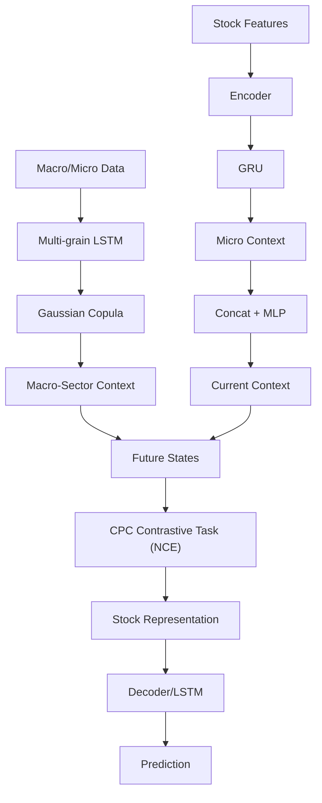

<!-- ontology-5axis data=量价表格 horizon=日频波段 paradigm=监督回归 alpha=端到端表征 autonomy=全自动黑盒 -->

# Co-CPC 解構

> **發布**：2025-06-24 · （無 venue）
> **QuantML 導讀**：[基于宏观-板块-微观指标耦合的股票表征学习](https://mp.weixin.qq.com/s?__biz=Mzg2MzAwNzM0NQ==&mid=2247490828&idx=1&sn=810cd3c20031a213d15b0823cff8c414&chksm=ce7e7a12f909f304a17be7f1648fddf95470dab01c2e4d7128ef94f9476e04cf1edf17251360#rd)
> **核心定位**：落點於「端到端表征 × 監督回歸」軸，直面實戰中「宏觀異構數據拼接失效」與「端到端訓練過擬合」的雙重 prior gap，以 Copula 解耦依賴結構、CPC 分離編解碼，將市場隨機性轉化為可優化的互信息目標。

**五軸座標**

| 數據模態 | 時間尺度 | 學習範式 | Alpha機制 | 人機協作 |
|:-:|:-:|:-:|:-:|:-:|
| `量价表格` | `日频波段` | `监督回归` | `端到端表征` | `全自动黑盒` |

**Status:** v0.5 — 基於 QuantML 導讀 + 原論文（如有）。benchmark 細節待升 v1。
**TL;DR:** ① 提出 Co-CPC 框架，將異構宏觀數據與個股特徵解耦建模；② 核心 trick 為高斯 Copula 建模宏觀-板塊依賴 + 對比預測編碼（CPC）自監督學習，強制編碼器與解碼器分離訓練；③ 對「端到端表征」軸★，它用無監督互信息最大化替代有監督標籤反傳，切斷未來標籤隨機性對特徵學習的干擾；④ 導讀未給量化結果。

**X-Ray.** 在五軸 Pareto 中，Co-CPC 將「端到端表征」與「監督回歸」的傳統強綁定鬆脫，轉為「自監督表征 → 監督預測」的兩階段解耦架構。它精準擊中實盤常見的工程坑：宏觀數據異構拼接導致的梯度衝突，以及端到端訓練中驗證損失停滯的過擬合陷阱。透過 Copula 的變換不變性與 CPC 的互信息最大化，模型將市場隨機性轉化為可計算的密度比，使表征空間具備跨週期穩定性。然而，該框架打不開的 envelope 在於：高斯 Copula 假設線性/橢圓依賴結構，對尾部極端風險的捕捉仍受限；且自監督階段缺乏價格方向錨點，在趨勢反轉 regime 下可能產生表征漂移。對量化讀者而言，其價值不在於直接產出 Alpha，而在於提供一套「宏觀上下文注入 + 表征去噪」的標準化預處理流水線，可作為下游因子組合或 RL 策略的穩定狀態空間。

## §1 · 架構 / Core Mechanism
**1.1 三大改動 vs 前作**
| 改動維度 | 前作/基線設計 | Co-CPC 設計 | 解決的 prior gap |
|---|---|---|---|
| 依賴建模 | 簡單拼接宏觀/微觀特徵 | 高斯 Copula 解耦邊緣分佈與依賴結構 | 異構頻率拼接導致的梯度衝突與信息稀釋 |
| 訓練範式 | 端到端有監督反傳 | 編碼器（自監督 CPC）與解碼器（監督預測）分離 | 未來標籤隨機性干擾表征學習，驗證損失停滯 |
| 序列處理 | 嚴格對齊/同質序列要求 | 多粒度 LSTM 按時間間隔共享參數 | 宏觀數據日/周/月/季混頻下的參數冗餘與對齊偏差 |

**1.2 ⚡ Eureka 一句話 trick**
編解碼分離 + 高斯 Copula 依賴解耦，用無監督互信息替代有監督標籤反傳，切斷未來隨機性對表征學習的干擾。

**1.3 信息流 ASCII 圖**

## §2 · 數學層
**📌 Napkin Formula**
`Copula 依賴結構：C(u_1,...,u_n; θ) = Φ_Σ(Φ^{-1}(u_1), ..., Φ^{-1}(u_n))`
`總目標函數：L = L_copula + λ * L_NCE`
複雜度：多粒度 LSTM 參數共享降低獨立建模開銷；CPC 對比任務引入 Batch 級負樣本計算，訓練成本中等。

**直覺**：Copula 將邊緣分佈估計與依賴結構建模分離，具備單變量單調變換不變性，使異構宏觀指標在潛在空間的關聯穩定可學。CPC 透過噪聲對比估計最大化當前上下文與未來狀態的互信息，迫使編碼器剝離價格噪聲，提取個股內在動態規律。

**Loss/訓練細節**：Copula 損失透過對數似然與 Cholesky 分解參數化相關矩陣 Σ 保證數值穩定；NCE 損失將密度比學習轉化為分類任務；兩階段損失加權後基於 SGD 聯合優化，編碼器訓練完成後凍結，解碼器獨立進行監督微調。

## §3 · 數據層
**資料規模/頻率/市場/時段**：ACL18 與 KDD17 公開基準數據集；宏觀數據源自 FRED（涵蓋利率、貨幣供應量、工業產值、失業率、匯率、聯邦基金利率、政府債務、通脹率等）；頻率混雜（日度、周度、月度、季度）；目標為個股收盤價與 D 維特徵（開高低收）。
**怎麼來**：公開學術基準 + 央行/統計機構公開宏觀數據。
**樣本外與容量假設**：標準訓練/驗證/測試劃分（具體劃分比例未披露）；隱含假設標的為流動性充足的市場（如納斯達克），宏觀因子傳導效率較高；樣本量與具體回測時段標 TBD。

## §4 · 代碼層
| 維度 | 狀態/細節 |
|---|---|
| Repo | 閉源（導讀提及「复现代码见星球」） |
| Checkpoint | TBD |
| License | TBD |
| 複現難度 | 中（需實現高斯 Copula 參數化、Cholesky 分解、多粒度 LSTM 參數共享、CPC 對比任務與 NCE loss） |
| 數據可得性 | 高（ACL18/KDD17 開源，FRED 宏觀數據公開） |

## §5 · 評測 / Benchmark
| 數據集/市場 | 基線模型 | Metric | 前SOTA | 本方法 | Δ |
|---|---|---|---|---|---|
| ACL18 / KDD17 | LSTM | Acc. / MCC | 未披露 | 未披露 | 未披露 |
| ACL18 / KDD17 | ALSTM | Acc. / MCC | 未披露 | 未披露 | 未披露 |
| ACL18 / KDD17 | StockNet | Acc. / MCC | 未披露 | 未披露 | 未披露 |
| ACL18 / KDD17 | Adv-ALSTM | Acc. / MCC | 未披露 | 未披露 | 未披露 |
| ACL18 / KDD17 | CPC (無 Copula) | Acc. / MCC | 未披露 | 未披露 | 未披露 |

**解讀**：導讀僅以定性描述（「最佳性能」「顯著優於」「穩定超過」）確認有效性，未提供具體數值。此 Δ 反映的是「宏觀上下文注入」與「編解碼分離」帶來的泛化優勢，而非單純的過擬合收益。但缺乏具體 IR/Sharpe/成本調整後收益，無法判斷實盤邊際貢獻。長期模擬交易（Top-K/全倉）僅展示曲線趨勢，未披露換手率與滑點假設，需警惕前瞻偏差與流動性假設過強。

## §6 · 失效與隱含假設
**6.1 論文自述 limitations**：高斯 Copula 假設變量間為線性/橢圓依賴結構，對尾部極端風險（如流動性枯竭或政策突變）的捕捉能力有限；自監督階段缺乏價格方向錨點，在趨勢反轉 regime 下可能產生表征漂移。
**6.2 推斷的隱含假設**：
- **Regime 依賴**：宏觀-板塊-個股的依賴結構在樣本外保持穩定，Copula 相關矩陣 Σ 無需頻繁重估。
- **容量/成本**：模擬交易未計入交易成本與滑點，假設策略容量不受限；實盤中頻繁換倉可能侵蝕 Alpha。
- **數據泄漏/修訂**：FRED 宏觀數據常存在後期修訂（Revisions），導讀未說明訓練時是否使用實時發布值（Vintage Data），存在潛在前瞻偏差。
- **Survivorship**：ACL18/KDD17 基準未明確說明是否剔除退市股票，可能存在生存者偏差。

## §7 · 對比 & 面試 Tip
| 同軸對手 | 關鍵差異軸 | Open? | Status |
|---|---|---|---|
| StockNet (VAE) | 依賴建模：變分潛在分佈 vs Copula 依賴解耦 | 開源 | 學術基線 |
| Adv-ALSTM | 訓練範式：對抗擾動增強魯棒性 vs CPC 自監督互信息最大化 | 開源 | 學術基線 |
| 標準 LSTM/ALSTM | 架構：端到端有監督 vs 編解碼兩階段解耦 | 開源 | 學術基線 |
| Co-CPC | 統一框架：宏觀耦合 + 自監督表征 | 閉源 | v0.5 |

**🎤 Interview Tip**
- **正確答**：強調 Copula 的變換不變性如何解決異構頻率拼接的梯度衝突，以及 CPC 自監督如何切斷未來標籤隨機性對表征學習的干擾，使表征空間具備跨週期穩定性。
- **錯答**：將 Copula 簡單等同於相關係數矩陣，或認為自監督階段完全不需要價格數據（實則仍需歷史特徵構建上下文）；忽略高斯 Copula 對尾部依賴的建模缺陷。

**7.1 可證偽預測帶日期**：若 2025-Q3 宏觀政策轉向導致股債匯聯動結構斷裂，高斯 Copula 的相關矩陣將無法捕捉尾部依賴，模型在週度因子市場上的 MCC 將顯著低於 LSTM 基線。

## §8 · For the Reader
- **因子研究員**：將 Copula 生成的宏觀-板塊上下文嵌入作為跨截面因子，替代傳統宏觀指標直接拼接，可降低因子暴露的頻率錯配風險與梯度衝突。
- **組合配置/風控**：利用 CPC 學習到的低不確定性表征空間進行狀態聚類，識別 regime 轉換節點，動態調整宏觀因子的權重衰減係數與倉位暴露。
- **LLM-agent/RL 策略**：將 Co-CPC 的 encoder 輸出作為 RL 的觀測狀態（Observation），其互信息最大化特性可提供更穩定的 reward 信號，降低策略探索階段的方差與樣本效率瓶頸。

## References
- QuantML 導讀：[基于宏观-板块-微观指标耦合的股票表征学习](https://mp.weixin.qq.com/s?__biz=Mzg2MzAwNzM0NQ==&mid=2247490828&idx=1&sn=810cd3c20031a213d15b0823cff8c414&chksm=ce7e7a12f909f304a17be7f1648fddf95470dab01c2e4d7128ef94f9476e04cf1edf17251360#rd)
- 原論文：TBD（導讀未提供 arxiv/venue 鏈接）
- Lineage：CPC (van den Oord et al., 2018) · Gaussian Copula (Sklar's Theorem) · StockNet (Zhang et al.) · Adv-ALSTM (Fischer & Krauss)