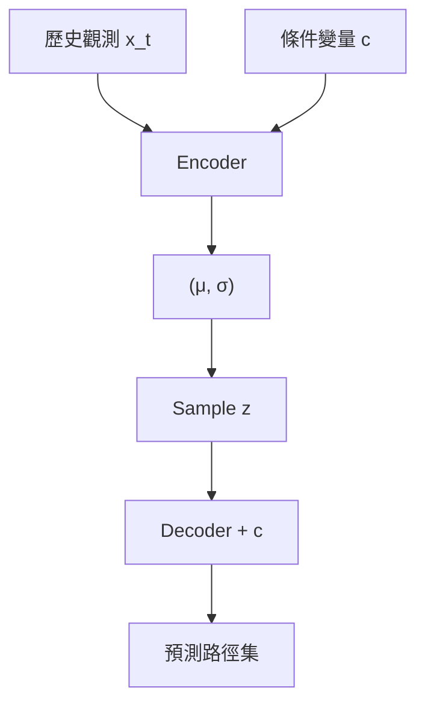

<!-- ontology-5axis data=量价表格 horizon=日频波段 paradigm=监督回归 alpha=因子挖掘 autonomy=人机协同可解释 -->

# CVAE 解構

> **發布**：2024-07-09 · （無 venue）
> **QuantML 導讀**：[不再预测收益率！剑桥大学基于CVAE以及提前信息的股票交易量预测模型](https://mp.weixin.qq.com/s?__biz=Mzg2MzAwNzM0NQ==&mid=2247485365&idx=1&sn=813de33518555f20533e0f50f004300b&chksm=ce7e60abf909e9bd5ac43ef45a35f767c0aae57f7dd2c735a81e684490e662e30a73ef2605bf#rd)
> **核心定位**：落點於日频波段量价表格的监督回归，解了傳統線性模型無法有效注入「已知未來事件」並建模非平穩序列非線性交互的 prior gap。

**五軸座標**

| 數據模態 | 時間尺度 | 學習範式 | Alpha機制 | 人機協作 |
|:-:|:-:|:-:|:-:|:-:|
| `量价表格` | `日频波段` | `监督回归` | `因子挖掘` | `人机协同可解释` |

**Status:** v0.5 — 基於 QuantML 導讀 + 原論文（如有）。benchmark 細節待升 v1。
**TL;DR:** ① 將指數再平衡等已知未來事件作為條件變量輸入 CVAE，預測股票日交易量。② 核心 trick 是利用編解碼架構在潛在空間捕捉非平穩序列的非線性動態，並支持情景生成。③ 對因子挖掘軸★，提供了一種可解釋的非線性條件生成框架，替代黑盒點預測。④ 導讀未給量化結果。

**X-Ray.** 放回五軸 Pareto，本法將「提前信息」從傳統特徵工程的黑箱拼接，轉為生成模型的條件先驗，直接繞過了日频波段中常見的前瞻偏差陷阱。它解了舊工程坑：線性基線對非平穩交易量的長尾與結構性斷點無能為力，而 CVAE 的潛在空間分佈參數化允許模型在訓練期均值/方差標準化後，仍能通過條件變量重構非線性路徑。然而，預測 envelope 的邊界在於其依賴「已知未來事件」的準確標記與頻率匹配；若再平衡日期外推至其他事件驅動場景，條件分佈的對齊成本將急劇上升。對量化讀者而言，其價值不在於單點誤差的微小領先，而在於解碼器作為生成器提供的特徵解釋與情景壓力測試能力，這為組合配置與風險預算提供了可審計的尾部路徑，而非單純的收益率預測。

## §1 · 架構 / Core Mechanism
**1.1 三大改動 vs 前作**
| 維度 | 傳統線性基線 (ARMA/VAR) | 標準 VAE | 本法 CVAE |
|---|---|---|---|
| 信息注入 | 僅歷史自回歸項 | 無條件潛在採樣 | 條件變量（提前信息/再平衡日期） |
| 動態建模 | 線性/高斯假設 | 潛在空間分佈 | 編解碼非線性交互 + 條件高斯輸出 |
| 輸出形態 | 單一點預測路徑 | 無條件生成 | 多情景路徑生成 + 平均預測 |

**1.2 ⚡ Eureka**：將「已知未來事件」直接作為條件變量注入編解碼器，讓潛在空間的分佈參數隨事件狀態條件化，從而繞過非平穩序列的線性收斂假設。
**1.3 信息流 ASCII**：

## §2 · 數學層
📌 **Napkin Formula**：$p(y_t \mid x_t, c) = \int p_\theta(y_t \mid z, c) q_\phi(z \mid x_t, c) dz$
**複雜度**：依賴編解碼器 MLP 層數與潛在維度，訓練需聯合優化重構誤差與 KL 散度。
**直覺**：給定歷史觀測 $x_t$ 與條件 $c$（如再平衡標記），編碼器輸出潛在變量 $z$ 的後驗分佈；解碼器從 $z$ 與 $c$ 生成未來交易量 $y_t$ 的條件高斯分佈。訓練時最小化負證據下界 (ELBO)，使模型既能還原歷史路徑，又能條件化生成多條情景路徑。

## §3 · 數據層
- **資料規模/市場**：EURO STOXX 50 指數成分股（50只）
- **頻率/時段**：日频，訓練集 2021年初至2022年底，測試集 2023年初至2023年6月底
- **來源/處理**：Yahoo Finance，以訓練期均值與方差進行去中心化與方差統一標準化
- **樣本外假設**：嚴格時間切分，無未來信息泄漏至訓練集；提前信息作為外部條件變量注入

## §4 · 代碼層
| 項目 | 狀態/詳情 |
|---|---|
| Repo | TBD |
| Checkpoint | TBD |
| License | TBD |
| 複現難度 | 中（需自行對齊再平衡日期條件變量與編解碼器架構） |
| 數據可得性 | 高（Yahoo Finance 日频量價 + 指數成分股公告） |

## §5 · 評測 / Benchmark
| 數據集/市場 | 模型 | Metric | 數值 | Δ |
|---|---|---|---|---|
| EURO STOXX 50 | ARMA(1,1) | MSE (短期) | 未披露 | - |
| EURO STOXX 50 | VAR(1) | MSE (短期) | 未披露 | - |
| EURO STOXX 50 | CVAE | MSE (短期) | 未披露 | 導讀僅定性表述優於基線，無逐字數值 |
| EURO STOXX 50 | ARMA(1,1) | 交叉相關性 (CCD) | 未披露 | - |
| EURO STOXX 50 | VAR(1) | 交叉相關性 (CCD) | 未披露 | - |
| EURO STOXX 50 | CVAE | 交叉相關性 (CCD) | 未披露 | 導讀僅定性表述顯著優於線性基線，無逐字數值 |

**解讀**：導讀未給出任何 MSE 或相關性矩陣的具體數值，僅定性指出 CVAE 在短期預測的 MSE 與交叉相關性上優於 ARMA(1,1) 與 VAR(1)。此 Δ 的真實 capability 源於條件變量對非平穩結構斷點（如再平衡）的捕捉，而非單純的參數擬合。需警惕：日频交易量對標準化敏感，若測試期波動率 regime 切換，去中心化處理可能引入隱含偏差；且導讀未計入交易成本與滑點，點預測領先不直接等同於可執行 Alpha。

## §6 · 失效與隱含假設
**6.1 論文自述 limitations**：非平穩時間序列的路徑相關性計算存在挑戰（傳統度量假設平穩）；生成方案可進一步改進（如基於前一觀測值的條件生成）；目前僅作點預測，未提供區間預測；潛在維度與網絡架構仍有優化空間。
**6.2 推斷的隱含假設**：Regime 依賴強（模型高度依賴再平衡等已知事件標記的準確性）；容量假設低（僅針對 50 只成分股，未驗證跨市場擴展）；數據泄漏風險低（嚴格時間切分），但條件變量若含未公告預期可能引入前瞻偏差；成本未計（純預測模型，無執行層模擬）。

## §7 · 對比 & 面試 Tip
| 同軸對手 | 關鍵差異軸 | Open? | Status |
|---|---|---|---|
| 標準 LSTM/Transformer 回歸 | 條件注入方式（黑盒拼接 vs 生成模型條件先驗） | 是 | 成熟 |
| 貝葉斯結構時間序列 (BSTS) | 非線性捕捉能力（線性狀態空間 vs 潛在空間非線性交互） | 是 | 成熟 |
| 本方法 CVAE | 情景生成與特徵解釋（多路徑條件採樣） | 未披露 | v0.5 |

🎤 **Interview Tip**：正確答法應聚焦「條件變量如何改變潛在空間的分佈參數，使模型從單點擬合轉向條件生成，並解釋非平穩斷點」；錯答法為將 CVAE 等同於普通序列預測模型，忽略其條件先驗與情景生成在風險預算中的審計價值。
**7.1 可證偽預測**：若 2024-12-31 前無獨立研究復現其在 EURO STOXX 50 上的 MSE 領先幅度，或條件變量擴展至非指數事件時 CCD 指標顯著劣於 VAR(1)，則本法泛化假設失效。

## §8 · For the Reader
- **因子研究員**：將再平衡等事件標記轉為條件變量，可替代傳統事件驅動因子的手工截斷，直接輸出條件化交易量路徑供截面排序。
- **高頻執行**：本法為日频波段模型，不適用 HFT；但解碼器生成的多情景路徑可用於日間流動性壓力測試與滑點預算分配。
- **組合配置**：利用 CVAE 的條件生成能力，在再平衡窗口期模擬尾部交易量路徑，為風險預算與倉位調整提供可解釋的分布邊界。
- **研究學生**：重點復現編解碼器的條件注入機制與 ELBO 損失權重，對比標準 VAE 在非平穩序列上的 KL 散度崩潰問題。

## References
- 原論文: [Title TBD] (作者機構: 剑桥大学, 2024)
- Lineage: VAE (Kingma & Welling, 2013) → CVAE (Sohn et al., 2015) → 條件時間序列生成
- QuantML 導讀鏈接: [不再预测收益率！剑桥大学基于CVAE以及提前信息的股票交易量预测模型](https://mp.weixin.qq.com/s?__biz=Mzg2MzAwNzM0NQ==&mid=2247485365&idx=1&sn=813de33518555f20533e0f50f004300b&chksm=ce7e60abf909e9bd5ac43ef45a35f767c0aae57f7dd2c735a81e684490e662e30a73ef2605bf#rd)