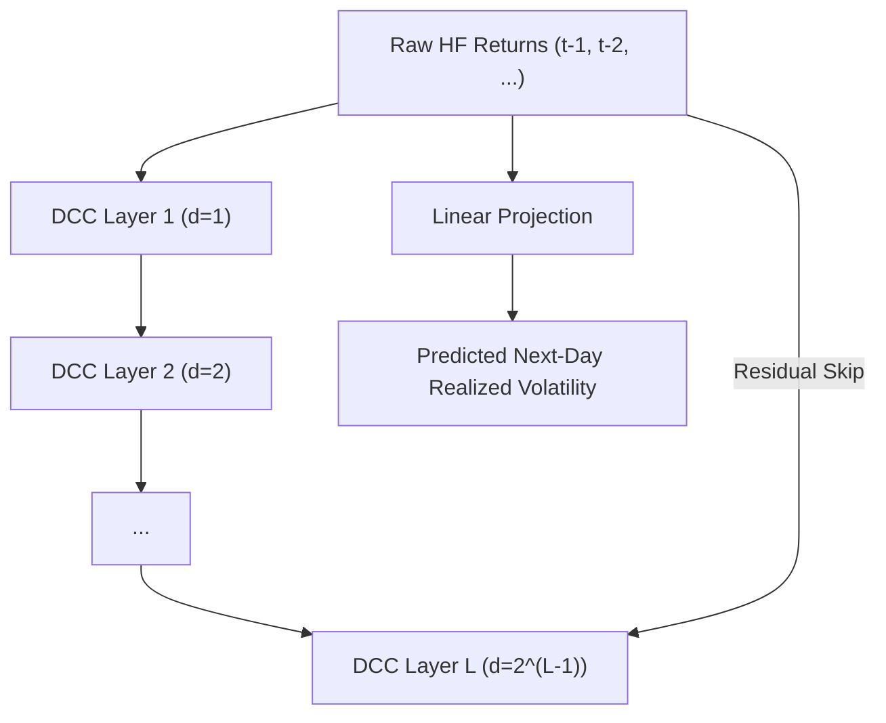

<!-- ontology-5axis data=量价表格 horizon=日频波段 paradigm=监督回归 alpha=风险择时 autonomy=全自动黑盒 -->

# DeepVol 解構

> **發布**：2025-05-04 · （無 venue）
> **QuantML 導讀**：[DeepVol：基于高频数据的波动率预测模型](https://mp.weixin.qq.com/s?__biz=Mzg2MzAwNzM0NQ==&mid=2247490274&idx=1&sn=3c9bd18e7590210ddf1f00e54e7fcd15&chksm=ce7e7dfcf909f4eadc57481aa05ba5aa2a47c3f0681bf340887236666686ac36266b8767f84cf#rd)
> **核心定位**：落點於「量價表格→日頻波段」的監督回歸，解了傳統波動率模型需手動構建已實現指標（Realized Measures）的預處理瓶頸，直接以擴張因果卷積（DCC）對齊高頻原始收益與日度波動率標籤。

**五軸座標**

| 數據模態 | 時間尺度 | 學習範式 | Alpha機制 | 人機協作 |
|:-:|:-:|:-:|:-:|:-:|
| `量价表格` | `日频波段` | `监督回归` | `风险择时` | `全自动黑盒` |

**Status:** v0.5 — 基於 QuantML 導讀 + 原論文（如有）。benchmark 細節待升 v1。
**TL;DR:** ① 用 Dilated Causal Convolution 直接吃原始高頻收益，跳過 Realized Variance 等指標的預處理與信息損耗。② 核心 trick 是指數級擴張感受野 + 殘差連接，在參數不暴增的前提下捕獲長程依賴。③ 對「風險擇時」軸★：提供純數據驅動的次日波動率預測，便於動態調整組合風險預算。④ 導讀未給量化結果，僅聲明「顯著提高了基線模型的性能」。

**X-Ray.** DeepVol 實質是將高頻微觀結構過濾與特徵提取的任務交給 DNN，而非傳統計量經濟學的參數化假設。它解了「已實現指標需人工選頻以平衡微觀結構噪聲與信息量」的工程坑，但代價是模型成為黑盒，且感受野固定為 1 天時可能遺漏隔夜跳躍風險。預測它打不開的 envelope：無法處理非同步交易、流動性枯竭或極端斷層行情下的分佈外推（OOD）。對量化讀者意義：若組合管理依賴日頻波動率預算（Volatility Targeting），此架構可作為低延遲的風險信號生成器，但需警惕高頻數據的存儲成本與時間序列劃分時的潛在泄漏。

## §1 · 架構 / Core Mechanism
| 改動維度 | 傳統/前作 (GARCH/HAR/LSTM) | DeepVol | 工程/數學意涵 |
|---|---|---|---|
| 輸入模態 | 日度收益 或 預計算已實現指標 | 原始高頻收益序列 | 消除預處理信息損耗，模型隱式學習微觀結構過濾 |
| 時序建模 | 遞歸狀態 (RNN/LSTM) 或 線性加權 | 擴張因果卷積 (DCC) + 殘差連接 | 感受野指數級擴張，參數線性增長，解決梯度消失與長程依賴 |
| 預測粒度 | 同頻預測或日度聚合 | 高頻輸入 → 日度輸出 | 隱式執行時域轉換，非自回歸架構降低訓練延遲 |

**⚡ Eureka:** 用 `dilation` 替換 `recursion`，讓卷積核隔點採樣，單層感受野呈指數擴張，配合殘差跳連直達深層。
**信息流 ASCII:**

## §2 · 數學層
📌 **Napkin Formula:**
$$y_{t}^{(l)} = \sum_{k=0}^{K-1} x_{t - k \cdot d}^{(l-1)} \cdot w_k, \quad x^{(l+1)} = \text{Affine}(y^{(l)}) + x^{(l-1)}$$
**直覺:** 擴張因子 $d$ 讓濾波器跳過中間時間步，感受野隨層數指數增長；殘差連接 $x^{(l-1)}$ 提供梯度高速公路，避免深層卷積退化。
**Loss/訓練:** 採用準對數似然（Quasi-log-likelihood）作為損失函數，優化器為 ADAM，配合驗證集 Early Stopping。計算複雜度為 $O(N)$，遠低於自回歸架構的 $O(N^2)$ 或 Transformer 的 $O(N^2)$。

## §3 · 數據層
- **市場/資產:** 納斯達克 100 指數成分股
- **頻率/時段:** 1、5、15、30、60 分鐘級別；明確排除隔夜交易時段數據
- **樣本劃分:** 訓練集 12 個月（2019-09-30 至 2020-09-30）｜驗證集 3 個月（2020-10-01 至 2020-12-31）｜測試集 9 個月（2021-01-01 至 2021-09-30）
- **容量假設:** 依賴完整無缺失的分鐘級報價/成交數據，需嚴格按時間戳滾動切割以防前視偏差。

## §4 · 代碼層
| 維度 | 狀態/細節 |
|---|---|
| Repo | TBD |
| Checkpoint | TBD |
| License | TBD |
| 複現難度 | 中（需高頻數據清洗管道 + PyTorch Lightning 環境 + GPU 顯存） |
| 數據可得性 | 低（需付費商業高頻數據源或機構級 Tick/分鐘級庫） |

## §5 · 評測 / Benchmark
| 數據集/市場 | Metric | 基線模型 (逐列) | 本方法 | Δ |
|---|---|---|---|---|
| NASDAQ 100 (Test: 2021-01-01 至 2021-09-30) | MAE / RMSE / SMAPE / ME / MedAE / QLIKE | IGARCH / FIGARCH / TARCH / APARCH / AGARCH / EGARCH / HEAVY / Realized GARCH / Realized EGARCH / ARFIMA / HAR / MLP / LSTM | 未披露 | 未披露 |

**解讀論斷:** 導讀僅給出定性結論「顯著提高了基線模型的性能」，未披露任何具體數值。此類「全基線通吃」的聲明在波動率預測領域常見，但需警惕：① 高頻數據劃分若未嚴格對齊交易時間戳，易產生隱性前視偏差；② 微觀結構噪聲在訓練集與測試集的統計特性若發生 Regime Shift（如 2021 年市場結構變化），DNN 的泛化能力可能急劇下降；③ 未計入數據存儲、特徵對齊與 GPU 推理的真實成本，純算法指標的 Δ 在實盤中會被摩擦成本稀釋。

## §6 · 失效與隱含假設
**6.1 論文自述 limitations:** 排除隔夜收益分析；感受野固定為 1 天可能無法捕捉更長週期的波動聚集效應；模型依賴高頻數據的連續性，對數據缺失或異常報價敏感。
**6.2 推斷的隱含假設:** 
- **Regime 依賴:** 訓練期（2019-2020）與測試期（2021）的流動性與波動結構需同質，否則 DCC 學習的濾波權重會失效。
- **容量/成本:** 分鐘級全市場數據的 I/O 與存儲成本高昂，實盤延遲取決於數據管道優化，非模型本身。
- **數據泄漏:** 高頻滾動窗口若未嚴格按 `t` 時刻切割，易混入 `t+1` 的訂單簿快照或成交修正，導致樣本外指標虛高。
- **Survivorship:** NASDAQ 100 為存活者偏差樣本，未覆蓋退市或長期低流動性股票，實盤覆蓋面需擴展。

## §7 · 對比 & 面試 Tip
| 同軸對手 | 關鍵差異軸 | Open? | Status |
|---|---|---|---|
| HAR / Realized GARCH | 參數化 vs 非參數黑盒；需預計算指標 vs 原始輸入 | Open (計量經濟學標準) | 穩健但特徵工程繁瑣 |
| LSTM / GRU | 遞歸狀態 vs 卷積跳連；梯度消失風險 vs 指數感受野 | Open (DL標準) | 訓練慢，長序列易退化 |
| Transformer | 全局注意力 vs 局部擴張卷積；$O(N^2)$ vs $O(N)$ | Open (LLM遷移) | 過參數化，金融時間序列易過擬合 |

🎤 **Interview Tip:** 
- **正確答:** 「DeepVol 用 DCC 替換 RNN 的遞歸依賴，核心優勢是感受野指數擴張且計算複雜度線性。實盤需驗證高頻數據切割的嚴格性，並評估微觀結構噪聲在 Regime 切換時的魯棒性。」
- **錯答:** 「它比 LSTM 好因為用了 Attention。」（混淆架構，DeepVol 是卷積非注意力）或「直接預測波動率所以不需要特徵工程。」（忽略了高頻數據清洗與時間戳對齊的隱性工程成本）。

**7.1 可證偽預測:** 若將感受野從 1 天擴展至 3-5 天，或引入隔夜收益率作為額外通道，模型在極端波動事件（如閃崩、宏觀數據發布日）的 QLIKE 損失應顯著下降；若無改善，則證明 DCC 的局部感受野已觸及信息瓶頸，需轉向圖神經網絡或混合架構。

## §8 · For the Reader
- **因子研究員:** 將 DeepVol 視為「波動率因子生成器」，輸出次日預測值後，可與傳統動量/價值因子正交化，構建波動率調整後的 Alpha 組合。
- **高頻執行/數據工程師:** 重點不在模型本身，而在數據管道。需設計嚴格的時間戳對齊與缺失值插補策略，避免分鐘級數據的碎片化導致 DCC 輸入張量維度錯亂。
- **組合配置/風控:** 將預測的次日波動率直接映射至風險預算（Volatility Targeting），動態調整槓桿或對沖比例。注意模型輸出為點估計，建議疊加歷史模擬法或 GARCH 殘差分佈以捕捉尾部風險。

## References
- 原論文/框架: DeepVol (無 venue, arxiv=None)
- Lineage: GARCH → HAR → Realized GARCH → LSTM/Transformer → Dilated Causal CNN
- QuantML 導讀鏈接: [DeepVol：基于高频数据的波动率预测模型](https://mp.weixin.qq.com/s?__biz=Mzg2MzAwNzM0NQ==&mid=2247490274&idx=1&sn=3c9bd18e7590210ddf1f00e54e7fcd15&chksm=ce7e7dfcf909f4eadc57481aa05ba5aa2a47c3f0681bf340887236666686ac36266b8767f84cf#rd)