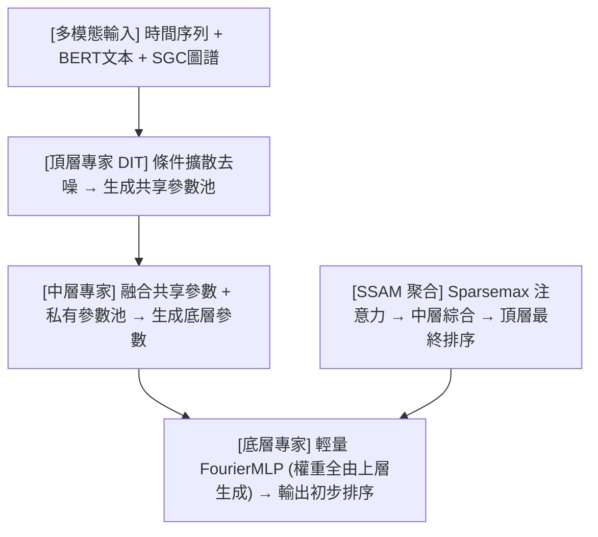

<!-- ontology-5axis data=多模态 horizon=日频波段 paradigm=监督回归 alpha=端到端表征 autonomy=全自动黑盒 -->

# DHMOE 解構

> **發布**：2025-06-27 · AAAI25
> **QuantML 導讀**：[AAAI 25 | 融合扩散模型与专家混合的层级化股票预测研究](https://mp.weixin.qq.com/s?__biz=Mzg2MzAwNzM0NQ==&mid=2247490858&idx=1&sn=a7ca3ad90535784bf9116af8fb76725c&chksm=ce7e7a34f909f322220426f75e3b3d8fd4739cda8dd1caa240b612ff3fd7ab1e42cab1e4ebec#rd)
> **原始論文**：[DHMoE: Diffusion Generated Hierarchical Multi-Granular Expertise for Stock Prediction](https://doi.org/10.1609/aaai.v39i11.33250)（Proceedings of the AAAI Conference on Artificial Intelligence · 2025 · 被引 3 · Crossref）
> **核心定位**：落點於「多模態 × 監督回歸 × 全自動黑盒」軸，解決傳統單一黑箱預測器無法模擬機構「自上而下教學／自下而上決策」協作流程的 prior gap，將異構信號轉化為可微的條件參數生成任務。

**五軸座標**

| 數據模態 | 時間尺度 | 學習範式 | Alpha機制 | 人機協作 |
|:-:|:-:|:-:|:-:|:-:|
| `多模态` | `日频波段` | `监督回归` | `端到端表征` | `全自动黑盒` |

**Status:** v0.5 — 基於 QuantML 導讀 + 原論文（如有）。benchmark 細節待升 v1。
**TL;DR:** ① 將投資公司層級化投研流程轉化為三層樹狀 MoE 架構；② 核心 trick 為用條件擴散模型（DIT）自頂向下生成底層專家參數，並透過稀疏綜合注意力（SSAM）自底向上聚合預測；③ 對「端到端表徵」軸的關鍵突破在於用生成式先驗替代靜態特徵拼接，降低多模態對齊的工程摩擦；④ 導讀指出相對最佳基線在風險調整收益與累計利潤上分別取得 17.37% 與 20.08% 的相對性能提升。

**X-Ray.** 在「多模態×監督回歸」Pareto 前沿，DHMOE 跳脫了特徵級拼接的舊工程坑，改走參數級生成路徑。它不試圖用單一 Transformer 硬吃所有異構信號，而是將擴散模型的反向去噪過程映射為「投研教學」，用條件分佈模擬市場隨機波動。這套架構對量化讀者的意義在於：它提供了一種可解釋的 MoE 路由機制（SSAM），能動態過濾低信噪比專家。但其 envelope 打不開的是高頻執行層面的滑點與容量瓶頸，且全自動黑盒屬性意味著微調成本極高，適合機構級中頻波段策略，而非散戶級因子挖掘。

## §1 · 架構 / Core Mechanism
**1.1 三大改動 vs 前作**
| 維度 | 傳統單一預測器 / 標準 MoE | DHMOE 改動 | 工程意圖 |
|---|---|---|---|
| 信號融合 | 靜態特徵拼接或早期注意力融合 | 擴散模型條件參數生成 | 將異構數據轉為動態權重先驗，避免維度災難 |
| 專家路由 | 靜態門控或基於輸入的 Softmax | 稀疏綜合注意力（SSAM）+ Sparsemax | 強制稀疏決策，模擬資深經理過濾噪音 |
| 訓練目標 | 單一 MSE/ ranking loss | 排序損失 + 條件擴散損失雙目標 | jointly 優化表徵生成與最終排序一致性 |

**1.2 ⚡ Eureka 一句話 trick + 直覺**
Trick：用條件擴散模型的反向去噪步長作為「教學週期」，逐層下發專家權重。
直覺：市場噪音本質是隨機游走，擴散過程天然匹配價格波動的分佈假設；將去噪結果映射為 MLP 權重，等同於讓頂層專家「手把手」教底層專家如何看盤。

**1.3 信息流 ASCII 圖**

## §2 · 數學層
📌 **Napkin Formula**：
`L_total = λ * L_rank + (1-λ) * L_diff`
`L_rank = α * L_pointwise + β * L_pairwise`
`L_diff = E[||ε - ε_θ(x_t, t, c)||^2]` (條件擴散噪聲估計損失)
複雜度：擴散步數決定推理延遲；SSAM 稀疏化降低聚合計算量。
直覺：損失函數將「預測準確度」與「參數生成質量」綁定。擴散損失確保頂層學到穩健的條件分佈，排序損失確保底層輸出直接對齊投資目標。
訓練細節：導讀未披露 λ, α, β 具體權重與超參數搜索空間，僅提及需平衡專家數量與隱藏維度。

## §3 · 數據層
資料規模／頻率／市場／時段：涵蓋美國 NASDAQ、NYSE 與中國 A股＆港股（Ashare&HK）。頻率為日頻波段。導讀未披露具體時間跨度、樣本量與數據清洗標準。
怎麼來：時間序列（開高低收）、新聞文本（BERT編碼）、圖譜信息（SGC融合行業關係）。
樣本外與容量假設：假設為標準時間序列劃分，但導讀未說明是否包含交易成本、滑點或容量限制。多模態數據依賴外部新聞源與圖譜構建，存在數據可得性與延遲風險。

## §4 · 代碼層
| 項目 | 狀態／細節 |
|---|---|
| Repo | TBD |
| Checkpoint | TBD |
| License | TBD |
| 複現難度 | 高（需自構圖譜、對齊多模態維度、調試擴散步數與 MoE 路由） |
| 數據可得性 | 中低（需商業新聞數據源與行業關係圖譜，非公開標準數據集） |

## §5 · 評測 / Benchmark
| 數據集／市場 | Metric | 前SOTA | 本方法 | Δ |
|---|---|---|---|---|
| NASDAQ / NYSE / Ashare&HK (平均) | 風險調整收益 (SR) | 未披露 | 未披露 | 17.37% |
| NASDAQ / NYSE / Ashare&HK (平均) | 累計投資回報率 (IRR) | 未披露 | 未披露 | 20.08% |

解讀：Δ 欄的 17.37% 與 20.08% 反映的是架構創新帶來的相對增益，屬真 capability 的體現（消融實驗證實 SSAM 聚合與 DIT 參數生成是主要貢獻源）。但導讀未披露是否計入交易成本、滑點或樣本外週期長度，高相對提升可能部分來自於基線模型未針對多模態優化，或存在數據預處理的前瞻偏差。需警惕全自動黑盒在實盤中的過擬合風險。

## §6 · 失效與隱含假設
**6.1 論文自述 limitations**：導讀提及參數敏感性分析指出專家數量過少或過多均會損害性能，需平衡；未明確列出其他 limitations。
**6.2 推斷的隱含假設**：
- Regime 依賴：擴散模型假設市場波動服從可學習的隨機過程，在極端流動性枯竭或政策突變 regime 下，條件分佈可能失效。
- 容量／成本：日頻波段 ＋ 多模態處理 ＋ 擴散推理延遲，不適合高頻；未計入實盤交易成本與滑點。
- 數據泄漏：新聞文本與圖譜信息若未嚴格按時間戳對齊，易產生未來函數；BERT／SGC 預訓練數據可能包含樣本外信息。
- Survivorship：導讀未說明數據集是否包含已退市股票，若僅用存活股，指標會被高估。

## §7 · 對比 & 面試 Tip
| 同軸對手 | 關鍵差異軸 | Open? | Status |
|---|---|---|---|
| AMMOE / AlphaMix | 僅依賴時序信息 vs 多模態條件參數生成 | TBD | 已發表 |
| 標準 Transformer/iTransformer | 靜態注意力融合 vs 擴散參數生成 + SSAM 稀疏聚合 | TBD | 已發表 |
| 傳統 LTR 模型 (Pointwise/Pairwise) | 單一預測器 vs 三層樹狀 MoE 教學決策流 | TBD | 已發表 |

🎤 **Interview Tip**
正確答：「DHMOE 的核心不在於多模態拼接，而在於用擴散模型將異構信號轉化為條件參數分佈，並透過 SSAM 實現動態專家路由。這解決了單一黑箱無法模擬機構協作流程的問題，但實盤需驗證擴散推理延遲與新聞數據時效性。」
錯答：「它只是把 BERT 和圖網絡拼接到 Transformer 裡，用 MoE 提高準確率。」（忽略了參數生成與教學決策流的本質）

**7.1 可證偽預測帶日期**：若未來半年內無開源實現或實盤報告顯示計入成本後指標轉負，則該架構實戰價值存疑。

## §8 · For the Reader
- **因子研究員**：關注 SSAM 的 Sparsemax 路由邏輯，可嘗試將其抽象為動態權重因子，替代靜態等權／方差逆權聚合。
- **高頻執行**：此架構推理延遲高且為日頻設計，不適合 HFT；但可借鑒其「參數生成」思想優化日內訂單流預測的模型初始化。
- **組合配置**：利用 DIT 生成的中間表徵作為宏觀狀態識別信號，動態調整股債配置權重，而非直接輸出個股排序。
- **LLM-agent**：可將新聞文本模態替換為 LLM 生成的投研摘要，驗證生成式先驗對參數質量的邊際貢獻。

## References
- 原論文：DHMOE, AAAI 2025.
- Lineage: iTransformer, MoE, Diffusion Models for Time Series, Learning-to-Rank.
- QuantML 導讀鏈接：[AAAI 25 | 融合扩散模型与专家混合的层级化股票预测研究](https://mp.weixin.qq.com/s?__biz=Mzg2MzAwNzM0NQ==&mid=2247490858&idx=1&sn=a7ca3ad90535784bf9116af8fb76725c&chksm=ce7e7a34f909f322220426f75e3b3d8fd4739cda8dd1caa240b612ff3fd7ab1e42cab1e4ebec#rd)