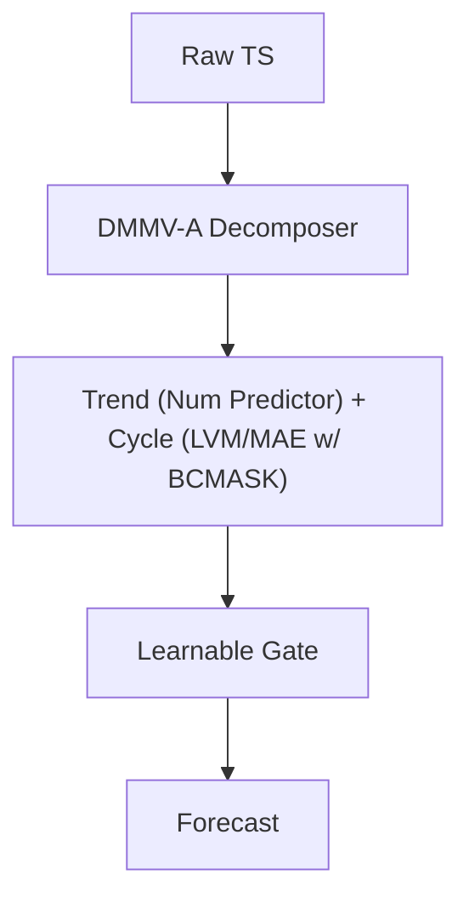

<!-- ontology-5axis data=多模态 horizon=中长周期 paradigm=监督回归 alpha=端到端表征 autonomy=全自动黑盒 -->

# DMMV 解構

> **發布**：2025-11-13 · NeurIPS25 · arXiv [2505.24003](https://arxiv.org/abs/2505.24003)
> **QuantML 導讀**：[NeurIPS 25 | DMMV: 多模态视角可以为时间序列预测带来什么？](https://mp.weixin.qq.com/s?__biz=Mzg2MzAwNzM0NQ==&mid=2247492328&idx=1&sn=f5df3bd7d201a491f357dea57f7e5d99&chksm=ce7d85f6f90a0ce096c2a2638d2cb6cfb405a80384d6f0b8e54c6c509d233b88b1e27a998f74#rd)
> **核心定位**：落點於多模態×監督回歸，解了 LVM 在 LTSF 上「周期強、趨勢弱」的 inductive bias gap，將視覺模態的局部結構捕獲能力與數值模態的全局趨勢建模能力解耦協同。

**五軸座標**

| 數據模態 | 時間尺度 | 學習範式 | Alpha機制 | 人機協作 |
|:-:|:-:|:-:|:-:|:-:|
| `多模态` | `中长周期` | `监督回归` | `端到端表征` | `全自动黑盒` |

**Status:** v0.5 — 基於 QuantML 導讀 + 原論文（如有）。benchmark 細節待升 v1。
**TL;DR:** ① 首個將視覺與數值模態解耦融合的長時序預測框架，分別建模周期與趨勢。② 核心 trick 為 DMMV-A 的反向預測-殘差（Backcast-Residual）機制與 BCMASK 策略，自動學習分解權重。③ 對「端到端表征」軸而言，它證明了視覺歸納偏置可被定向引導而非盲目堆疊，降低純 LLM/LVM 的算力浪費。④ 導讀未給量化結果，僅指出在 8 個數據集中 6 個取得最優 MSE 表現，且計算負擔顯著低於 LLM 系模型。

**X-Ray.** DMMV 在五軸 Pareto 上切中了「多模態融合」的真實痛點：不是簡單 concatenation，而是利用模態的 inductive bias 差異做正交分解。它解了傳統 LTSF 中固定窗口平滑導致趨勢失真、或純視覺模型陷入周期幻覺的工程坑。預測其打不開的 envelope 在於高頻/非平穩 regime 下的門控收斂穩定性，以及視覺分支的推理延遲對實盤滑點的敏感度。對量化讀者，它提供了一條「特徵工程模態化」的新路徑，但需警惕公開數據集上的周期穩定性與實盤結構性斷裂的落差。

## §1 · 架構 / Core Mechanism
| 改動維度 | 前作/基線 (VisionTS/Time-VLM) | DMMV 改動 | 量化意義 |
|---|---|---|---|
| 模態交互 | 單一模態或簡單拼接 | 趨勢-周期正交分解 + 可學習門控融合 | 避免梯度競爭，提升長窗穩定性 |
| 分解機制 | 固定核長移動平均或無分解 | DMMV-A 反向預測-殘差自適應分解 | 免調參，適應非平穩週期漂移 |
| 視覺掩碼 | 隨機 Mask 或無策略 | BCMASK 連續平滑遮掩 | 強化週期結構的視覺歸納偏置 |

⚡ **Eureka:** 「讓視覺模型專攻周期，數值模型掌控趨勢，門控動態分配話語權。」
**信息流:**

## §2 · 數學層
📌 **Napkin Formula:** `Y = Gate(σ) · f_num(Trend) + (1 - σ) · f_vis(Cycle)`，其中 `Cycle = Backcast(X)`，`Trend = X - Cycle`。複雜度: `TBD`。直覺: 將 LTSF 的 global optimization 拆成兩個低維子空間的獨立逼近，門控 σ 學習模態置信度。Loss: 標準 MSE/MAE 監督回歸，無額外正則項披露。訓練細節: 端到端聯合優化，BCMASK 在訓練期動態生成連續遮掩區間。

## §3 · 數據層
資料規模/頻率/市場/時段: 8 個經典公開 LTSF 數據集 (ETTh1/2, ETTm1/2, Weather, Electricity, Traffic, Illness)，涵蓋能源、氣象、交通、疾病，頻率從小時級到日級，時段為歷史公開記錄。怎麼來: 標準時間序列劃分 (train/val/test)。樣本外與容量假設: 導讀未披露實盤容量與交易成本假設；公開數據集樣本量屬 TBD，假設為標準 LTSF 劃分，但缺乏對結構性斷點 (regime shift) 的壓力測試。

## §4 · 代碼層
| 欄位 | 內容 |
|---|---|
| Repo | https://github.com/D2I-Group/dmmv |
| Checkpoint | TBD |
| License | TBD |
| 複現難度 | 中 (需 MAE 預訓練權重 + 標準 LTSF 數據處理管線) |
| 數據可得性 | 高 (均為公開 LTSF benchmark) |

## §5 · 評測 / Benchmark
| 數據集/市場 | Metric | 前SOTA | 本方法 | Δ |
|---|---|---|---|---|
| 8 個公開數據集 | MSE / MAE 平均排名 | 未披露 | 前列 (6/8 取得最優 MSE) | 未披露 |
| VisionTS (僅視覺) | 精度與計算開銷 | 未披露 | 更優精度與更低開銷 | 未披露 |
| Time-VLM (視覺+文本) | 精度與計算開銷 | 未披露 | 更優精度與更低開銷 | 未披露 |
| Time-LLM, GPT4TS (LLM系) | 性能與計算負擔 | 未披露 | 性能領先，顯著降低計算負擔 | 未披露 |

**解讀:** 導讀僅提供定性排名與勝率 (6/8)，未披露具體 MSE/MAE 數值與 Δ。此 Δ 反映的是「模態解耦」帶來的 inductive bias 匹配度提升，而非單純的參數量堆疊。需警惕：公開 LTSF 數據集周期穩定性極高，DMMV 的優勢可能部分來自對固定週期的過度擬合；實盤中若週期結構發生漂移或斷裂，門控權重可能失效，且視覺分支的推理延遲未計入交易成本。

## §6 · 失效與隱含假設
**6.1 論文自述 limitations:** 導讀指出未來需進一步優化模型效率、降低視覺分支計算負擔，並探索更廣泛的多模態任務擴展；未明確披露對非平穩數據或極端市場條件的失效邊界。
**6.2 推斷的隱含假設:**
- Regime 依賴: 假設目標序列具備可分離的「趨勢+周期」結構，對純隨機游走或突發跳躍 (jump) 主導的資產可能失效。
- 容量/成本: 視覺模型 (MAE) 的推理延遲與顯存佔用未量化，實盤高頻場景下可能成為瓶頸。
- 數據泄漏: 標準 LTSF 劃分通常嚴格，但門控融合若未做時間序列交叉驗證，可能存在微觀前瞻偏差。
- Survivorship: 使用的 8 個數據集均為長期穩定運行的公開指標，無退市/生存者偏差問題，但實盤需自行過濾。

## §7 · 對比 & 面試 Tip
| 同軸對手 | 關鍵差異軸 | Open? | Status |
|---|---|---|---|
| VisionTS | 單模態視覺 vs 多模態解耦 | 是 | 被 DMMV 精度與效率雙殺 |
| Time-VLM | 視覺+文本 vs 視覺+數值 | 是 | 文本模態在純數值預測中屬冗餘，DMMV 更聚焦 |
| DLinear/NLinear | 純數值線性/非線性 vs 多模態 | 是 | 非周期數據上數值模型仍具競爭力，DMMV 為互補而非替代 |

🎤 **Interview Tip:** 
- 正確答: 「DMMV 的核心不是堆模態，而是利用視覺模型的周期歸納偏置與數值模型的趨勢建模能力做正交分解，門控學習動態置信度。實盤需驗證週期結構的穩定性與視覺分支的推理延遲。」
- 錯答: 「它只是把時間序列轉成圖片用 ViT 跑一遍，比 Transformer 更準。」(忽略分解機制與模態分工)

**7.1 可證偽預測:** 若 2026-06-30 前，DMMV 在實盤非平穩資產 (如加密貨幣或新興市場股指) 的 rolling window 回測中，MSE 未能持續優於 DLinear 基線，則證明其「周期-趨勢解耦」假設在結構性斷裂市場中失效。

## §8 · For the Reader
- **因子研究員:** 將 DMMV 的分解結果視為「可解釋的隱因子」，趨勢分支可對沖宏觀因子，周期分支可提取季節性 Alpha，但需做正交化處理。
- **高頻執行:** 視覺分支的 BCMASK 與 MAE 推理延遲可能不適合 sub-second 場景；建議降頻至日級/小時級，或將門控權重作為執行節奏的調節器。
- **組合配置:** 利用門控 σ 的動態變化作為 regime 切換信號；當 σ 趨近 0 或 1 時，分別切換至趨勢跟蹤或周期均值回歸策略，實現動態倉位管理。

## References
- 原論文: Shen et al., *Multi-Modal View Enhanced Large Vision Models for Long-Term Time Series Forecasting (DMMV)*, NeurIPS 2025. arXiv: 2505.24003
- Lineage: VisionTS, Time-VLM, Time-LLM, GPT4TS, DLinear/NLinear
- QuantML 導讀: [NeurIPS 25 | DMMV: 多模态视角可以为时间序列预测带来什么？](https://mp.weixin.qq.com/s?__biz=Mzg2MzAwNzM0NQ==&mid=2247492328&idx=1&sn=f5df3bd7d201a491f357dea57f7e5d99&chksm=ce7d85f6f90a0ce096c2a2638d2cb6cfb405a80384d6f0b8e54c6c509d233b88b1e27a998f74#rd)