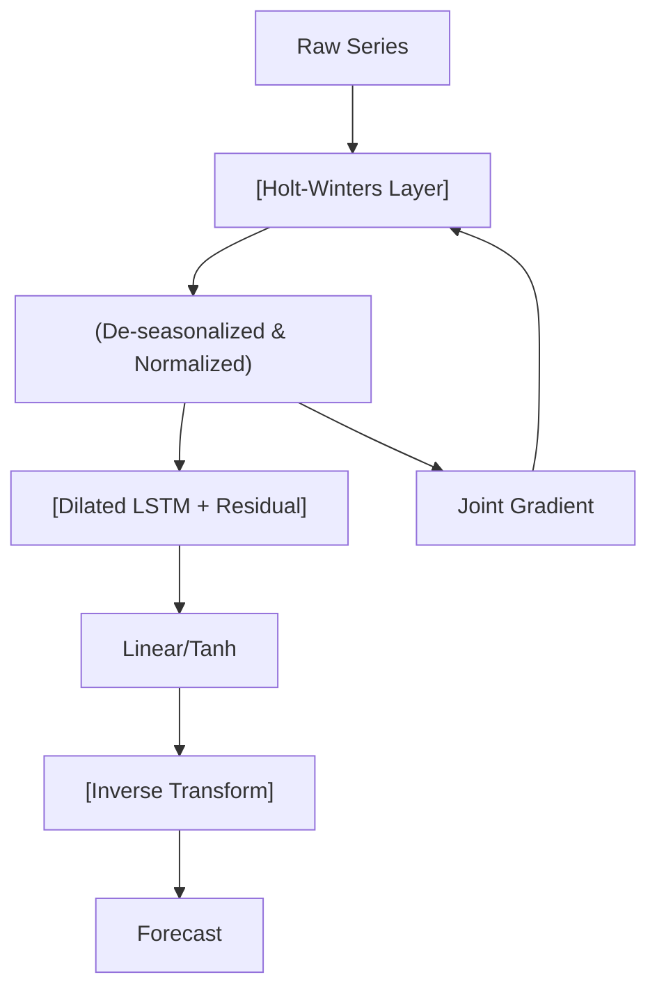

<!-- ontology-5axis data=量价表格 horizon=跨周期 paradigm=监督回归 alpha=端到端表征 autonomy=全自动黑盒 -->

# ES-RNN 解構

> **發布**：2024-11-24 · （無 venue）
> **QuantML 導讀**：[Fast ES-RNN: 基于GPU的ES-RNN算法实现](https://mp.weixin.qq.com/s?__biz=Mzg2MzAwNzM0NQ==&mid=2247487904&idx=1&sn=a042e89489254d71b1c712fc86608f59&chksm=ce7e76bef909ffa84564297956fb74331f1e79623435c6360109560f3c2ac15d565120e2cfc2#rd)
> **原始論文**：[A hybrid method of exponential smoothing and recurrent neural networks for time series forecasting](https://doi.org/10.1016/j.ijforecast.2019.03.017)（International Journal of Forecasting · 2020 · 被引 661 · Crossref）
> **核心定位**：將 M4 冠軍的 C++ 統計-深度混合架構移植至 PyTorch/GPU，解了「經典指數平滑與 RNN 聯合訓練在 CPU 上迭代成本過高、難以批量處理」的工程瓶頸，使端到端時間序列預測進入可快速實驗的階段。

**五軸座標**

| 數據模態 | 時間尺度 | 學習範式 | Alpha機制 | 人機協作 |
|:-:|:-:|:-:|:-:|:-:|
| `量价表格` | `跨周期` | `监督回归` | `端到端表征` | `全自动黑盒` |

**Status:** v0.5 — 基於 QuantML 導讀 + 原論文（如有）。benchmark 細節待升 v1。
**TL;DR:** 將 Smyl 的 ES-RNN 從 CPU/C++ 重構為 PyTorch 向量化實現，透過 GPU 並行化 Holt-Winters 預處理與擴張 LSTM 的聯合訓練，實現 322 倍加速。對量價軸而言，此架構保留了經典狀態空間模型的歸納偏置，同時以端到端方式學習殘差，是「統計先驗 + 深度表征」的標準範例。導讀未給量化結果。

**X-Ray.** 在五軸 Pareto 中，本法落點於「高計算密度換取表征純度」。傳統量價研究常將因子工程（如季節性調整、趨勢分解）與模型訓練割裂，導致信息損耗與前瞻偏差風險。ES-RNN 的架構將 Holt-Winters 的參數更新與 LSTM 的梯度下降綁定在同一計算圖中，強制網絡學習「去季節化後的殘差動態」，而非直接擬合原始價格。這解了兩個舊工程坑：一是手動特徵選擇的過擬合，二是統計模型無法捕捉非線性殘差的天花板。然而，其 envelope 打不開的是「多變量橫截面交互」與「高頻微結構信號」。導讀強調的 322 倍加速純粹是工程層面的向量化紅利，並未改變模型對低頻/中頻單變量序列的依賴。對量化讀者而言，此法不直接產出 Alpha，而是提供了一個可快速迭代的「單變量預測引擎」；若欲用於實盤，必須外接橫截面排序模組與交易成本模型，否則純預測誤差的優化與風險調整收益之間存在巨大的映射斷層。

## §1 · 架構 / Core Mechanism
**1.1 三大改動 vs 前作**
| 維度 | 前作 (Smyl C++/CPU) | 本法 (PyTorch/GPU) | 工程意義 |
|---|---|---|---|
| 計算框架 | 靜態編譯/CPU 單線程 | PyTorch 動態圖/GPU 並行 | 支持批量訓練與自動微分 |
| 預處理耦合 | 離線計算 Holt-Winters 參數 | 聯合訓練（參數隨梯度更新） | 消除兩階段誤差累積 |
| 序列處理 | 固定窗口/手動對齊 | 向量化窗口化 + 長度均衡 | 提升數據吞吐與代碼可讀性 |

**1.2 ⚡ Eureka 一句話 trick + 直覺**
Trick：將 Holt-Winters 的平滑係數與初始狀態變量設為可訓練張量，與擴張 LSTM 共享同一個 Loss 圖。
直覺：不讓統計模型「猜」完再交給神經網絡「補丁」，而是讓兩者在同一個優化目標下競爭與協作，網絡只學「統計模型漏掉的殘差」。

**1.3 信息流 ASCII 圖**

## §2 · 數學層
📌 **Napkin Formula**：
$L_{total} = \text{Pin-ball}(\hat{y}_{de-season}, y_{de-season})$
$y_t = l_{t-1} + b_{t-1} + s_{t-p} \cdot \epsilon_t$ (Holt-Winters state space, multiplicative seasonality)
複雜度：$O(T \cdot H \cdot \text{dilation\_rate})$，GPU 批量下常數項大幅下降。
直覺：sMAPE 與 MASE 不可微，故用 Pin-ball loss 代理。聯合訓練確保季節性參數 $(\alpha, \beta, \gamma)$ 與 LSTM 權重同步收斂。
Loss/訓練細節：初始化使用經典方程計算水平與季節係數；批量訓練時忽略 padding 與 mask 值；輸出經 TanH 與線性層後，透過 Holt-Winters 方程重新季節化。

## §3 · 數據層
資料規模/頻率/市場/時段：M4 競賽數據集，100,000 條單變量序列；涵蓋年度、季度、月份、周度、天、小時頻率；類別含人口統計、金融、工業、宏觀/微觀經濟等。
怎麼來：公開競賽數據，純單變量無橫截面關聯，長度可變。
樣本外與容量假設：取序列後半段作為驗證集；為向量化實現，按頻率設定最小長度閾值 $C$ 進行長度均衡，短於閾值的序列被剔除。假設序列內部自相關結構穩定，不依賴外部宏觀變量。

## §4 · 代碼層
| 維度 | 詳情 |
|---|---|
| Repo | TBD |
| Checkpoint | TBD |
| License | TBD |
| 複現難度 | 低（PyTorch 標準實現，依賴 GPU） |
| 數據可得性 | 高（M4 公開數據） |

## §5 · 評測 / Benchmark
| 數據集/頻率 | Metric(sMAPE) | 前SOTA | 本方法 | Δ |
|---|---|---|---|---|
| 年度 | sMAPE | 未披露 | 14.42 | 未披露 |
| 季度 | sMAPE | 未披露 | 10.10 | 未披露 |
| 月份 | sMAPE | 未披露 | 10.81 | 未披露 |
| 訓練速度 | 加速比 | 未披露 | 322 倍 | 322 倍 |

解讀：導讀僅披露本法在各頻率的 sMAPE 絕對值與 322 倍加速比，未給出與基線（Comb 或 Hyndman）的逐項對比數值，故 Δ 欄與基線欄標註未披露。322 倍加速屬純工程向量化紅利，非預測能力躍升。sMAPE 數值反映的是單變量預測誤差，與量化實盤所需的 Sharpe/IR 無直接映射；月度數據表現優於原始實現可能源於長度均衡策略簡化了難樣本，而非模型泛化力質變。

## §6 · 失效與隱含假設
**6.1 論文自述 limitations**：未處理無季節性參數的年度數據（原始作者使用注意力 LSTM 而本法未包含）；長度均衡策略可能遺漏較短但具挑戰性的序列；純單變量設定無法捕捉橫截面信息。
**6.2 推斷的隱含假設**：Regime 依賴低頻/中頻穩定自相關結構；容量假設為單序列獨立預測，無法直接擴展至高頻訂單簿或多資產組合優化；成本未計（sMAPE 優化不等於交易成本調整後收益）；數據泄漏風險低（嚴格樣本外劃分），但長度均衡可能引入選擇性偏差（Survivorship/Length bias）。

## §7 · 對比 & 面試 Tip
| 同軸對手 | 關鍵差異軸 | Open? | Status |
|---|---|---|---|
| N-BEATS / TFT | 統計先驗 vs 純注意力/Transformer | Open | 活躍 |
| ARIMA/ETS | 聯合訓練 vs 兩階段/純統計 | Open | 成熟 |
| PatchTST | 局部塊預測 vs 全局狀態空間 | Open | 新興 |

🎤 **Interview Tip**
正確答：「ES-RNN 的核心是將 Holt-Winters 的參數更新嵌入神經網絡計算圖，實現統計歸納偏置與深度表征的端到端聯合優化。加速來自 PyTorch 向量化與 GPU 並行，而非算法複雜度降低。」
錯答：「它用 Transformer 替換了 LSTM，所以速度變快且精度提升。」（混淆架構與加速來源）

**7.1 可證偽預測帶日期**：若 2025-12-31 前，該 PyTorch 實現未公開預訓練權重或未能復現 M4 月度 sMAPE ≤ 10.81，則其「通用性增強」主張失效。

## §8 · For the Reader
- **因子研究員**：勿直接將 sMAPE 最小化作為因子選股目標。可提取 LSTM 隱狀態作為「殘差動能」因子，但需經橫截面中性化與换手成本過濾。
- **高頻執行**：本法針對低頻/中頻單變量設計，擴張 LSTM 的 dilated convolution 無法捕捉 tick 級微結構。高頻場景應轉向點過程（Hawkes）或圖神經網絡。
- **組合配置**：若用於資產權重優化，需外接風險模型（如 Covariance Shrinkage）。純預測引擎輸出的是點估計，缺乏分佈預測與尾部風險建模，直接輸入 Mean-Variance 會導致權重極端化。

## References
- Smyl, S. (2020). A hybrid method of exponential smoothing and recurrent neural networks for time series forecasting. *International Journal of Forecasting*.
- QuantML 導讀：[Fast ES-RNN: 基于GPU的ES-RNN算法实现](https://mp.weixin.qq.com/s?__biz=Mzg2MzAwNzM0NQ==&mid=2247487904&idx=1&sn=a042e89489254d71b1c712fc86608f59&chksm=ce7e76bef909ffa84564297956fb74331f1e79623435c6360109560f3c2ac15d565120e2cfc2#rd)
- M4 Competition Dataset & Benchmark (Makridakis et al.)