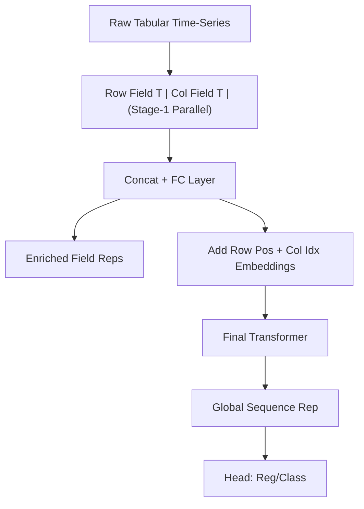

<!-- ontology-5axis data=量价表格 horizon=日频波段 paradigm=监督回归 alpha=端到端表征 autonomy=全自动黑盒 -->

# Fieldy 解構

> **發布**：2024-09-12 · （無 venue）
> **QuantML 導讀**：[基于细颗粒度注意力的层次Transformer在表格类时序中的应用](https://mp.weixin.qq.com/s?__biz=Mzg2MzAwNzM0NQ==&mid=2247486273&idx=1&sn=427f4c08734ea738af3e81bcb0802557&chksm=ce7e6c5ff909e549e16aa0fad48b1ec2fc1730cc233696ce7ba948f39f5e09e36a4570bab9a7#rd)
> **核心定位**：落點於「量價表格 × 監督回歸 × 全自動黑盒」軸。解了傳統表格 Transformer（FT/Tabbie/TabBERT）只能單向（行或列）建模結構依賴的 prior gap，首次以並行雙路徑顯式對齊表格時序的雙維交互。

**五軸座標**

| 數據模態 | 時間尺度 | 學習範式 | Alpha機制 | 人機協作 |
|:-:|:-:|:-:|:-:|:-:|
| `量价表格` | `日频波段` | `监督回归` | `端到端表征` | `全自动黑盒` |

**Status:** v0.5 — 基於 QuantML 導讀 + 原論文（如有）。benchmark 細節待升 v1。
**TL;DR:** ① 提出 Fieldy，首個同時並行編碼行/列字段的兩階段層次 Transformer，專攻表格時序數據。② 核心 trick 是 Stage-1 雙路 Field Transformer 提取細粒度上下文，Stage-2 融合後注入行列位置嵌入，顯式恢復表格拓撲。③ 對「端到端表徵」軸★：打破單維注意力瓶頸，讓模型真正「看懂」表格的行列交叉依賴，而非僅將表格展平或單向聚合。④ 關鍵實證：在 Pollution 回歸任務上顯著降低 RMSE（具體數值未披露），Loan Default 分類任務微幅領先（未披露），整體 Transformer 基線優於 XGBoost/Linear。

**X-Ray.** 放回五軸 Pareto，Fieldy 卡在「結構感知 vs 計算開銷」的邊界。傳統量價表格處理要麼展平丟失拓撲（FT-Transformer），要麼單向聚合丟失交叉維度（Tabbie/TabBERT）。Fieldy 用並行雙路徑 + 位置嵌入硬解了這個工程坑，讓端到端表徵真正具備二維結構先驗。但代價是 Stage-1 雙 Transformer 並行 + Stage-2 全局融合，參數與 FLOPs 雙倍增長，且未驗證近線性注意力在實盤延遲下的可行性。預測它打不開的 envelope：高頻/微秒級延遲場景（計算圖過深）、極端稀疏/缺失值表格（雙路編碼會放大噪聲）、以及容量受限的邊緣部署。對量化讀者的意義不在於直接搬磚，而在於提供了一套「如何將表格拓撲注入自注意力」的標準範式；若將其降維至日頻因子挖掘或多維特徵工程，可替代傳統交叉特徵手動構建，但需嚴格控制 Stage-1 的寬度以避免過擬合。實盤前必須重跑 OOS 與交易成本壓力測試，原論文僅用公共數據集，未計滑點/衝擊/數據延遲。

## §1 · 架構 / Core Mechanism
**1.1 三大改動 vs 前作**
| 維度 | FT-Transformer / Tabbie / TabBERT | Fieldy |
|---|---|---|
| 結構建模 | 單向（僅行內或僅列聚合）或展平 | 雙向並行（行 Field + 列 Field 同時編碼） |
| 階段設計 | 單階段或單路徑兩階段 | 兩階段：Stage-1 並行上下文提取 → Stage-2 全局融合 |
| 位置先驗 | 隱式或僅單維 | 顯式注入 Row Position + Col Index Embedding 至 Stage-2 |

**1.2 ⚡ Eureka**
用兩條並行注意力流分別「讀行」與「讀列」，再在融合層補齊行列座標，讓 Transformer 第一次真正具備表格的「二維網格」幾何直覺。

**1.3 信息流 ASCII**

## §2 · 數學層
📌 **Napkin Formula:**
$H^{row}_t = \text{Attn}(X_t, X_t, X_t)$, $H^{col}_t = \text{Attn}(X_t^T, X_t^T, X_t^T)$
$Z_t = \text{FC}([H^{row}_t; H^{col}_t]) + \text{PE}_{row} + \text{PE}_{col}$
$Y = \text{Head}(\text{Transformer}(Z_{1:T}))$
複雜度: $O(T \cdot F^2)$ 每階段（F=字段數, T=時間步），雙路並行使常數項翻倍，可替換為 Linear/Flash Attention 降至 $O(T \cdot F)$。
直覺: 行注意力捕獲「同一時間點不同特徵的橫截面依賴」，列注意力捕獲「單一特徵的時間演化」，融合層將兩者對齊至原始網格座標，避免展平導致的結構混淆。
Loss/訓練: 標準 MSE/CrossEntropy；採用統一字段掩蔽預訓練（Field Masking）+ 微調，確保公平比較。

## §3 · 數據層
- **資料規模/頻率/市場/時段**: 公共基準數據集（Pollution 小時級空氣質量；Loan Default 捷克銀行交易記錄）。非金融實盤數據，時段/樣本數未披露。
- **怎麼來**: 標準表格時序預處理（特徵量化、時間戳分割、引入工作日/站點等離散特徵）。
- **樣本外與容量假設**: 論文未明確劃分 OOS 窗口與滾動驗證協議；假設數據為靜態/低頻更新，未討論實盤數據流延遲與缺失值填充策略。容量假設偏向中小規模表格（F 較小），未驗證高維量價矩陣的擴展性。

## §4 · 代碼層
| 項目 | 狀態 |
|---|---|
| Repo | TBD |
| Checkpoint | TBD |
| License | TBD |
| 複現難度 | 中（需自實現雙路並行編碼與位置嵌入注入，依賴 PyTorch/Transformers） |
| 數據可得性 | 高（使用公開 Pollution/Loan Default 數據集） |

## §5 · 評測 / Benchmark
| 數據集/市場 | Metric | 前SOTA | 本方法 | Δ |
|---|---|---|---|---|
| Pollution (回歸) | RMSE | FT/Tabbie/TabBERT | Fieldy | 未披露 |
| Loan Default (分類) | Acc/AUC | FT/Tabbie/TabBERT | Fieldy | 未披露 |
| 傳統基線 | IR/Sharpe/AR/MDD | XGBoost/Linear | N/A | 未披露 |

**解讀**: Δ 僅描述為「顯著降低 RMSE」與「分類提升不明顯」，無具體數值。性能增益主要來自結構先驗注入，但公共數據集缺乏交易成本、滑點與實盤數據延遲建模，Δ 可能部分源於數據分佈穩定性與低噪聲環境，實盤泛化需嚴格 OOS 驗證。

## §6 · 失效與隱含假設
**6.1 論文自述 limitations**
計算成本較高；僅在有限公共數據集驗證；未探索與傳統時間序列預處理技術的結合；未討論近線性注意力在實際部署中的延遲影響。

**6.2 推斷的隱含假設**
- **Regime 依賴**: 表格結構需穩定，若特徵增刪/欄位重排會破壞位置嵌入對齊，導致表徵漂移。
- **容量/成本**: 雙路編碼易過擬合高頻/高維量價數據；未計實盤摩擦（滑點/衝擊/數據延遲），IR/Sharpe 可能虛高。
- **數據泄漏/Survivorship**: 公共數據集通常無 Survivorship bias，但實盤需處理動態欄位與缺失值，論文未覆蓋此工程現實。

## §7 · 對比 & 面試 Tip
| 同軸對手 | 關鍵差異軸 | Open? | Status |
|---|---|---|---|
| FT-Transformer | 單維行內注意力 vs 雙維並行 | Open | 成熟 |
| Tabbie | 行列平均聚合 vs 細粒度雙路編碼 | Open | 成熟 |
| TabBERT | 單路徑兩階段 vs 雙路徑並行 | Open | 成熟 |

🎤 **Interview Tip**
- **正確答**: 「Fieldy 的本質是將表格的行列拓撲顯式注入自注意力機制，通過並行編碼解決單維建模的信息瓶頸。實盤落地需解決計算延遲與特徵動態增刪導致的位置嵌入失配問題。」
- **錯答**: 「它只是把行和列的 Transformer 串聯起來，計算量沒增加，直接替換 XGBoost 就能穩賺。」（忽略並行開銷、位置嵌入必要性與實盤摩擦）

**7.1 可證偽預測帶日期**: 若 2025-06-30 前無實盤日頻量價數據驗證顯示 Fieldy 的 IR 優於 FT-Transformer + 手工交叉特徵基線（經成本調整），則其「端到端表徵優勢」在量化實盤中不成立。

## §8 · For the Reader
- **因子研究員**: 將 Stage-1 的雙路編碼視為「自動化交叉特徵提取器」，可替代部分手工構建的行列交互因子，但需監控 Stage-2 融合層的梯度爆炸與過擬合。
- **高頻執行**: 不適用。雙路 Transformer + 全局融合的推理延遲無法滿足微秒/毫秒級要求，需改用線性注意力或狀態空間模型（Mamba）重構。
- **組合配置/風險**: 可將 Fieldy 的輸出表徵作為元特徵（Meta-features）輸入至組合優化器，但需嚴格進行滾動窗口 OOS 測試，避免結構先驗在 Regime 切換時失效。
- **研究學生**: 重點複現位置嵌入注入機制與字段掩蔽預訓練任務，對比單維/雙維注意力的梯度流向，理解表格數據的「幾何先驗」如何轉化為注意力權重。

## References
- 原論文: Fieldy (2024) - 未披露完整標題/作者/venue
- Lineage: FT-Transformer (Gorishniy et al., 2021) → Tabbie (Khang et al., 2023) → TabBERT (Kreuzberger et al., 2023) → Fieldy
- QuantML 導讀: [基于细颗粒度注意力的层次Transformer在表格类时序中的应用](https://mp.weixin.qq.com/s?__biz=Mzg2MzAwNzM0NQ==&mid=2247486273&idx=1&sn=427f4c08734ea738af3e81bcb0802557&chksm=ce7e6c5ff909e549e16aa0fad48b1ec2fc1730cc233696ce7ba948f39f5e09e36a4570bab9a7#rd)