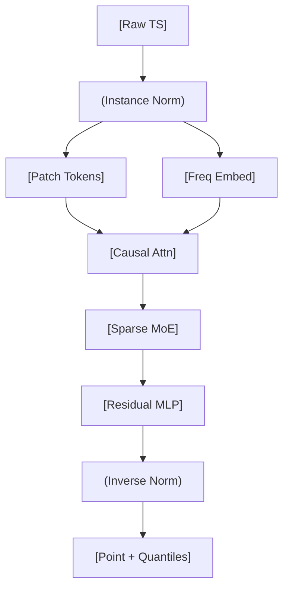

<!-- ontology-5axis data=量价表格 horizon=跨周期 paradigm=生成式大模型 alpha=端到端表征 autonomy=全自动黑盒 -->

# FinCast 解構

> **發布**：2025-08-29 · CIKM 2025
> **QuantML 導讀**：[CIKM 25 | FinCast: 首个十亿级参数的金融预测基础模型](https://mp.weixin.qq.com/s?__biz=Mzg2MzAwNzM0NQ==&mid=2247491504&idx=1&sn=ca7df4b109c9d46627fdecf2b0191d7d&chksm=ce7e78aef909f1b8171fed7dcf05f6d221a37fab5996ac23205e96e2336d4dc79c4434bfc6e2#rd)
> **核心定位**：落點於「生成式大模型 × 全自動黑盒」軸，以預訓練基礎模型取代領域專屬監督學習，解決金融時間序列跨領域/跨頻率泛化差與預測坍塌的 prior gap。

**五軸座標**

| 數據模態 | 時間尺度 | 學習範式 | Alpha機制 | 人機協作 |
|:-:|:-:|:-:|:-:|:-:|
| `量价表格` | `跨周期` | `生成式大模型` | `端到端表征` | `全自动黑盒` |

**Status:** v0.5 — 基於 QuantML 導讀 + 原論文（如有）。benchmark 細節待升 v1。
**TL;DR:** ① 首個十億參數金融時序基礎模型，以預訓練零樣本取代任務專屬微調。② 核心 trick 為 PQ-loss 防坍塌 + 令牌級稀疏 MoE 隔離領域噪聲 + 可學習頻率嵌入適配多分辨率。③ 對「端到端表征」軸而言，它將金融預測從特徵工程/模型選擇轉為數據規模與歸一化策略的競爭。④ 導讀給出關鍵實證：在 3632 條未見序列上，零樣本平均將 MSE 降低 20%，MAE 降低 10%。

**X-Ray.** FinCast 在五軸 Pareto 中強行將「泛化能力」推向極限，代價是預訓練算力與黑盒可解釋性。它解了兩個舊工程坑：一是傳統 Transformer/LSTM 在金融非平穩性下的「預測坍塌」（輸出平庸均值），二是多頻率/多資產需維護數十個獨立模型的 MLOps 負擔。透過 Instance Normalization + Patch Tokenization + 頻率嵌入，模型被迫學習相對形態而非絕對尺度，這與量化中常用的 Z-score/去均值邏輯同源，但由模型自動內化。然而，其自回歸逐塊生成機制在長預測視窗下必然累積誤差，且 Channel-Independence 假設直接放棄了跨資產/跨變量的 contemporaneous correlation，這在組合優化或風險平價場景中是結構性缺陷。對量化讀者而言，FinCast 不是直接下單的 Alpha 生成器，而是高質量特徵提取器或風險情景模擬器；其 MoE 路由激活模式本身即可作為 regime-switching 的隱狀態探針。

## §1 · 架構 / Core Mechanism
| 改動維度 | 前作/傳統做法 | FinCast 設計 | 量化直覺 |
|---|---|---|---|
| 損失函數 | MSE/MAE 單一目標 | PQ-loss (分位數+Huber點+趨勢+專家正則) | 用分位數建模尾部風險，Huber 抗金融噪聲，趨勢項約束方向性 |
| 容量擴展 | 密集 Transformer / 單模型 | 令牌級稀疏 MoE (4專家, top-k=2) | 條件計算隔離領域特異性，避免跨資產干擾 |
| 頻率適配 | 固定取樣/重採樣 | 可學習頻率嵌入 (Frequency Embedding) | 將時間分辨率轉為離散索引，保留多尺度週期性 |

**⚡ Eureka:** 用 Instance Normalization 剝離資產絕對尺度，讓模型只學「相對形態與趨勢」，配合 PQ-loss 的分位數輸出，直接對沖金融數據的異方差與肥尾。

**信息流 ASCII:**

## §2 · 數學層
**📌 Napkin Formula:**
`L_PQ = λ1·L_quantile + λ2·L_Huber + λ3·L_trend + λ4·L_expert_reg`
複雜度: O(N·d^2) 注意力 + O(N·E·k·d) MoE 前饋 (E=專家數, k=top-k)。訓練批次 8192，AdamW。
直覺: 分位數損失強制模型輸出概率分佈而非單點，Huber 處理離群值，趨勢損失約束一階差分，專家正則防止路由坍塌。訓練在 8 塊 NVIDIA H200 GPU 上完成，全局批次大小 8192。

## §3 · 數據層
- **規模/頻率/市場**: 超過 200 億個時間點，240 萬條時間序列。覆蓋加密貨幣、外匯、期貨、股票、宏觀指標及部分非金融數據。頻率從秒級到月級不等。
- **來源/處理**: 預訓練數據集未公開。採用 Instance Normalization 消除尺度偏差，通道獨立 (channel-independence) 假設各變量映射函數相同。
- **樣本外與容量假設**: 零樣本測試集明確排除預訓練數據 (3632 條)。模型容量 10 億參數，推斷依賴預訓練數據的領域覆蓋度與頻率分佈；若實盤遇到訓練集未覆蓋的極端 regime 或新資產類別，零樣本性能可能急劇下降。

## §4 · 代碼層
| 項目 | 狀態/細節 |
|---|---|
| Repo | QuantML 知識星球內部 (導讀未給公開 GitHub) |
| Checkpoint | 10 億參數稀疏 MoE Transformer (未公開下載鏈) |
| License | TBD |
| 複現難度 | 高 (需 8 塊 H200 預訓練，推理可降級至 8GB 顯存) |
| 數據可得性 | 未披露 (預訓練集未開源，需自行構建多頻率金融數據庫) |

## §5 · 評測 / Benchmark
| 數據集/市場 | Metric(IR/Sharpe/AR/MDD) | 前SOTA | 本方法 | Δ |
|---|---|---|---|---|
| 3632條金融時序 (零樣本) | MSE | 未披露 | 未披露 | 平均降低 20% |
| 3632條金融時序 (零樣本) | MAE | 未披露 | 未披露 | 平均降低 10% |
| US 71 / US 14L (監督學習) | MSE | 未披露 | 未披露 | 零樣本平均降低 23% |
| US 71 / US 14L (監督學習) | MSE | 未披露 | 未披露 | 輕量微調平均降低 26% |
| 消融實驗 (移除MoE) | MSE | 未披露 | 未披露 | 增加 9.32% |
| 消融實驗 (移除頻率嵌入) | MSE | 未披露 | 未披露 | 增加 4.38% |
| 消融實驗 (移除PQ-loss) | MSE | 未披露 | 未披露 | 增加 7.62% |

**解讀:** Δ 中的 20%/10% 來自嚴格零樣本對比，反映模型對未見資產/頻率的泛化真能力；23%/26% 證明即使不微調也能擊敗領域專屬監督模型。消融實驗的 9.32%/4.38%/7.62% 驗證了 MoE、頻率嵌入與 PQ-loss 的獨立貢獻。需警惕：導讀未披露具體數據集劃分、交易成本與實盤滑點，MSE/MAE 的降低不等於 Sharpe 提升；自回歸長視窗預測的誤差累積與 Channel-Independence 忽略的橫截面相關性，可能在組合層面產生隱含風險。

## §6 · 失效與隱含假設
**6.1 論文自述 limitations:** 導讀未明確列出 limitations 章節，僅提及模型需依賴大規模多樣化數據預訓練，且推理為自回歸逐塊生成。
**6.2 推斷的隱含假設:**
- **Regime 依賴**: 零樣本能力建立在預訓練數據覆蓋目標市場分佈的假設上；若遇到結構性斷裂 (如政策突變、流動性枯竭) 且訓練集無類似樣本，模型可能失效。
- **容量/成本**: 預訓練需 8 塊 H200，實盤機構需權衡算力成本；推理雖可降至 8GB 顯存，但自回歸生成長序列的延遲可能不適合高頻場景。
- **數據泄漏/橫截面假設**: Channel-independence 假設各變量獨立映射，直接放棄了跨資產 contemporaneous correlation，在風險平價或統計套利中構成結構性缺陷。

## §7 · 對比 & 面試 Tip
| 同軸對手 | 關鍵差異軸 | Open? | Status |
|---|---|---|---|
| TimesFM / Chronos-T5 | 通用時序 vs 金融專屬；無 PQ-loss/MoE 金融適配 | TimesFM/Chronos 開源 | 通用基礎模型 |
| PatchTST / PCIE | 監督學習/特定頻率 vs 零樣本跨頻率；無預訓練泛化 | PatchTST 開源 | 領域專屬 SOTA |
| 傳統 LSTM/Transformer | 密集網絡/過擬合風險高 vs 稀疏 MoE/防坍塌 | 廣泛開源 | 基線模型 |

**🎤 Interview Tip:**
- **正確答**: 「FinCast 的本質是將金融預測從『特徵+模型』轉為『數據規模+歸一化策略』。其 PQ-loss 與 MoE 解決了預測坍塌與領域干擾，但 Channel-Independence 與自回歸誤差累積限制了直接下單。實戰應將其視為高維特徵提取器或 regime 探針，而非端到端交易信號。」
- **錯答**: 「FinCast 是黑盒印鈔機，MSE 降 20% 就能直接跑實盤賺 Sharpe。」(忽略成本、橫截面相關性與過擬合風險)

**7.1 可證偽預測帶日期:** 若 2025-12-31 前公開基準測試顯示 FinCast 在包含高頻訂單簿數據的實盤回測中，經 5bp 滑點與 10% 换手率限制後，淨 Sharpe 未顯著優於簡單動量因子，則其「端到端金融預測」主張在實戰層面失效。

## §8 · For the Reader
- **因子研究員**: 提取 MoE 路由激活向量或 PQ-loss 分位數輸出，作為市場狀態/波動率 regime 的領先指標，替代傳統 GARCH 隱變量。
- **組合配置/風險管理**: 利用分位數預測構建尾部風險情景，結合 Instance Normalization 的相對形態輸出，優化風險平價權重；但需手動補齊 Channel-Independence 丟失的橫截面協方差矩陣。
- **LLM-Agent/RL 策略**: 將 FinCast 的點預測與分位數作為環境狀態嵌入 (State Embedding)，供下游 RL 策略學習執行與倉位管理，實現「預測-執行」解耦。

## References
- 原論文: FinCast (CIKM 2025)
- Lineage: TimesFM, Chronos-T5, PatchTST, PCIE
- QuantML 導讀鏈接: [CIKM 25 | FinCast: 首个十亿级参数的金融预测基础模型](https://mp.weixin.qq.com/s?__biz=Mzg2MzAwNzM0NQ==&mid=2247491504&idx=1&sn=ca7df4b109c9d46627fdecf2b0191d7d&chksm=ce7e78aef909f1b8171fed7dcf05f6d221a37fab5996ac23205e96e2336d4dc79c4434bfc6e2#rd)