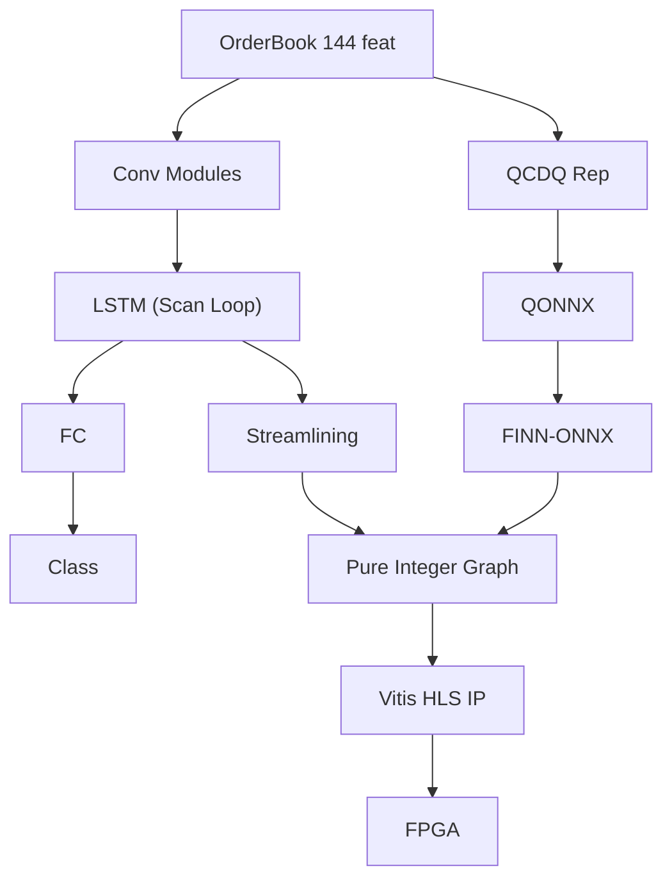

<!-- ontology-5axis data=微观盘口 horizon=高频日内 paradigm=监督回归 alpha=端到端表征 autonomy=全自动黑盒 -->

# FINN扩展框架 解構

> **發布**：2025-10-04 · （無 venue）
> **QuantML 導讀**：[面向FPGA的通用化LSTM端到端硬件加速框架](https://mp.weixin.qq.com/s?__biz=Mzg2MzAwNzM0NQ==&mid=2247491869&idx=1&sn=a710e842d97fb7d4b0eaaeb8862c1f45&chksm=ce7d8603f90a0f15cfff5831ddf07697a825b502e40bdd5cb18b59511cd599c07ddcee4c41e1#rd)
> **核心定位**：落點於高頻盤口數據的端到端監督回歸，解決了現有FPGA工具鏈對循環神經網絡缺乏通用化、混合精度硬件部署支持的工程斷層。

**五軸座標**

| 數據模態 | 時間尺度 | 學習範式 | Alpha機制 | 人機協作 |
|:-:|:-:|:-:|:-:|:-:|
| `微观盘口` | `高频日内` | `监督回归` | `端到端表征` | `全自动黑盒` |

**Status:** v0.5 — 基於 QuantML 導讀 + 原論文（如有）。benchmark 細節待升 v1。
**TL;DR:** ① 將ONNX Scan算子引入LSTM循環建模，打通FINN編譯器對RNN的通用化硬件映射。② 核心trick是通過「流線化」轉換將浮點運算吸收至MultiThreshold層，實現純整數混合精度量化與IP自動生成。③ 對高頻軸而言，它繞過了傳統定制FPGA邏輯的開發瓶頸，使量化ConvLSTM能在邊緣FPGA上實現單樣本推論。④ 導讀未給量化結果。

**X-Ray.** 本框架將RNN部署從「手寫HLS狀態機」降維至「算子圖編譯」，本質是將循環依賴的順序性約束轉化為可參數化的硬件IP。它解了前饋網絡工具鏈無法處理反饋連接的工程坑，但代價是序列長度直接綁定啟動間隔，長序列下啟動間隔必然膨脹。對量化讀者而言，這不是一個新Alpha，而是Alpha的「硬部署層」：它證明混合精度量化在FPGA上可無損逼近浮點分類指標，但並行化被順序依賴鎖死，實盤容量將受單核吞吐與啟動間隔瓶頸嚴格限制。

## §1 · 架構 / Core Mechanism
**1.1 三大改動 vs 前作**
| 維度 | 前作 (FINN/hls4ml) | 本框架 (FINN扩展) | 工程意義 |
|---|---|---|---|
| 循環結構建模 | 無通用支持 / 定制實現 | ONNX Scan算子封裝LSTM計算圖 | 解耦循環邏輯，支持混合精度內部控制 |
| 運算類型 | 保留浮點/定點 / 高資源 | 流線化轉換消除浮點，純整數計算 | 降低DSP消耗，提升邊緣FPGA適配性 |
| 部署目標 | 優先低延遲或前饋 | 性能與資源效率平衡，參數化IP輸出 | 避免資源耗盡，支持序列長度自定義 |

**1.2 ⚡ Eureka**
用Scan算子把LSTM的「時間展開」變成計算圖的「迭代節點」，再讓編譯器把浮點加乘全部「吸」進MultiThreshold比較層，徹底抹除浮點運算。

**1.3 信息流 ASCII**

## §2 · 數學層
📌 **Napkin Formula**
$h_t = \text{LSTM}(x_t, h_{t-1})$  (Scan迭代)
$A_{int} = \text{MultiThreshold}(x, \theta)$ 替代 $\sigma(x), \tanh(x)$
複雜度: 順序依賴導致 $O(T)$ 啟動間隔，無法完全unrolling。
直覺: 利用sigmoid/tanh單調性，用多閾值比較取代指數運算；量化位寬在層內量化器中獨立配置。
Loss/訓練: 浮點預訓練 -> 量化微調(學習率加快) -> 精度反超浮點約1%。

## §3 · 數據層
- 資料規模/頻率/市場/時段: FI-2010數據集，赫爾辛基證券交易所5隻股票，9天限價訂單簿數據。
- 特徵與來源: 144個特徵，z-score標準化。
- 樣本外與容量假設: 導讀未披露具體訓練/驗證/測試劃分比例與樣本量。容量假設受單核啟動間隔與單樣本延遲限制，僅適用於batch-1實時推論，無法支撐多標的並行高頻輪詢。

## §4 · 代碼層
| 欄位 | 內容 |
|---|---|
| Repo | 導讀提及「代碼見QuantML知識星球引言」，未給GitHub鏈接 |
| Checkpoint | TBD |
| License | TBD |
| 複現難度 | 高 (需Vivado/Vitis HLS環境、Zynq平台、FINN編譯器定制轉換腳本) |
| 數據可得性 | 中 (FI-2010為公開數據集，但需自行處理LOB格式與特徵提取) |

## §5 · 評測 / Benchmark
| 數據集/市場 | Metric | 前SOTA | 本方法 | Δ |
|---|---|---|---|---|
| FI-2010 | F1 Score | DeepLOB (相當) | Q-ConvLSTM IP | 未披露 |
| FI-2010 | 資源佔用 (LUT) | 未披露 | ~49% | 未披露 |
| FI-2010 | 單樣本延遲 | 未披露 | 4.3毫秒 | 未披露 |

**解讀:** Δ欄多為「未披露」因導讀僅給定性比較或單一數值。F1與DeepLOB相當屬模型架構能力，非硬件加速帶來；4.3毫秒延遲與~49% LUT消耗證明硬件映射成功，但導讀明確指出「不包括數據傳輸開銷」，實盤AXI-DMA搬遷延遲未計，實際端到端延遲可能逼近決策窗口。資源餘量顯示可通過展開降延遲，但會犧牲啟動間隔與並行度。

## §6 · 失效與隱含假設
**6.1 論文自述 limitations**
順序依賴限制unrolling，長序列增加啟動間隔成為實時瓶頸；未來需探索降低順序層延遲的優化。

**6.2 推斷的隱含假設**
- Regime依賴: 訓練於9天LOB數據，未驗證跨市場/跨週期泛化；量化微調依賴浮點基線，分佈漂移時混合精度可能崩潰。
- 容量/成本: 單核處理batch-1，多標的需多IP實例，資源成本線性增長；未計數據傳輸開銷，實盤網絡延遲可能吃掉硬件加速優勢。
- 數據泄漏: 9天數據訓練，未提及時間序列交叉驗證或Walk-forward，前瞻偏差風險高。

## §7 · 對比 & 面試 Tip
| 同軸對手 | 關鍵差異軸 | Open? | Status |
|---|---|---|---|
| hls4ml (LSTM支持) | 純整數/混合精度 vs 保留浮點/定點；資源平衡 vs 極致低延遲 | Open | 成熟 |
| F-LSTM | CPU預處理/後處理 vs 全FPGA流線化 | 未披露 | 定制 |

🎤 **Interview Tip**
正確答: 「本框架核心是將循環計算圖通過Scan算子與流線化轉換為純整數IP，解決了FPGA部署LSTM的通用性問題，但順序依賴導致啟動間隔無法為1，實盤需權衡序列長度與吞吐。」
錯答: 「它把LSTM變成CNN一樣並行，延遲降到微秒級，完全取代GPU訓練。」

**7.1 可證偽預測帶日期**
若2026年Q2前無公開實盤報告證明該IP在真實交易所網絡環境下（含DMA傳輸）能穩定維持端到端延遲低於決策窗口並跑通多標的輪詢，則該框架僅限於實驗室原型驗證。

## §8 · For the Reader
- **因子研究員**: 關注混合精度量化對盤口特徵非線性映射的保真度，可嘗試將本流程套用於自研LSTM Alpha的邊緣部署，但需警惕量化誤差在極端行情下的放大。
- **高頻執行**: 單樣本延遲僅為計算延遲，實盤必須將FPGA置於交換機同機櫃並優化DMA路徑，否則網絡抖動會使硬件加速失效。
- **組合配置/RL策略**: 本框架不產Alpha，僅提供低延遲推論管道；若策略需長序列歷史窗口，啟動間隔膨脹將成為瓶頸，建議改用GRU或截斷序列。
- **研究學生**: 學習ONNX Scan與FINN流線化轉換是掌握AI編譯器與硬件協同設計的極佳切入點，但需補足HLS與Vivado基礎。

## References
- 原論文: 面向FPGA的通用化LSTM端到端硬件加速框架 (2025-10-04)
- Lineage: FINN Compiler / Brevitas / ONNX Scan Operator / DeepLOB
- QuantML 導讀鏈接: [面向FPGA的通用化LSTM端到端硬件加速框架](https://mp.weixin.qq.com/s?__biz=Mzg2MzAwNzM0NQ==&mid=2247491869&idx=1&sn=a710e842d97fb7d4b0eaaeb8862c1f45&chksm=ce7d8603f90a0f15cfff5831ddf07697a825b502e40bdd5cb18b59511cd599c07ddcee4c41e1#rd)