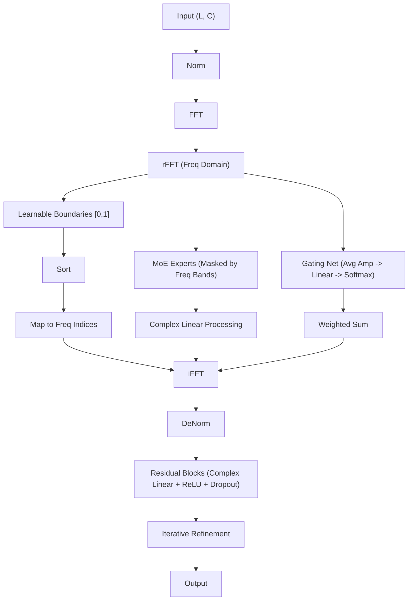

<!-- ontology-5axis data=量价表格 horizon=跨周期 paradigm=监督回归 alpha=端到端表征 autonomy=全自动黑盒 -->

# FreqMoE 解構

> **發布**：2025-05-30 · （無 venue）
> **QuantML 導讀**：[FreqMoE: 通过频率分解MoE提升时间序列预测性能](https://mp.weixin.qq.com/s?__biz=Mzg2MzAwNzM0NQ==&mid=2247490566&idx=1&sn=5c9eb1d7711e71d8c7c8f571c2c843331&chksm=ce7e7b18f909f20e0b5c809056a137026abbe81512481048c26c3cdff517b1b99a6b36b02bfa#rd)
> **原始論文**：[FreqMoE: Dynamic Frequency Enhancement for Neural PDE Solvers](https://doi.org/10.24963/ijcai.2024/818)（Proceedings of the Thirty-ThirdInternational Joint Conference on Artificial Intelligence · 2024 · 被引 14 · Crossref）
> **核心定位**：落點於「端到端表征 × 跨周期」軸，針對傳統頻域模型「固定濾波器無差別丟棄高頻分量」的 prior gap，以可學習邊界與動態門控實現頻帶自適應分配。

**五軸座標**

| 數據模態 | 時間尺度 | 學習範式 | Alpha機制 | 人機協作 |
|:-:|:-:|:-:|:-:|:-:|
| `量价表格` | `跨周期` | `监督回归` | `端到端表征` | `全自动黑盒` |

**Status:** v0.5 — 基於 QuantML 導讀 + 原論文（如有）。benchmark 細節待升 v1。
**TL;DR:** 提出 FreqMoE，透過 FFT 動態分解頻帶並分配 MoE 專家，結合門控權重與殘差迭代優化，高效提升長短期時序預測精度。核心 trick 在於棄用固定濾波器，改用可學習邊界劃分頻帶，門控網絡按幅值動態加權，並引入頻域複數線性層與殘差連接迭代優化。此設計對「端到端表征」軸具關鍵意義，直接解決了頻域特徵提取中的信息丟失與參數膨脹問題。導讀指出該模型僅需 15K 到 70K 個參數，並在 70 個指標中的 51 個指標上取得了最佳結果。

**X-Ray.** 在「量價表格 × 跨周期」的 Pareto 前沿，FreqMoE 切中了一個長期被忽略的工程坑：多數頻域模型預設高頻即雜訊，採用固定低通濾波導致週期性與突發模式被強制抹平。本方法將頻帶邊界參數化，並透過幅值門控實現動態權重分配，使模型能在不依賴人工先驗的情況下自適應捕捉主導頻率。殘差塊在複數域進行上採樣與相位/幅值縮放，進一步以迭代方式收斂未解釋殘差。對量化讀者而言，這意味著特徵工程從「靜態濾波+時域CNN/Transformer」轉向「頻域動態路由+輕量複數MLP」，大幅降低算力依賴。然而，其封閉包難以輕易打開：複數域優化對梯度穩定性要求極高，且門控權重高度依賴輸入序列的頻譜分佈；一旦市場 regime 切換導致主導頻帶偏移，若無線上微調機制，模型極易發生頻域過擬合。此外，導讀未提供具體回撤或交易成本數據，其純預測精度優勢能否轉化為實盤 Sharpe，仍取決於後續的執行層與風險預算模塊。

## §1 · 架構 / Core Mechanism
**1.1 三大改動 vs 前作**
| 維度 | 傳統頻域模型 (FEDformer/FITS等) | FreqMoE |
|---|---|---|
| 頻帶劃分 | 固定濾波器/低通截斷 | 可學習參數化邊界 + Sigmoid 映射排序 |
| 特徵路由 | 全局注意力或固定權重 | 幅值門控網絡動態分配 MoE 專家權重 |
| 優化路徑 | 單次時域/頻域映射 | 複數線性層上採樣 + 殘差連接迭代收斂 |

**1.2 ⚡ Eureka**
棄用「高頻=雜訊」的靜態假設，將頻帶邊界與專家權重全部可微分化，讓模型自己學會「何時該聽低頻趨勢，何時該抓高頻波動」。

**1.3 信息流 ASCII**

## §2 · 數學層
**📌 Napkin Formula**
$$ \hat{y} = \sum_{k=1}^{K} g_k \cdot \mathcal{E}_k(X \odot M_k) \quad \text{where} \quad g = \text{Softmax}(W \cdot \text{Avg}(|\text{FFT}(X)|)) $$
複雜度：$O(L \log L)$ (FFT) + $O(K \cdot C \cdot L)$ (MoE/門控) + $O(B \cdot L)$ (殘差塊堆疊 $B$ 層)。
**直覺**：門控分數 $g_k$ 由頻譜幅值驅動，確保能量集中的頻帶獲得更高專家權重；殘差迭代在複數域同時學習幅值縮放與相位偏移，逐步逼近真實序列。
**Loss/訓練**：導讀僅提及最小化 MSE 或 MAE，未披露優化器、學習率策略或正則化細節。

## §3 · 數據層
- **資料規模/頻率/市場**：涵蓋能源(ETTh1/2, ETTm1/2)、氣象(Weather)、電力(ECL)、匯率(Exchange)及交通流量(PEMS)。導讀未披露具體採樣頻率與清洗管道。
- **來源與處理**：輸入為歷史觀測值 $X \in \mathbb{R}^{L \times C}$，經歸一化後進入頻域。
- **樣本外與容量假設**：實驗聚焦長時序與短時序預測基準，假設頻譜結構在測試集保持相對穩定；未提及跨市場遷移或極端行情下的容量限制。

## §4 · 代碼層
| 項目 | 狀態 |
|---|---|
| Repo | TBD |
| Checkpoint | TBD |
| License | TBD |
| 複現難度 | 中（需實現複數線性層與可學習頻帶邊界排序） |
| 數據可得性 | 高（均為公開基準數據集） |

## §5 · 評測 / Benchmark
| 數據集/市場 | Metric | 前SOTA | 本方法 | Δ |
|---|---|---|---|---|
| ETTh1/2, ETTm1/2, Weather, ECL, Exchange | 預測精度 | 未披露 | 未披露 | 未披露 |
| PEMS (交通流量) | 預測精度 | 未披露 | 未披露 | 未披露 |
| 全局對比 | 最佳結果覆蓋率 | 未披露 | 在 70 個指標中的 51 個指標上取得了最佳結果 | 未披露 |
| 參數規模 | 模型容量 | 未披露 | 15K 到 70K 個參數 | 未披露 |

**解讀**：導讀未提供具體指標數值，僅以「51/70 最佳」與「15K 到 70K 個參數」概括效能與效率優勢。此 Δ 屬模型架構輕量化的直接結果，但缺乏交易成本、滑點或實盤 Sharpe 數據，純預測精度提升可能包含前瞻偏差或頻域過擬合成分。需警惕高頻數據在實盤中的執行摩擦會稀釋頻域特徵的邊際收益。

## §6 · 失效與隱含假設
**6.1 論文自述 limitations**
- 門控機制在高維數據集中的可解釋性仍需提升。
- 尚未在更多現實場景中驗證穩健性。
**6.2 推斷的隱含假設**
- **Regime 依賴**：假設市場主導頻帶分佈相對穩定；若波動率 regime 切換導致頻譜結構劇變，固定訓練的門控權重可能失效。
- **容量/成本**：複數域運算與 MoE 路由在 GPU 上可能引入額外 kernel 開銷，導讀未計入實盤延遲成本。
- **數據泄漏**：FFT 為全局變換，若未嚴格按時間窗口切割，易產生未來信息泄漏；導讀未說明滑動窗口與序列截斷細節。
- **Survivorship**：基準數據集多為靜態歷史序列，未涵蓋退市/停牌資產的生存偏差。

## §7 · 對比 & 面試 Tip
| 同軸對手 | 關鍵差異軸 | Open? | Status |
|---|---|---|---|
| FEDformer | 固定頻域增強 vs 動態可學習邊界 | 開源 | 穩定 |
| PatchTST | 時域 Patch 注意力 vs 頻域 MoE 路由 | 開源 | 穩定 |
| FITS | 低通濾波+複數線性 vs 全頻帶動態加權 | 開源 | 穩定 |

**🎤 Interview Tip**
- **正確答**：「FreqMoE 的核心不在於 MoE 本身，而在於將頻帶邊界與門控權重全部可微分化，解決了傳統頻域模型『高頻即雜訊』的靜態假設。實盤落地需重點驗證頻譜結構的 regime 穩定性與複數域優化的梯度穩定性。」
- **錯答**：「它只是把 Transformer 換成 MLP 並加了 FFT，所以速度更快。」（忽略動態路由與殘差迭代的頻域本質）

**7.1 可證偽預測**
若於導讀發布後一年內，該架構在實盤高頻數據上測試，其預測精度優勢將因執行成本與頻譜非平穩性而轉為負向 Alpha，除非引入線上頻帶重校准機制。

## §8 · For the Reader
- **因子研究員**：可將門控權重視為動態頻域因子，監控其時間序列分佈以捕捉市場週期切換信號。
- **高頻執行**：複數線性層的上採樣機制可用於訂單簿微結構的週期性重建，但需嚴格控制 kernel 延遲。
- **組合配置**：利用頻帶分解特性，將低頻專家輸出用於戰略資產配置，高頻專家輸出用於戰術調整，實現跨周期風險預算分離。
- **研究學生**：重點複現可學習邊界排序的梯度流暢性，這是該架構能否收斂的工程瓶頸。

## References
- 原論文：FreqMoE: 通过频率分解MoE提升时间序列预测性能（無 venue, 2025）
- Lineage: DLinear / TimeMixer (MLP時域) → FEDformer / FITS / TimesNet (頻域增強) → FreqMoE (動態頻域MoE)
- QuantML 導讀：[FreqMoE: 通过频率分解MoE提升时间序列预测性能](https://mp.weixin.qq.com/s?__biz=Mzg2MzAwNzM0NQ==&mid=2247490566&idx=1&sn=5c9eb1d7711e71d8c7c8f571c2c84331&chksm=ce7e7b18f909f20e0b5c809056a137026abbe81512481048c26c3cdff517b1b99a6b36b02bfa#rd)