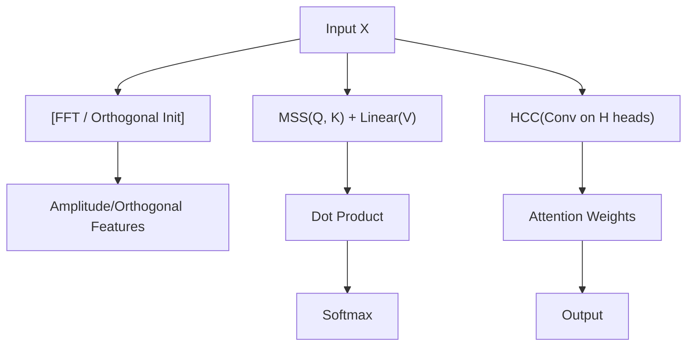

<!-- ontology-5axis data=量价表格 horizon=跨周期 paradigm=监督回归 alpha=端到端表征 autonomy=全自动黑盒 -->

# FSatten / SOatten 解構

> **發布**：2025-06-14 · AAAI 25
> **QuantML 導讀**：[AAAI 25 | 重新审视多元时间序列预测中的注意力机制](https://mp.weixin.qq.com/s?__biz=Mzg2MzAwNzM0NQ==&mid=2247490720&idx=1&sn=9cf34d629bb9318be4cc40dbb78d83e2&chksm=ce7e7bbef909f2a8b3b591ee0d561f3f99d9529152140de31e3b9a2408dc8295ec1c9db25e38#rd)
> **核心定位**：落點於「端到端表征 × 監督回歸」軸，直擊傳統 Transformer 在多元時間序列預測（MTSF）中盲目依賴數據驅動隱空間的 Prior Gap。以確定性頻域/正交映射取代學習式投影，為量價表格的週期性與鄰近相似性提供可解釋的注意力先驗。

**五軸座標**

| 數據模態 | 時間尺度 | 學習範式 | Alpha機制 | 人機協作 |
|:-:|:-:|:-:|:-:|:-:|
| `量价表格` | `跨周期` | `监督回归` | `端到端表征` | `全自动黑盒` |

**Status:** v0.5 — 基於 QuantML 導讀 + 原論文（如有）。benchmark 細節待升 v1。
**TL;DR:** ① 提出 FSatten（頻譜注意力）與 SOatten（縮放正交注意力），用 FFT 與可學習正交映射替換傳統 Q/K 線性投影。② 核心 Trick 是 MSS（多頭譜縮放）自適應放大關鍵頻率分量，並引入 HCC（頭耦合卷積）利用「鄰近相似性」約束注意力權重學習。③ 對「端到端表征」軸★ 的關鍵意義在於：將黑盒隱空間降維為具物理先驗的頻域/正交域，顯著降低條件數並提升滿秩率。④ 導讀未給 Sharpe/IR 等交易指標，僅披露在 ECL 數據集上 MSE 總體改善 9.0%。

**X-Ray.** 在量價表格的跨周期預測中，傳統 Transformer 的隱空間投影本質是「無先驗的相關性盲搜」，容易在低信噪比環境下過擬合偽週期或產生秩虧損。FSatten/SOatten 的 Pareto 突破在於將 Q/K 的生成從數據驅動轉為結構驅動：FSatten 鎖定頻域振幅，SOatten 推廣至正交域。這直接解決了量化工程中的兩個舊坑：一是注意力權重矩陣條件數過高導致的數值不穩定（傳統方法條件數高達 78,596,560，本法降至 ~1,500）；二是變量間弱相關信號被主週期淹沒（MSS 實現分量級自適應縮放）。然而，該方法打不開的 Envelope 在於對「強週期性」與「變量排列順序」的依賴：若市場 regime 切換導致週期結構破裂，或變量順序無物理鄰近性，HCC 的局部耦合將退化為雜訊放大器。對量化讀者而言，此框架不直接產出 Alpha，而是提供一套可插拔的注意力替換模塊，適合嵌入現有的 PatchTST/iTransformer 流水線，用於特徵工程階段的週期性濾波與矩陣穩定性增強。

## §1 · 架構 / Core Mechanism
| 改動維度 | 傳統 Transformer (MHA) | FSatten / SOatten |
|---|---|---|
| 序列嵌入 | 學習式 Embedding / 線性投影 | 確定性 FFT (FSatten) / 可學習正交映射 (SOatten) |
| Q/K 映射 | 全連接線性投影 | MSS (多頭譜縮放，元素級哈達瑪積) |
| 權重引導 | 無 | HCC (頭耦合卷積，利用鄰近相似性) |

⚡ **Eureka:** 放棄黑盒隱空間，用「頻域振幅+正交基」硬編碼週期先驗，靠 MSS 與 HCC 做軟性微調。
**信息流:**

## §2 · 數學層
📌 **Napkin Formula:**
$Q, K = \text{MSS}(\text{FFT}(X))$, $V = \text{Linear}(X)$
$\text{Attention}(Q,K,V) = \text{Softmax}(\frac{QK^T}{\sqrt{d}}) \cdot V$
**複雜度:** $O(L^2 d)$ (同標準 MHA，FFT 為 $O(L \log L)$)
**直覺:** 用哈達瑪積替代矩陣乘法生成 Q/K，保留正交性；HCC 在權重矩陣上做通道融合卷積，將局部鄰近變量的動態模式耦合進全局注意力。
**Loss/訓練:** 標準 MSE/L1 回歸損失；正交矩陣僅做初始化，反向傳播不強制正交約束以保留梯度。

## §3 · 數據層
- **資料規模/頻率/市場/時段:** 6 個真實世界大型數據集（ECL, ETT×4, Exchange, Traffic, Weather, Solar-Energy），涵蓋電力、交通、氣象、能源等領域。
- **怎麼來:** 公開基準數據集。
- **樣本外與容量假設:** 遵循標準時間序列劃分（訓練/驗證/測試），未披露具體樣本量與回測窗口；假設數據具備穩定的週期性結構與變量鄰近相似性。

## §4 · 代碼層
| Repo | Checkpoint | License | 複現難度 | 數據可得性 |
|---|---|---|---|---|
| TBD | TBD | TBD | 中（需自實現 MSS 與 HCC 模塊，替換現有 Transformer 的 attention 層） | 高（均為開源 MTSF 基準數據） |

## §5 · 評測 / Benchmark
| 數據集/市場 | Metric | 前SOTA | 本方法 | Δ |
|---|---|---|---|---|
| ECL (電力) | MSE | iTransformer (傳統注意力) | FSatten | 改善 9.0% |
| Weather (氣象) | 矩陣條件數 | 傳統注意力 78,596,560 | FSatten 1,519 / SOatten 1,480 | ↓ 約 5 個數量級 |
| Weather (氣象) | 矩陣秩 | 傳統注意力 19 | FSatten / SOatten 21 | +2 |

**解讀:** Δ 中的 MSE 改善 9.0% 屬真實週期捕捉能力，但僅限於 ECL 等強週期數據；條件數與秩的 Δ 反映數值穩定性提升，屬架構內稟屬性，非市場 Alpha。導讀未提供交易成本、過擬合檢驗或跨市場 Sharpe，此 Δ 不可直接外推為實盤收益。HCC 在時間 Transformer 上提升更明顯，暗示其對變量順序敏感，實盤需警惕數據預處理帶來的排列偏差。

## §6 · 失效與隱含假設
**6.1 論文自述 limitations:** 固定頻域映射非普適；正交約束在反向傳播中未強制施加（權衡梯度）；未探索趨勢性/季節性等非週期物理屬性；未與 SSM (如 Mamba) 結合處理海量變量。
**6.2 推斷的隱含假設:** Regime 依賴強（假設週期結構與變量鄰近性在樣本外穩定）；容量假設為中小型變量規模（未驗證超寬截面下的擴展性）；成本未計（FFT 與 HCC 增加前向計算開銷，高頻場景需評估延遲）；數據泄漏風險低（純結構替換），但 Survivorship Bias 未明確控制（基準數據通常已過濾退市變量）。

## §7 · 對比 & 面試 Tip
| 同軸對手 | 關鍵差異軸 | Open? | Status |
|---|---|---|---|
| iTransformer | 隱空間投影 vs 正交/頻域映射 | 開源 | SOTA Baseline |
| PatchTST | 時間 Patch 注意力 vs 變量/全局正交耦合 | 開源 | SOTA Baseline |
| Mamba/SSM | 狀態壓縮 vs 注意力矩陣顯式建模 | 開源 | 互補方向 |

🎤 **Interview Tip**
- **正確答:** 「FSatten/SOatten 不是新的因子挖掘器，而是注意力機制的結構先驗替換。它用 FFT/正交基解決了隱空間秩虧損與條件數過高的數值問題，適合嵌入現有流水線做週期濾波，但實盤需驗證變量排列穩定性與 regime 切換下的週期魯棒性。」
- **錯答:** 「這模型用頻域分析直接預測股價，比 Transformer 準確率高 9%，可以直接上線交易。」（混淆了 MSE 改善與交易收益，無視了數據集領域與成本假設）

**7.1 可證偽預測:** 若 2025-12-31 前，該模塊在 A 股高頻量價數據（如 Tick 級）上測試，因變量順序無物理鄰近性且 regime 切換頻繁，HCC 耦合將導致過擬合，MSE 改善幅度將顯著收斂或轉負。

## §8 · For the Reader
- **因子研究員:** 將 MSS 視為自適應頻域濾波器，提取週期性 Alpha 前先用條件數診斷特徵矩陣穩定性，避免低秩特徵進入組合優化。
- **高頻執行:** HCC 的卷積操作增加推理延遲，需評估在微秒級延遲約束下的吞吐量；若延遲不可接受，可僅保留 FSatten 的 FFT 嵌入層。
- **組合配置:** 此方法產出的是預測值而非直接權重，需接入後端的風險模型與交易成本模型；注意正交映射對極端行情（週期破裂）的滯後響應。
- **LLM-agent/RL 策略:** 可將 HCC 的「鄰近相似性」約束抽象為圖結構先驗，用於多智能體協同或跨資產關聯建模。
- **研究學生:** 重點復現 MSS 的哈達瑪積與 HCC 的通道融合卷積，對比傳統 MHA 在 Weather 數據集上的條件數變化，理解「結構先驗 vs 數據驅動」的 Pareto 邊界。

## References
- 原論文: AAAI 25 (FSatten / SOatten)
- Lineage: iTransformer, PatchTST, Standard MHA
- QuantML 導讀鏈接: [AAAI 25 | 重新审视多元时间序列预测中的注意力机制](https://mp.weixin.qq.com/s?__biz=Mzg2MzAwNzM0NQ==&mid=2247490720&idx=1&sn=9cf34d629bb9318be4cc40dbb78d83e2&chksm=ce7e7bbef909f2a8b3b591ee0d561f3f99d9529152140de31e3b9a2408dc8295ec1c9db25e38#rd)