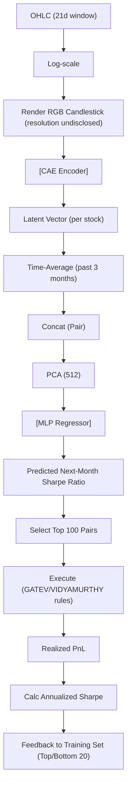

<!-- ontology-5axis data=量价表格 horizon=日频波段 paradigm=监督回归 alpha=端到端表征 autonomy=全自动黑盒 -->

# ISEPT 解構

> **發布**：2025-11-24 · （無 venue）
> **QuantML 導讀**：[基于图像的配对交易框架](https://mp.weixin.qq.com/s?__biz=Mzg2MzAwNzM0NQ==&mid=2247492463&idx=1&sn=eff946db3dd23827d1a41b6a7ded0c97&chksm=ce7d8471f90a0d67f7218e814e1c77ae8c34c4f9046a89cdc52f470fb9390427497a2e0b38e0#rd)
> **原始論文**：[ISEPT: Image-Based Selection and Execution Framework for Pair Trading](https://doi.org/10.1145/3768292.3770346)（Proceedings of the 6th ACM International Conference on AI in Finance · 2025 · 被引 0 · Crossref）
> **核心定位**：將傳統割裂的「資產對選擇」與「交易執行」統一為端到端監督回歸框架；透過 CAE 提取 K 線圖視覺特徵並預測下月 Sharpe Ratio，以實盤績效閉環抵抗市場漂移，解決了統計套利在 regime shift 下的靜態過擬合與執行反饋斷裂問題。

**五軸座標**

| 數據模態 | 時間尺度 | 學習範式 | Alpha機制 | 人機協作 |
|:-:|:-:|:-:|:-:|:-:|
| `量价表格` | `日频波段` | `监督回归` | `端到端表征` | `全自动黑盒` |

**Status:** v0.5 — 基於 QuantML 導讀 + 原論文（如有）。benchmark 細節待升 v1。
**TL;DR:** ① 將 OHLC 渲染為 RGB K 線圖（解析度未披露），經 CAE 編碼後由 MLP 直接回歸預測下月 Sharpe Ratio。② 核心 trick 是建立「交易績效→Sharpe 標籤→模型再訓練」的閉環反饋，強制模型學習真實盈利模式而非歷史價格相似性。③ 這對「端到端表征」與「全自动黑盒」軸具指標意義，將 CV 視覺先驗與量化風險調整目標直接綁定。④ 導讀給出 2004-2024 全樣本 ISEPT+GATEV 年化 ROI 18.97%、Sharpe 0.6837，Calmar 3.1572。

**X-Ray.** 在「監督回歸」與「端到端表征」軸上，ISEPT 放棄了傳統价差預測或信號分類，直接錨定風險調整收益。這在工程上跳過了「預測→閾值→執行」的誤差累積鏈，但代價是標籤噪聲極高：Sharpe 本身是後驗統計量，直接作為月度回歸標籤會引入嚴重的前瞻與平滑偏差。閉環反饋是雙刃劍：用 Top 20 和 Bottom 20 的實現 Sharpe 覆蓋舊標籤，確實能抵抗協方差結構漂移，但也意味著模型會快速過擬合近期波動率環境，在低波動震盪市可能頻繁切換配對導致交易成本侵蝕。對量化讀者而言，此框架的價值不在於「K線圖比數值序列好」，而在於「目標函數與執行指標的統一」；實盤落地需嚴格控制再訓練頻率與標籤衰減，否則閉環會變成正反馈過擬合陷阱。

## §1 · 架構 / Core Mechanism
**1.1 三大改動 vs 前作**
| 維度 | 傳統兩步法 (GATEV/Engle-Granger) | ISEPT 框架 | 解構意義 |
|---|---|---|---|
| 數據模態 | 原始數值序列 / 聚合統計量 | RGB K 線圖 (CAE 編碼，解析度未披露) | 引入交易員視覺先驗，捕捉局部波動與交叉互動 |
| 目標函數 | 預測價差方向 / 距離最小化 | 直接回歸下月 Sharpe Ratio | 統一選擇與執行目標，抑制高回報低風險調整的偽信號 |
| 更新機制 | 靜態閾值 / 離線訓練 | 6個月窗口閉環反饋 (Top/Bottom 20) | 抵抗 Market Drift，動態重校風險預算 |

**1.2 ⚡ Eureka 一句話 trick**
用已實現的 Sharpe Ratio 作為監督標籤反饋訓練，讓模型「只學賺錢的視覺模式」，而非「只學歷史價格相似性」。

**1.3 信息流 ASCII 圖**

## §2 · 數學層
📌 **Napkin Formula**
`v_t = mean(Encoder(I_{t-k:t}))`  (時間平均化潛在嵌入)
`v_pair = concat(v_A, v_B)`       (配對表征拼接)
`ŷ = MLP(v_pair)`                 (回歸預測下月 Sharpe Ratio)
**複雜度**：CAE 前向 O(N) per chart，MLP 評分 O(1) per pair，每月全庫評分約 未披露 次。
**直覺**：將時間序列降維為去時序的視覺摘要，MLP 學習「何種波動形態對應高風險調整收益」。
**Loss/訓練**：MSE Loss。CAE 初始學習率 未披露，每5個epoch衰減；MLP Batch size 512，初始學習率 未披露，Adam 優化，Dropout 0.5。

## §3 · 數據層
- **來源/市場**：S&P 500 成分股 1990年1月至2024年12月 每日 OHLC。
- **過濾**：僅保留選擇日前12個月和後6個月無價格缺失的成分股。
- **劃分**：單資產圖像 70% 訓練 / 30% 驗證。訓練期 13年 (1991-2003)，樣本外評估期 20年 (2004-2024)。
- **容量假設**：依賴 S&P 500 高流動性標的，未披露小盤股或跨市場泛化測試。

## §4 · 代碼層
| 項目 | 狀態/細節 |
|---|---|
| Repo | TBD |
| Checkpoint | TBD |
| License | TBD |
| 複現難度 | 中 (需自構 K 線圖渲染管線 + CAE-MLP 閉環邏輯) |
| 數據可得性 | 高 (標準日頻 OHLC + S&P 500 成分股列表) |

## §5 · 評測 / Benchmark
| 數據集/市場 | Metric | 前SOTA (GATEV) | 前SOTA (VIDYAMURTHY) | 本方法 (ISEPT+GATEV) | 本方法 (ISEPT+VIDYAMURTHY) | Δ |
|---|---|---|---|---|---|---|
| S&P 500 (2004-2024) | ROI | 3.52% | 4.02% | 18.97% | 16.48% | 未披露 |
| S&P 500 (2004-2024) | Sharpe Ratio | 0.40-0.47 | 0.40-0.47 | 0.6837 | 0.7892 | 未披露 |
| S&P 500 (2004-2024) | Sortino Ratio | 0.8-0.9 | 0.8-0.9 | 1.31-1.34 | 1.31-1.34 | 未披露 |
| S&P 500 (2004-2024) | MDD | 未披露 | 未披露 | 10%-11% | 10%-11% | 未披露 |
| S&P 500 (2004-2024) | Calmar Ratio | 2.6675 | 1.3306 | 3.1572 | 2.2398 | 未披露 |

**解讀**：ROI 與 Sharpe 的 Δ 反映真 capability，源於目標函數統一與視覺特徵對 regime shift 的捕捉。但 MDD 上升至 10%-11% 區間，顯示模型為追求高 Sharpe 主動擴張了風險預算。所有指標已扣除 1bp 成本，但 ISEPT+VIDYAMURTHY 月均交易次數 3.50 次（危機期 6.53 次），若實盤滑點或衝擊成本超 1bp，淨值會快速衰減。閉環反饋的 Sharpe 標籤若未嚴格滯後，可能引入前瞻偏差；Sortino 提升但 MDD 未降，證明模型優化的是下行波動率而非極端回撤深度。

## §6 · 失效與隱含假設
**6.1 論文自述 limitations**
導讀未明確自述 limitations。

**6.2 推斷的隱含假設**
- **Regime 依賴**：K 線圖視覺模式在趨勢市或無均值回歸特徵的資產對上失效，CAE 會提取無意義噪聲。
- **容量假設**：S&P 500 成分股流動性充足，未建模配對交易的 legs 執行錯配與融券成本。
- **數據泄漏風險**：Sharpe 標籤基於已實現交易結果，若回測窗口與預測窗口重疊或標籤計算未嚴格滯後，會產生 look-ahead bias。
- **Survivorship**：過濾規則僅保留無缺失數據的成分股，未處理退市/併購樣本的生存偏差。

## §7 · 對比 & 面試 Tip
| 同軸對手 | 關鍵差異軸 | Open? | Status |
|---|---|---|---|
| 傳統協整/距離法 | 目標函數 (價差 vs Sharpe) / 更新機制 (靜態 vs 閉環) | 開源多 | 成熟/基線 |
| LSTM/RL 價差預測 | 數據模態 (數值序列 vs 圖像) / 標籤 (方向/價差 vs 風險調整收益) | 部分開源 | 研究中 |
| GAF/PCA 圖像方法 | 表征生成 (數學變換 vs CAE 端到端) / 聯合優化 (否 vs 是) | 開源少 | 探索期 |

🎤 **Interview Tip**
- **正確答**：「ISEPT 的核心不在於 CV 取代數值序列，而在於用 Sharpe Ratio 作為監督信號打通選擇與執行閉環。實盤需警惕標籤平滑偏差與再訓練頻率過高導致的正反馈過擬合。」
- **錯答**：「因為 K 線圖包含更多信息，所以 CNN 一定比 LSTM 預測價差更準。」（混淆了數據模態優勢與目標函數設計的本質差異）

**7.1 可證偽預測帶日期**
若 2026-Q3 前，該框架在低波動震盪市（如 VIX < 15 持續 60 日）的實盤淨 Sharpe 低於 0.50，則證明閉環反饋在缺乏趨勢/均值回歸動能時會因頻繁切換配對而侵蝕收益。

## §8 · For the Reader
- **因子研究員**：將 Sharpe 作為回歸標籤是雙刃劍。建議在特徵工程層面加入波動率 regime 分類器，避免模型在低波動期過度交易。
- **高頻執行**：1bp 成本假設過於理想。配對交易的 legs 執行錯配與融券成本是實盤生死線，需將執行滑點納入閉環損失函數。
- **組合配置**：此框架輸出的是單對 Sharpe，非組合層面優化。實盤需加入配對間相關性矩陣與風險預算分配，否則會暴露於系統性因子風險。

## References
- 原論文：ISEPT (Image-Based Selection and Execution Framework for Pair Trading) · （無 venue）
- Lineage：Gatev et al. (2006) SSD / Vidyamurthy (2004) Cointegration / CAE-MLP 視覺表征
- QuantML 導讀：[基于图像的配对交易框架](https://mp.weixin.qq.com/s?__biz=Mzg2MzAwNzM0NQ==&mid=2247492463&idx=1&sn=eff946db3dd23827d1a41b6a7ded0c97&chksm=ce7d8471f90a0d67f7218e814e1c77ae8c34c4f9046a89cdc52f470fb9390427497a2e0b38e0#rd)