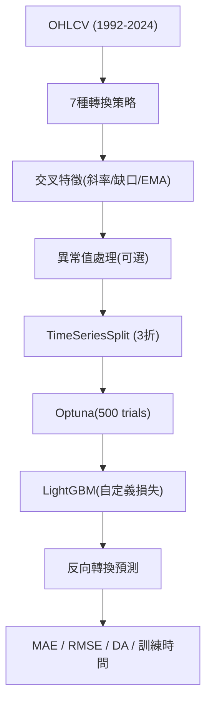

<!-- ontology-5axis data=量价表格 horizon=日频波段 paradigm=监督回归 alpha=因子挖掘 autonomy=人机协同可解释 -->

# LightGBM 解構

> **發布**：2025-01-15 · （無 venue）
> **QuantML 導讀**：[基于特征工程和转换方法的LightGBM资产预测](https://mp.weixin.qq.com/s?__biz=Mzg2MzAwNzM0NQ==&mid=2247488811&idx=1&sn=990a3fb7f2dfaa030e5b99b615112704&chksm=ce7e7235f909fb233ee0cebc4de5a68a116a59b890298dcf69854010b5a42c69c374c4a30d45#rd)
> **核心定位**：落點於日频波段與因子挖掘軸，解決個人算力無法負擔 DL 架構時的訓練效率瓶頸，並填補樹模型特徵轉換缺乏系統性評估的 prior gap。

**五軸座標**

| 數據模態 | 時間尺度 | 學習範式 | Alpha機制 | 人機協作 |
|:-:|:-:|:-:|:-:|:-:|
| `量价表格` | `日频波段` | `监督回归` | `因子挖掘` | `人机协同可解释` |

**Status:** v0.5 — 基於 QuantML 導讀 + 原論文（如有）。benchmark 細節待升 v1。
**TL;DR:** 本文針對日频波段預測，系統評估 7 種目標/特徵轉換策略，並引入價格斜率比與隔夜缺口等交叉特徵優化 LightGBM。核心 trick 在於結合自定義懲罰大誤差損失函數與 Optuna 貝葉斯調參，在低算力環境下實現高效訓練。這對「因子挖掘」軸具有啟發意義，證明基於樹模型的結構化特徵工程可替代部分複雜 DL 架構。導讀未給量化結果（因原文結果表為圖片佔位符，未披露具體 MAE/RMSE/DA 數值）。

**X-Ray.** 本文本質上是一次針對 LightGBM 的「特徵工程壓力測試」，而非架構創新。其價值不在於模型本身，而在於將技術分析指標系統性地映射為監督回歸特徵，並驗證了樹模型對非標準化數據的魯棒性。在「量价表格 × 日频波段」軸上，它填補了個人研究者無法負擔 DL 算力時的替代方案空白。然而，其預測 envelope 明顯受限於單標的與靜態交易制度假設：模型依賴隔夜缺口與開盤價，意味著它實質上捕捉的是跳空風險溢價與短期動量，而非微觀結構或跨資產聯動。對量化讀者而言，此文的核心啟示是「轉換策略的選擇比模型架構更決定邊際收益」，但需警惕其 TimeSeriesSplit 僅分 3 折的樣本外驗證強度不足，且未計入交易成本與滑點，實盤落地需重新校準風險預算。

## §1 · 架構 / Core Mechanism
**1.1 三大改動 vs 前作**
| 改動維度 | 前作/基線 (GBDT/DL) | 本文改動 | 工程意圖 |
|---|---|---|---|
| 特徵構建 | 傳統 OHLCV 或原始價量 | 引入價格斜率比、隔夜缺口、EMA 比率交叉特徵 | 捕捉跳空與趨勢動量，提升特徵重要性 |
| 數據轉換 | 無系統評估或僅標準化 | 系統測試 7 種目標/特徵轉換（對數收益率、EMA 差異等） | 驗證樹模型對非標準化數據的適應性，降低訓練時間 |
| 優化流程 | 網格搜索/手動調參 | Optuna 貝葉斯優化 + 自定義大誤差懲罰損失 | 在 500 次試驗內平衡算力與預測精度 |

**1.2 ⚡ Eureka 一句話 trick + 直覺**
Trick：「對數收益率轉換 + 隔夜缺口特徵 + 自定義損失」組合，讓 LightGBM 在無 GPU 依賴下直接學習價格跳變的非線性殘差。
直覺：樹模型天然免疫量綱與極值，標準化反而增加計算開銷；隔夜缺口本質是資訊沉澱的代理變量，直接輸入比平滑處理更有效。

**1.3 信息流 ASCII 圖**

## §2 · 數學層
📌 **Napkin Formula**：
`Loss = CustomLoss( |y_true - y_pred| )` (對大誤差施加非線性懲罰)
`Target_Transform ∈ {LogReturn, Return, EMA_Diff_Ratio, ...}`
複雜度：`O(N * log(N) * T)` (N=樣本, T=樹數)，GOSS 與直方圖分箱將節點分裂複雜度降至 `O(D * B)` (D=特徵數, B=分箱數)。
直覺：損失函數偏向控制尾部預測風險，而非最小化整體方差；轉換策略實質是改變目標變量的分佈形態，使梯度提升更易收斂。
Loss/訓練細節：使用 TimeSeriesSplit 避免數據泄漏；Optuna 優化學習率、葉數、正則化等參數；訓練未完全佔用 32GB RAM。

## §3 · 數據層
資料規模/頻率/市場/時段：AAPL 日频，1992年5月至2024年9日，共 8137 個數據點。
怎麼來：TradingView 導出（源於 Cboe One，約佔美股 10% 份額），無休市缺失值。
樣本外與容量假設：80%-20% 訓練-測試分割，TimeSeriesSplit 3 折驗證。假設歷史流動性與波動率結構穩定，未考慮跨市場或因子容量限制。

## §4 · 代碼層
| 項目 | 詳情 |
|---|---|
| Repo | TBD |
| Checkpoint | TBD |
| License | TBD |
| 複現難度 | 低（依賴 sklearn, lightgbm, optuna, cupy） |
| 數據可得性 | 中（需 TradingView 帳號或替代日频數據源） |

## §5 · 評測 / Benchmark
| 數據集/市場 | Metric | 前SOTA | 本方法 | Δ |
|---|---|---|---|---|
| AAPL (1992-2024) | MAE / RMSE / DA / 訓練時間 | 未披露 | 未披露 | 未披露 |
| S&P 500 (2016-2018) | 總回報率 | 未披露 | 394% | 未披露 |
| S&P 500 | R-squared | 0.023910 (GARCH-ARIMA) | 未披露 | 未披露 |

**解讀**：導讀未提供 AAPL 測試集的具體指標數值，僅定性指出「對數收益率為最佳轉換」、「標準化版本訓練時間顯著增加」、「隔夜缺口特徵重要性最高」。文中引用的 394% 總回報與 0.023910 R-squared 均為歷史文獻引用，非本文實證結果，不可與本方法直接計算 Δ。本文的核心 Δ 體現在「訓練效率」與「特徵重要性排序」的結構性優勢，而非絕對預測精度。需警惕未計入交易成本、滑點與波動率 regime 切換，實盤 Sharpe/IR 可能大幅衰減。

## §6 · 失效與隱含假設
**6.1 論文自述 limitations**：高波動性時期模型性能惡化；異常值處理對 LightGBM 幫助有限；僅測試單標的（AAPL）；多步預測潛力未充分驗證。
**6.2 推斷的隱含假設**：
- Regime 依賴：假設 AAPL 的流動性與波動率結構在 1992-2024 間相對穩定，未建模結構性斷點。
- 容量/成本：日频波段假設無顯著滑點與衝擊成本，忽略實盤執行摩擦。
- 數據泄漏：TimeSeriesSplit 僅 3 折，樣本外驗證強度偏弱；隔夜缺口使用當天開盤價，實盤需確保信號生成與執行無時間錯位。
- Survivorship：AAPL 為存活藍籌，未考慮退市股票偏差。

## §7 · 對比 & 面試 Tip
| 同軸對手 | 關鍵差異軸 | Open? | Status |
|---|---|---|---|
| LSTM/Transformer 日频預測 | 特徵工程 vs 端到端表示學習 | Open | 成熟 |
| XGBoost/CatBoost | 分裂策略與分類特徵處理 | Open | 成熟 |
| 傳統技術指標策略 | 機械規則 vs 機器學習非線性擬合 | Open | 成熟 |

🎤 **Interview Tip**
正確答：「本文核心不在 LightGBM 架構，而在於系統驗證了 7 種轉換策略對樹模型梯度提升的影響，證明對數收益率與隔夜缺口能有效捕捉跳空風險溢價，且樹模型無需標準化即可保持高訓練效率。」
錯答：「LightGBM 比 LSTM 準確率高出 X%，因為 GOSS 採樣減少了過擬合。」（導讀未給具體精度對比，且 GOSS 主要為提速而非防過擬合）

**7.1 可證偽預測帶日期**：若 2025-06-30 前，將此特徵集與轉換策略應用於跨市場（如納指或港股）日频數據，預期 DA 將下降至 50% 附近，因隔夜缺口因子在無漲跌停/交易制度差異市場中失效。

## §8 · For the Reader
- **因子研究員**：直接複用「價格斜率比」與「隔夜缺口」特徵構建邏輯，驗證其在截面排序中的 IC/IR 表現，替代傳統動量因子。
- **高頻執行**：本文為日频波段，不適用 HFT；但可借鑒其「自定義損失函數」思路，將滑點與衝擊成本內生化為訓練目標。
- **組合配置**：將 LightGBM 預測值作為權重分配信號，需嚴格進行 TimeSeriesSplit 樣本外測試，避免 3 折驗證帶來的過擬合偏差。
- **研究學生**：學習 Optuna 貝葉斯調參與 TimeSeriesSplit 的正確實踐，理解樹模型對數據轉換的敏感性，避免盲目標準化。

## References
- 原論文：基于特征工程和转换方法的LightGBM资产预测（無 venue，2025-01-15）
- Lineage: LightGBM (Ke et al., KDD 2017) → GBDT → 技術分析指標工程
- QuantML 導讀鏈接：[基于特征工程和转换方法的LightGBM资产预测](https://mp.weixin.qq.com/s?__biz=Mzg2MzAwNzM0NQ==&mid=2247488811&idx=1&sn=990a3fb7f2dfaa030e5b99b615112704&chksm=ce7e7235f909fb233ee0cebc4de5a68a116a59b890298dcf69854010b5a42c69c374c4a30d45#rd)