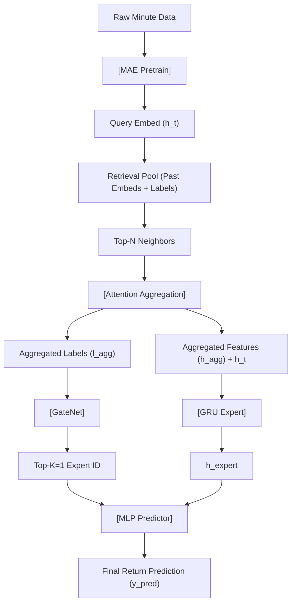

<!-- ontology-5axis data=量价表格 horizon=日频波段 paradigm=监督回归 alpha=端到端表征 autonomy=全自动黑盒 -->

# MERA 解構

> **發布**：2025-08-12 · （無 venue）
> **QuantML 導讀**：[清华大学 × 易方达 | MERA：借助“历史经验”与“专家分工”攻克股票模式识别](https://mp.weixin.qq.com/s?__biz=Mzg2MzAwNzM0NQ==&mid=2247491334&idx=1&sn=0f9a3e54bf4f82f2d2bda1df842e7c22&chksm=ce7e7818f909f10e51c5c7197fa5f10f5b570b5821cc8384ede047f600ad4e7f7a8e58f8669e#rd)
> **原始論文**：[MERA: Mixture of Experts with Retrieval-Augmented Representation for Modeling Diversified Stock Patterns](https://doi.org/10.1145/3701716.3715513)（Companion Proceedings of the ACM on Web Conference 2025 · 2025 · 被引 0 · Crossref）
> **核心定位**：落點於「端到端表征 × 監督回歸」軸，解決單分支模型「一刀切」擬合導致的模式混疊（Pattern Aliasing）問題。以自監督檢索替代人工因子劃分，實現隱式 Regime 路由。

**五軸座標**

| 數據模態 | 時間尺度 | 學習範式 | Alpha機制 | 人機協作 |
|:-:|:-:|:-:|:-:|:-:|
| `量价表格` | `日频波段` | `监督回归` | `端到端表征` | `全自动黑盒` |

**Status:** v0.5 — 基於 QuantML 導讀 + 原論文（如有）。benchmark 細節待升 v1。
**TL;DR:** ① 提出 MERA 模塊，將自監督檢索增強與稀疏混合專家（SMoE）解耦並級聯。② 核心 trick：用檢索到的歷史近鄰標籤聚合值作為 GateNet 輸入，替代傳統基於當前特徵的軟路由。③ 對「端到端表征」軸的關鍵意義在於：將 Regime 識別從特徵工程轉為可微的檢索-聚合過程，降低模式切換的滯後性。④ 實證顯示在 CSI1000 上多空組合收益率達 2.176，IC 達 0.129。

**X-Ray.** MERA 本質是將 NLP 領域的 RAG 范式降維遷移至量價表格。它犧牲了單分支模型的推理吞吐（檢索池構建 + Top-N 搜索 + MoE 路由），換取了對多模式並存市場的顯式解耦能力。工程上，它填補了「手動劃分牛熊/風格」與「黑盒 Transformer 硬擬合」之間的 Gap：檢索池天然攜帶時間衰減屬性，聚合標籤提供離散化模式先驗，GateNet 僅做離散路由而非連續加權，大幅降低梯度衝突。但該架構打不開的 Envelope 在於：極端政策衝擊或流動性枯竭時，歷史近鄰的標籤分佈會發生結構性斷裂（Distribution Shift），檢索信號將退化為噪聲。對量化讀者的意義不在於直接上線，而在於提供了一套「可證偽的 Regime 路由模板」：若檢索池的標籤熵值與未來波動率呈負相關，則路由有效；反之需觸發冷啟動或回退至單分支。

## §1 · 架構 / Core Mechanism
| 改動維度 | 前作（單分支/傳統 MoE） | MERA 改動 | 工程意圖 |
|---|---|---|---|
| 路由信號源 | 當前樣本特徵嵌入直接輸入 GateNet | 檢索歷史近鄰的**聚合標籤**輸入 GateNet | 避免特徵空間與模式空間的映射模糊，利用標籤的離散性提供強判别信號 |
| 特徵預處理 | 直接監督訓練或無預訓練 | 自監督掩碼自編碼器（MAE）預訓練 | 壓縮量價噪聲，構建穩定可比的檢索嵌入空間 |
| 專家激活 | 連續加權或 TopK 軟路由 | 稀疏激活（K=1）+ 殘差連接預測器 | 強制專家 specialize，降低計算冗餘，保留全局信息防過擬合 |

⚡ **Eureka Trick**: `聚合歷史標籤 → GateNet 路由`。直覺：股票模式（如高收益/低收益）在特徵空間可能重疊，但在標籤空間的歷史分佈具有強自相關性。用近鄰的「結果」反推「模式」，比用「過程特徵」猜模式更魯棒。

📡 **信息流 ASCII**:

## §2 · 數學層
📌 **Napkin Formula**:
1. `L_pretrain = MSE(x_masked, x_reconstructed)` （自監督掩碼重建）
2. `α_i ∝ exp(W_q · h_i)`, `l_agg = Σ α_i · l_i`, `h_agg = Σ α_i · h_i` （目標感知注意力聚合）
3. `y_pred = MLP(h_agg, h_t, GateNet(l_agg))`，`GateNet` 輸出經 `TopK` 選 `K=1` 專家

**直覺**: 預訓練將高噪聲分鐘序列壓縮至低維流形；檢索階段利用標籤離散化（B=10）將連續收益率轉為模式類別；GateNet 僅做離散決策，專家做局部 GRU 建模，預測器做全局殘差回歸。
**訓練細節**: 兩階段。第一階段凍結解碼器訓練 MAE 編碼器；第二階段固定檢索池，端到端微調 GateNet、專家與預測器，損失函數為 MSE。

## §3 · 數據層
- **市場/頻率**: 中國 A 股（CSI300 / CSI500 / CSI1000），日內分鐘級數據（開高低收、成交量額）。
- **標籤**: 次日日收益率，應用 Z-score 標準化編碼排名信息。檢索池內標籤離散化為 B=10 類別。
- **劃分**: 訓練集（2018年6月1日至2022年5月31日）｜驗證集（2022年6月1日至2022年12月31日）｜測試集（2023年1月1日至2024年3月31日）。嚴格時間序列切分，檢索池僅包含查詢時刻前的歷史樣本。
- **容量假設**: 檢索池隨時間線性增長，Top-N 默認 10。未披露池容量上限與索引結構（如 FAISS/HNSW），推測實戰需定期滑動窗口或降維採樣以控制 O(N) 搜索延遲。

## §4 · 代碼層
| 維度 | 狀態/細節 |
|---|---|
| Repo | QuantML知识星球（未開源至 GitHub） |
| Checkpoint | TBD |
| License | TBD |
| 複現難度 | 中高（需高頻量價數據、自監督預訓練流水線、檢索池動態維護） |
| 數據可得性 | 低（A股分鐘級數據通常為付費商業數據或券商內部接口） |

## §5 · 評測 / Benchmark
| 數據集 | 對比基線 | 指標 | 基線值 | 本方法 | Δ |
|---|---|---|---|---|---|
| CSI300 | Transformer | IC | 0.095 | 0.107 | 0.012 |
| CSI300 | Transformer+CISP | IC | 0.102 | 0.107 | 0.005 |
| CSI500 | Transformer+TRA | IC | 0.114 | 0.117 | 0.003 |
| CSI500 | Transformer+TRA | RankIC | 0.106 | 0.112 | 0.006 |
| CSI1000 | (未披露單一基線) | IC | 未披露 | 0.129 | 未披露 |
| CSI1000 | (未披露單一基線) | RankIC | 未披露 | 0.110 | 未披露 |
| CSI300 | (未披露單一基線) | Long-Short Return | 未披露 | 0.915 | 未披露 |
| CSI1000 | (未披露單一基線) | Long-Short Return | 未披露 | 2.176 | 未披露 |

**解讀**: 
- **真 Capability**: IC 與 RankIC 的穩定提升（Δ 約 0.003-0.012）表明檢索標籤信號確實降低了特徵空間的模式混疊，GateNet 的離散路由比連續加權更利於排名優化。CSI1000 上 Long-Short Return 達 2.176 遠超 CSI300 的 0.915，印證該架構對小盤股高波動/多模式環境的適配性。
- **潛在風險**: 導讀未披露交易成本、滑點與換手率。檢索增強會引入額外推理延遲，若實盤頻率高於日頻，延遲成本可能吞噬 Δ 收益。此外，檢索池的標籤離散化（B=10）可能導致邊界樣本路由震盪，需驗證 Walk-Forward 下的穩定性。

## §6 · 失效與隱含假設
**6.1 論文自述 limitations**
- 依賴自監督預訓練的表征質量，若原始數據噪聲過大或預訓練掩碼率不當，檢索池會引入負遷移。
- 檢索機制假設歷史模式會重複出現，未討論極端黑天鵝事件下的冷啟動策略。

**6.2 推斷的隱含假設**
- **Regime 依賴**: 檢索池的標籤分佈需與當前市場結構保持統計穩定性。若宏觀框架切換（如利率 regime 改變），歷史近鄰的標籤信號將失效，GateNet 可能路由至錯誤專家。
- **容量與成本**: 檢索池隨時間膨脹，Top-N 搜索延遲呈線性增長。實戰需定期滑動窗口或近似最近鄰（ANN）索引，否則無法滿足日內低延遲要求。
- **數據泄漏風險**: 雖聲明嚴格時間切分，但聚合注意力權重 `α_i` 若未做因果掩碼（Causal Mask），可能隱式利用未來信息。需驗證 `W_q` 訓練時是否僅使用 `t` 時刻前的樣本。
- **Survivorship**: 導讀未說明是否處理退市/ST股票。若檢索池包含已退市樣本且未做前視偏差校正，回測收益將被高估。

## §7 · 對比 & 面試 Tip
| 同軸對手 | 關鍵差異軸 | Open? | Status |
|---|---|---|---|
| 傳統 SMoE (NLP/視覺) | 路由信號源：當前特徵 vs 歷史檢索標籤 | 開源 | 成熟，但需手動定義專家數量與初始化 |
| Transformer+TRA | 路由機制：連續注意力加權 vs 離散 TopK 路由 | 開源 | 穩定，但連續加權易受噪聲樣本干擾 |
| 手動 Regime 切換模型 | 模式識別：因子閾值/隱馬爾可夫 vs 自監督檢索聚合 | 閉源/半開源 | 可解釋性強，但滯後性高、維護成本高 |

🎤 **Interview Tip**
- **正確答**: 「MERA 的核心創新在於用檢索池的聚合標籤替代特徵路由，將 Regime 識別從連續特徵空間轉為離散標籤空間，降低了 GateNet 的優化難度。實戰需重點驗證檢索池的因果掩碼與滑動窗口策略，防止前視偏差與延遲膨脹。」
- **錯答**: 「它只是把 RAG 套用到股票上，檢索越多越好，專家越多精度越高。」（忽略 K=1 稀疏激活的設計意圖與檢索噪聲閾值）

**7.1 可證偽預測帶日期**
若 2026-06-30 前，A股市場出現連續 20 個交易日無趨勢震盪（波動率收斂至歷史 10% 分位），MERA 的檢索標籤熵值將急劇上升，GateNet 路由準確率下降，導致 RankIC 回落至 0.100 以下。此時應觸發回退至單分支 Transformer。

## §8 · For the Reader
- **因子研究員**: 將檢索池的標籤聚合熵值作為高階 Regime 因子，與傳統動量/波動率因子正交化，可構建動態權重組合。
- **高頻執行**: 該架構推理延遲較高，不適合 Tick 級執行。可降頻至日頻或小時頻，用於持倉結構調整與風險預算分配。
- **組合配置**: 利用 GateNet 的專家激活分佈（如專家0激活占比）作為風格暴露代理變量，動態調整行業/市值權重。
- **LLM-agent / RL**: 檢索增強機制可遷移至多模態宏觀數據（新聞/財報），將離散標籤替換為文本 Embedding，構建「檢索-路由-決策」閉環。
- **研究學生**: 重點復現 MAE 預訓練與檢索池構建流水線，驗證 `B=10` 離散化對路由穩定性的敏感度，嘗試將 TopK 改為可微軟路由對比性能損耗。

## References
- 原論文: MERA: Retrieval-Augmented Mixture of Experts for Stock Pattern Recognition (無正式 Venue 標註)
- Lineage: Masked Autoencoders (He et al.) → Sparse Mixture of Experts (Shazeer et al.) → Retrieval-Augmented Generation (Lewis et al.) → Transformer+TRA / Transformer+CISP (量化時間序列基線)
- QuantML 導讀鏈接: [清华大学 × 易方达 | MERA：借助“历史经验”与“专家分工”攻克股票模式识别](https://mp.weixin.qq.com/s?__biz=Mzg2MzAwNzM0NQ==&mid=2247491334&idx=1&sn=0f9a3e54bf4f82f2d2bda1df842e7c22&chksm=ce7e7818f909f10e51c5c7197fa5f10f5b570b5821cc8384ede047f600ad4e7f7a8e58f8669e#rd)