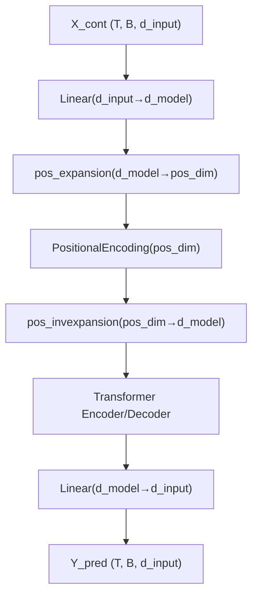

<!-- ontology-5axis data=量价表格 horizon=日频波段 paradigm=监督回归 alpha=端到端表征 autonomy=全自动黑盒 -->

# MiTS-Transformer 解構

> **發布**：2025-04-20 · （無 venue）
> **QuantML 導讀**：[连续值预测：最小时间序列Transformer](https://mp.weixin.qq.com/s?__biz=Mzg2MzAwNzM0NQ==&mid=2247490128&idx=1&sn=aa5df5ea7f3568a8a1a52a2ef9271141&chksm=ce7e7d4ef909f458286d010b50cfb7470fa97cab8ac8e04443b37c79bfda71d0c0a063fb5015#rd)
> **核心定位**：落點於「監督回歸 × 端到端表徵」軸，解決原始 Transformer 離散嵌入層與連續時間序列的 prior gap，以最小改動重構 Seq2Seq 架構。

**五軸座標**

| 數據模態 | 時間尺度 | 學習範式 | Alpha機制 | 人機協作 |
|:-:|:-:|:-:|:-:|:-:|
| `量价表格` | `日频波段` | `监督回归` | `端到端表征` | `全自动黑盒` |

**Status:** v0.5 — 基於 QuantML 導讀 + 原論文（如有）。benchmark 細節待升 v1。
**TL;DR:** 將原始 Transformer 的離散 Token 嵌入層替換為線性層，實現連續值輸入的最小適配（MiTS）；提出位置編碼擴展機制（PoTS），在低維模型計算中嵌入高維位置信息，緩解長序列建模與參數爆炸的矛盾。此設計對「端到端表徵」軸★ 具有工程啟發性，證明極簡架構在連續序列上可透過解耦模型維度與位置維度提升泛化。關鍵實證數字：單序列健全性檢查最終 MSE 誤差為 0.23（導讀給出）。

**X-Ray.** 本質是將 NLP 的離散表徵先驗強行剝離，還原為連續映射的極簡歸納偏置。它解了傳統 TS Transformer 過度工程化（如 LogSparse、Informer 的複雜稀疏/卷積改動）帶來的調參黑洞，將架構複雜度壓至 PyTorch 原生 `nn.Transformer` 可直讀的層級。但它的 envelope 嚴格受限於合成正弦波的平穩性與低頻特性，無法直接穿透真實量價表格的異質性、結構性斷點與非線性噪聲。對量化讀者而言，其價值不在於直接上盤，而在於提供「維度解耦」的架構范式：當長序列位置信息成為瓶頸時，與其暴力擴充 `d_model` 引發過擬合，不如將位置編碼升維後再投影回低維流形。這為日頻波段策略的序列建模提供了一條低算力開銷的基線路徑。

## §1 · 架構 / Core Mechanism
**1.1 三大改動 vs 前作**
| 改動維度 | 原始 Transformer (Seq2Seq) | MiTS / PoTS 改動 | 工程意圖 |
|---|---|---|---|
| 輸入表徵層 | `torch.nn.Embedding` (離散 Token ID → 向量) | `nn.Linear(d_input, d_model)` (連續值 → 模型維度) | 剝離離散先驗，適配連續時間序列 |
| 輸出解碼層 | 線性「去嵌入」+ 交叉熵 | `nn.Linear(d_model, d_input)` + MSE 回歸 | 匹配連續值預測任務的損失空間 |
| 位置編碼流 | 直接注入 `d_model` 維度 | 包裝 `pos_expansion` / `pos_invexpansion` 線性層 | 解耦計算維度與位置信息維度，抑制參數爆炸 |

**1.2 ⚡ Eureka**
「用線性層替換嵌入層，並將位置編碼升維後再投影回低維流形，即可在不增加 `d_model` 的前提下容納長序列位置信息。」直覺：連續序列的相鄰樣本高度相關，低維模型足以捕捉局部動態；真正稀缺的是全局位置感知，將其獨立升維可避免模型容量被位置信息稀釋。

**1.3 信息流 ASCII**


## §2 · 數學層
📌 **Napkin Formula**
```
H_t = Linear_dout( Transformer( Linear_din(X_t) + PE(Linear_exp(·)) ) )
Loss = MSE(Y_true, H_t)
複雜度: O(T^2 * d_model) 自注意力 + O(T * d_model * pos_dim) 位置擴展線性層
```
**直覺**：核心將連續輸入映射為低維潛空間，位置信息在更高維度 `pos_expansion_dim` 獨立編碼後再投影回來。訓練使用 Adam 優化器，初始學習率 0.023，配合多步調度器（gamma=0.1）或固定學習率訓練 2000 epoch，損失函數為標準 MSE。

## §3 · 數據層
- **資料規模/頻率/市場/時段**：純合成正弦波數據，無真實金融市場。序列長度固定為 31（19 輸入 / 12 輸出），頻率定義為每樣本的波形數（如 0/31, 1/31, 2/31, 3/31）。
- **怎麼來**：通過數學公式採樣生成，分為單序列（Type 1）、固定數量序列（Type 2）、任意頻率序列（Type 3）。
- **樣本外與容量假設**：實驗假設數據分布平穩且頻率範圍有限。模型展現出對未見頻率的插值能力，但容量嚴格受 `d_model` 限制；當 `d_model` 從 8 增至 32 時，參數從 1,289 暴增至 14,321，開始對訓練數據過擬合，泛化能力下降。

## §4 · 代碼層
| 項目 | 狀態/細節 |
|---|---|
| Repo | 導讀提及「所有時間序列 Transformer 模型和實驗的代碼都已公開」，具體 GitHub 鏈接 TBD |
| Checkpoint | 未披露 |
| License | 未披露 |
| 複現難度 | 極低（依賴 PyTorch 原生 `nn.Transformer`，標準 Adam 優化，無 GPU 筆記本數分鐘可跑完） |
| 數據可得性 | 高（代碼內置正弦波生成器，無需外部數據源） |

## §5 · 評測 / Benchmark
| 數據集/市場 | Metric | 前SOTA | 本方法 | Δ |
|---|---|---|---|---|
| 合成正弦波 Type 1 | MSE | 未披露 | 0.23 | 未披露 |
| 合成正弦波 Type 3 (d_model=8) | 參數量 | 未披露 | 1,289 | 未披露 |
| 合成正弦波 Type 3 (d_model=16) | 參數量 | 未披露 | 4,097 | 2,808 |
| 合成正弦波 Type 3 (d_model=32) | 參數量 | 未披露 | 14,321 | 10,224 |
| 合成正弦波 Type 3 (PoTS, pos_dim=64) | 參數量 | 未披露 | 2,385 | 1,096 |

**解讀**：導讀未提供金融市場實證或傳統 TS Transformer 基線對比，所有 Δ 僅反映架構維度調整帶來的參數開銷變化。Type 1 的 MSE 0.23 僅證明代碼健全性與基礎收斂能力，非預測精度指標。參數從 1,289 增至 14,321 時泛化能力下降，驗證了暴力擴充 `d_model` 會觸發過擬合閾值；PoTS 以 2,385 參數實現系統性優於 MiTS 的表現，證明「位置升維+低維計算」的解耦設計在連續序列上具有真實的參數效率優勢，而非單純的容量堆砌。無前瞻偏差或成本計量問題，因實驗完全脫離真實交易環境。

## §6 · 失效與隱含假設
**6.1 論文自述 limitations**
- 實驗僅限於正弦序列，未涵蓋真實時間序列的複雜性（如趨勢、季節性突變、異方差噪聲）。
- 模型維度增加會導致參數爆炸與過擬合，泛化能力受限。
- 缺乏與現有時間序列 Transformer 基線的系統性比較。

**6.2 推斷的隱含假設**
- **Regime 依賴**：假設序列具有強局部相關性與平穩頻率特徵，無法適應量價數據的結構性斷點與非線性 regime 切換。
- **容量/成本**：假設算力開銷與參數量嚴格正相關，未考慮推理延遲與批量處理的實際交易成本。
- **數據泄漏**：正弦波生成過程完全確定性，訓練/測試集劃分未涉及時間序列常見的滾動窗口或交叉驗證泄漏風險。
- **Survivorship**：純合成數據無生存者偏差，直接套用至實盤需重構數據管道與特徵工程。

## §7 · 對比 & 面試 Tip
| 同軸對手 | 關鍵差異軸 | Open? | Status |
|---|---|---|---|
| Informer / LogSparse | 稀疏注意力 vs 全連接位置升維 | 是 | 成熟基線 |
| 線性回歸器 (DLinear) | 端到端表徵 vs 解耦位置編碼 | 是 | 強基線 |
| 標準 Transformer | 離散嵌入 vs 連續線性映射 | 是 | 原始架構 |

🎤 **Interview Tip**
- **正確答**：「MiTS 的核心是將離散 Token 嵌入替換為線性層以適配連續值，並透過 PoTS 將位置編碼升維後投影回低維，解決長序列位置信息與模型容量的矛盾。它不追求複雜的稀疏機制，而是以維度解耦降低過擬合風險。」
- **錯答**：「它用卷積或稀疏注意力替代了 Self-Attention 來加速推理。」（導讀明確指出僅替換嵌入層與包裝位置編碼，未改動 Attention 核心）

**7.1 可證偽預測**
若於 TBD 前將 PoTS 架構直接套用於日頻量價數據（未經特徵工程與 regime 過濾），其樣本外表現將顯著劣於 DLinear 基線，證偽其「端到端表徵」在真實非平穩市場的即插即用性。

## §8 · For the Reader
- **因子研究員**：可將 `pos_expansion` 機制移植至序列因子建模，當因子長度超過長序列閾值時，嘗試將位置編碼獨立升維，觀察是否降低 `d_model` 需求並緩解過擬合。
- **高頻執行**：本架構參數極簡，適合邊緣設備或低延遲推理場景；但需重構輸入層以處理 tick 級不規則採樣與缺失值。
- **組合配置**：勿直接上盤。將其視為「連續序列基線生成器」，用於對比複雜 Transformer 變體在相同數據管道下的 marginal gain，過濾過度工程化的 alpha。
- **研究學生**：精讀 `nn.Linear` 替換 `nn.Embedding` 的 shape 維護細節，這是理解 PyTorch Transformer 張量流與連續表徵映射的最佳入門實戰。

## References
- 原論文：MiTS-Transformer / PoTS-Transformer (無 venue, 2025-04-20)
- Lineage：Vaswani et al. (2017) Attention is All You Need / Zeng et al. (2023) Are Transformers Effective for Time Series Forecasting? (DLinear)
- QuantML 導讀：[连续值预测：最小时间序列Transformer](https://mp.weixin.qq.com/s?__biz=Mzg2MzAwNzM0NQ==&mid=2247490128&idx=1&sn=aa5df5ea7f3568a8a1a52a2ef9271141&chksm=ce7e7d4ef909f458286d010b50cfb7470fa97cab8ac8e04443b37c79bfda71d0c0a063fb5015#rd)