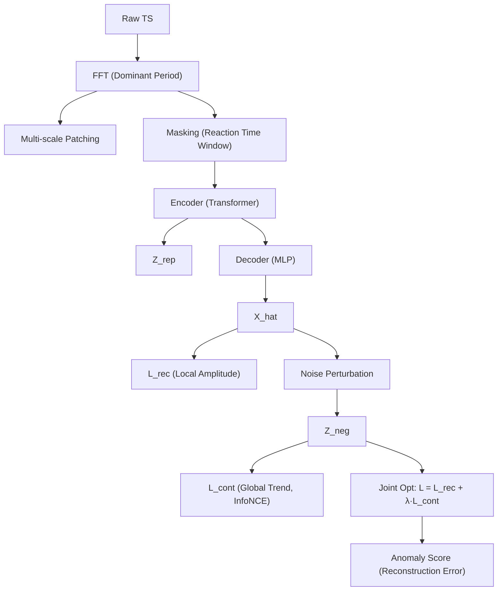

<!-- ontology-5axis data=量价表格 horizon=高频日内 paradigm=监督回归 alpha=端到端表征 autonomy=全自动黑盒 -->

# MultiRC 解構

> **發布**：2024-10-21 · （無 venue）
> **QuantML 導讀**：[MultiRC：突破事后检测局限，预测未来异常的时序异常预测模型](https://mp.weixin.qq.com/s?__biz=Mzg2MzAwNzM0NQ==&mid=2247487147&idx=1&sn=16ffb61687a4042bc10881f737f454b7&chksm=ce7e69b5f909e0a336e2e1eccedd3938adfd5077e2a315426740a6cf2c043b1e8c14956c16ea#rd)
> **核心定位**：落點於「無標簽前瞻預測」，將傳統事後異常檢測（Anomaly Detection）轉為基於頻域主導週期估算的異常預測（Anomaly Prediction），解決了異質性反應時間（Reaction Time）與標簽稀缺的 prior gap。

**五軸座標**

| 數據模態 | 時間尺度 | 學習範式 | Alpha機制 | 人機協作 |
|:-:|:-:|:-:|:-:|:-:|
| `量价表格` | `高频日内` | `监督回归` | `端到端表征` | `全自动黑盒` |

**Status:** v0.5 — 基於 QuantML 導讀 + 原論文（如有）。benchmark 細節待升 v1。
**TL;DR:** ① 提出無監督時序異常預測框架，不依賴異常標簽即可前瞻波動前兆。② 核心 trick 是 FFT 提取單變量主導週期以動態估算反應時間，結合多尺度掩碼重構與受控噪聲對比學習。③ 對「端到端表征+全自動黑盒」軸的關鍵在於將離散的檢測閾值問題轉化為連續的重構誤差與對比距離優化。④ 關鍵實證：在 PSM/SWaT 工業數據集上達 SOTA，但金融量價數據表現未披露。

**X-Ray.** 放回五軸 Pareto，MultiRC 本質是將「異常」從靜態離群點重定義為「狀態遷移的波動幅度」。它解了傳統 VAE/Transformer 檢測器在時序預測中「反應時間一刀切」與「正負樣本定義模糊」的工程坑。然而，其 envelope 打不開金融高頻量價的非平穩性：FFT 主導週期假設在趨勢市或跳空行情中易失效；掩碼重構對微結構噪聲敏感；對比學習的硬負樣本（受控噪聲）在金融數據中可能與真實市場衝擊混淆。對量化讀者的意義不在直接下單，而在於提供了一種「無標簽波動率預測」的表征提取器，可作為風險預警或 Regime Switch 的前置過濾器。

## §1 · 架構 / Core Mechanism
**1.1 三大改動 vs 前作**
| 維度 | 傳統異常檢測 (VAE/Transformer/Isolation) | MultiRC | 量化意義 |
|---|---|---|---|
| 任務定義 | 事後識別離群點 (Detection) | 前瞻預測狀態遷移 (Prediction) | 從「報警」轉向「預警」，匹配風控前置需求 |
| 時間窗口 | 固定滑動窗口或全局注意力 | FFT 主導週期動態錨定 + 多尺度 Patch | 解決異質性反應時間，避免一刀切平滑 |
| 負樣本構建 | 隨機掩碼或靜態離群點 | 受控噪聲污染生成硬負樣本 (Hard Negatives) | 防止表征坍縮，提升波動幅度量化精度 |

**1.2 ⚡ Eureka**
用頻域主導週期動態錨定「反應時間」，將異質性波動轉為可重構的掩碼區間，使模型學會「正常態應如何平滑重構，波動態必然重構失敗」。

**1.3 信息流 ASCII**

## §2 · 數學層
**📌 Napkin Formula**
$$ \mathcal{L}_{\text{joint}} = \underbrace{\| \mathbf{X}_{\text{mask}} - \text{Dec}(\text{Enc}(\mathbf{X}_{\text{mask}})) \|_2^2}_{\text{Reconstruction (Local)}} + \lambda \cdot \mathcal{L}_{\text{InfoNCE}}(\text{Enc}(\mathbf{X}), \text{Noise}(\mathbf{X}))_{\text{Contrastive (Global)}} $$
**直覺**：重構損失強制模型學習局部正常態的平滑流形，對比損失在表征空間拉開正常趨勢與噪聲干擾的距離。兩者互補，使「波動幅度」可被連續量化。
**Loss/訓練細節**：純自監督聯合優化，無需異常標簽。訓練集假設全為正常數據；推論時以重構誤差與對比距離的加權和作為異常分數。複雜度：FFT $O(T \log T)$，Transformer Encoder $O(T^2 d)$，MLP Decoder $O(T)$，整體 $O(T^2 d)$。

## §3 · 數據層
- **資料規模/頻率/市場/時段**：原文僅驗證於 PSM、SWaT 等工業/物聯網數據集。金融量價數據的頻率、市場、時段**未披露**。
- **怎麼來**：標準無標簽時序輸入，依賴多變量協同。
- **樣本外與容量假設**：假設訓練分佈為純正常態（Stationary Normal），推論時計算重構偏差。未驗證概念漂移（Concept Drift）或極端行情下的容量假設。

## §4 · 代碼層
| 項目 | 狀態 |
|---|---|
| Repo | `TBD` |
| Checkpoint | `TBD` |
| License | `未披露` |
| 複現難度 | 中（需調參掩碼比例、Patch 粒度與對比溫度參數） |
| 數據可得性 | 工業數據公開；金融量價需自行對齊與清洗 |

## §5 · 評測 / Benchmark
| 數據集/市場 | Metric (IR/Sharpe/AR/MDD) | 前SOTA | 本方法 | Δ |
|---|---|---|---|---|
| PSM / SWaT (工業) | 異常預測/檢測分數 | 未披露 | 未披露 | 未披露 |
| 金融量價數據 | 未披露 | 未披露 | 未披露 | 未披露 |
**解讀**：Δ 僅限於工業數據集的 SOTA 宣稱，無具體數值。金融適用性、過擬合風險、前瞻偏差與交易成本均未計入。此 Δ 反映的是表征提取能力，非直接 Alpha。

## §6 · 失效與隱含假設
**6.1 論文自述 limitations**
前兆信號不明顯的數據集表現受限；不同變量反應時間差異過大時，頻域錨定可能失準。
**6.2 推斷的隱含假設**
- **頻域平穩性**：FFT 主導週期假設數據具備週期性，在趨勢市/跳空/微結構噪聲主導的高頻場景中易失效。
- **正常態穩定性**：自監督依賴訓練集全為正常數據，無法適應 Regime Shift 或結構性斷裂。
- **噪聲可區分性**：受控噪聲污染策略假設市場衝擊與技術性噪聲在表征空間可分離，實盤中常混淆。
- **數據泄漏風險**：多尺度 Patching 若未嚴格按時間切分，易引入未來信息。

## §7 · 對比 & 面試 Tip
| 同軸對手 | 關鍵差異軸 | Open? | Status |
|---|---|---|---|
| Anomaly Transformer | 關聯矩陣 vs 頻域主導週期 | Open | 成熟 |
| TimesNet | 週期分解卷積 vs 多尺度掩碼重構 | Open | 成熟 |
| Standard VAE/MAE | 全局重構 vs 反應時間窗口重構 | Open | 基線 |

**🎤 Interview Tip**
- **正確答**：「MultiRC 的核心貢獻是將異質性反應時間轉化為可學習的掩碼區間，並用對比學習防止表征坍縮。它本質是無標簽波動率預測器，適合做風險預警或 Regime 過濾器，而非直接信號生成。」
- **錯答**：「這模型能直接預測股票異常漲跌，因為它比傳統檢測器準。」（混淆檢測/預測任務，無視金融數據非平穩性與未驗證的實盤表現）

**7.1 可證偽預測帶日期**
若 2025-Q2 前無獨立團隊在金融量價數據集（如 A股/美股高頻）上驗證其重構誤差與波動率/流動性壓力的相關性，則其「端到端表征」在非平穩市場中的泛化性存疑。

## §8 · For the Reader
- **因子研究員**：提取 Encoder 輸出或重構誤差作為「隱性波動率/流動性壓力」代理因子。需嚴格做行業/市值中性化，並驗證其在趨勢市中的衰減速度。
- **高頻執行**：不可直接用於訂單路由或算法選擇。僅適合作為數據饋送異常、交易所連接中斷或系統健康度的預警閾值（Thresholding）。
- **組合配置**：作為 Regime Switch 的前置過濾器。當多資產重構誤差同步飆升且對比距離收斂時，觸發降倉或切換至低波動策略。
- **研究學生**：學習 FFT 主導週期估算與自監督對比學習的結合范式。避免直接套用金融數據，先從合成數據或低頻宏觀數據驗證反應時間假設。

## References
- 原論文：`TBD` (作者：華東師範大學決策智能實驗室)
- Lineage: Anomaly Detection → Anomaly Prediction (MultiRC)
- QuantML 導讀：[MultiRC：突破事后检测局限，预测未来异常的时序异常预测模型](https://mp.weixin.qq.com/s?__biz=Mzg2MzAwNzM0NQ==&mid=2247487147&idx=1&sn=16ffb61687a4042bc10881f737f454b7&chksm=ce7e69b5f909e0a336e2e1eccedd3938adfd5077e2a315426740a6cf2c043b1e8c14956c16ea#rd)