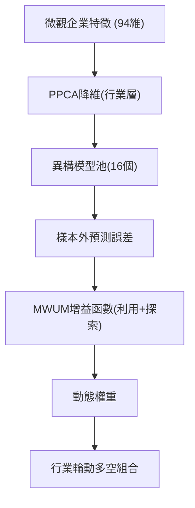

<!-- ontology-5axis data=量价表格 horizon=中长周期 paradigm=监督回归 alpha=因子挖掘 autonomy=全自动黑盒 -->

# MWUM在线集成框架 解構

> **發布**：2025-11-20 · （無 venue）
> **QuantML 導讀**：[基于在线集成学习的行业轮动策略](https://mp.weixin.qq.com/s?__biz=Mzg2MzAwNzM0NQ==&mid=2247492399&idx=1&sn=a78befb22441724f5d36817ca3e585a0&chksm=ce7d8431f90a0d27008cf34b5f770f2d964ff4da2e1cf414ff41794b6f039174fc913df7e98e#rd)
> **核心定位**：針對金融時間序列非平穩性，以無梯度 MWUM 動態加權異構模型，解決傳統離線集成無法快速適應結構性突變且易喪失多樣性的 prior gap。

**五軸座標**

| 數據模態 | 時間尺度 | 學習範式 | Alpha機制 | 人機協作 |
|:-:|:-:|:-:|:-:|:-:|
| `量价表格` | `中长周期` | `监督回归` | `因子挖掘` | `全自动黑盒` |

**Status:** v0.5 — 基於 QuantML 導讀 + 原論文（如有）。benchmark 細節待升 v1。
**TL;DR:** ① 提出無梯度在線集成算法，動態加權異構模型預測行業收益。② 核心 trick 為雙項增益函數（利用項獎勵低誤差，探索項懲罰冗餘/獎勵差異化），無需梯度即可自適應非平穩市場。③ 對「監督回歸」與「因子挖掘」軸★，因它將模型風險管理從靜態離線轉為在線動態，直接提升樣本外泛化與危機 Alpha。④ 導讀給出樣本外測試期（1987-2021）Top 5 組合在等權下年化收益率達 50.4%（疫情期間），索提諾比率達 2.4，且扣除 5bps 到 15bps 交易成本後仍具可交易性。

**X-Ray.** 放回五軸 Pareto：該框架在「自動化黑盒」與「監督回歸」軸上取得平衡，以 MWUM 替代傳統離線 Stacking，將模型選擇的 Lag 降至再平衡週期級別。解了舊工程坑：離線集成權重固化導致的 Regime Shift 失效，以及深度集成對梯度的依賴限制黑盒模型接入。預測打不開的 envelope：增益函數依賴歷史 12 個月自適應學習率網格，在極端流動性枯竭或因子共線性瞬間崩潰時，探索項可能因誤差基準（市場波動率）失真而延遲切換；且 PPCA 僅保留第一主成分雖降噪，但可能濾除高頻微結構信號。對量化讀者意義：提供了一種可插拔的模型風險對沖層，適合機構整合多管理人信號，但需警惕行業層級聚合對個股 Alpha 的稀釋。

## §1 · 架構 / Core Mechanism
**1.1 三大改動 vs 前作**
| 維度 | 傳統離線集成 (Offline Ensemble) | 深度集成 (如 AdaNet) | 本框架 (MWUM Online) |
|---|---|---|---|
| 權重更新機制 | 靜態歷史平均/固定最優 | 依賴梯度反向傳播 | 無梯度乘法權重更新 (MWUM) |
| 模型接入限制 | 需同構或易合併 | 需訪問內部梯度/參數 | 模型無關 (Model-Agnostic)，黑盒友好 |
| 多樣性控制 | 忽略模型相關性，易冗餘 | 架構級正則 | 增益函數探索項主動懲罰冗餘/獎勵差異化 |

**1.2 ⚡ Eureka 一句話 trick + 直覺**
直覺：用「利用項」追高準確度，用「探索項」買保險防反轉，雙項加權讓系統在市場切換時自動重倉「當下對的模型」而非「過去最強的模型」。

**1.3 信息流 ASCII 圖**

## §2 · 數學層
📌 **Napkin Formula**：
$w_{t+1}^i = w_t^i \cdot \exp(\eta \cdot g_t^i)$
$g_t^i = \underbrace{\text{Exploitation}(\epsilon_t^i, \sigma_t^2)}_{\text{獎勵低誤差}} + \underbrace{\text{Exploration}(\text{Redundancy Matrix } M)}_{\text{懲罰冗餘/獎勵差異}}$
複雜度：$O(N \cdot T)$，N為模型數，T為時間步，無需反向傳播。
直覺：指數乘法規避了梯度消失/爆炸，增益函數將預測誤差與市場波動率錨定，確保權重調整幅度與當前市場風險匹配。
Loss/訓練細節：無全局 Loss，各子模型獨立訓練，集成層僅在線更新權重；自適應學習率 $\eta$ 基於過去 12 個月樣本外表現從預定義網格中選取。

## §3 · 數據層
資料規模/頻率/市場/時段：CRSP 數據庫，1957 年至 2021 年的月度數據。前 30 年（1957-1986）作為初始訓練窗口，後 35 年（1987-2021）作為樣本外測試期。
怎麼來：選取 94 個公司層面預測特徵，覆蓋約 9000 家公司，基於 SIC 代碼的前兩位數字將資產劃分為 60 個行業。
樣本外與容量假設：樣本外期長達 35 年，策略為月度再平衡多空組合（做多預期收益最高的 5 個行業 / 做空預期收益最低的 5 個行業），容量假設基於行業 ETF 或流動性較高的行業組合，未披露具體管理規模上限。

## §4 · 代碼層
| 維度 | 狀態/詳情 |
|---|---|
| Repo | TBD |
| Checkpoint | TBD |
| License | TBD |
| 複現難度 | 中（需處理 CRSP 數據、實現 PPCA 與 16 個異構模型，MWUM 邏輯較直觀） |
| 數據可得性 | 低（依賴 CRSP 公司層面財務/價格數據，機構訂閱） |

## §5 · 評測 / Benchmark
| 數據集/市場 | Metric | 前SOTA (基線) | 本方法 | Δ |
|---|---|---|---|---|
| CRSP 1987-2021 | 預測精度 ($R^2$) | 簡單平均 | 在線集成 | 未披露 |
| CRSP 1987-2021 | 預測精度 ($R^2$) | 離線集成 | 在線集成 | 未披露 |
| CRSP 1987-2021 | 預測精度 ($R^2$) | 僅利用集成 | 在線集成 | 未披露 |
| CRSP 1987-2021 (疫情期) | 年化收益率 (Top 5 等權) | 未披露 | 50.4% | 未披露 |
| CRSP 1987-2021 (疫情期) | 索提諾比率 (Top 5 等權) | 未披露 | 2.4 | 未披露 |
| CRSP 1987-2021 (全樣本) | 最大回撤 | 與市場相當甚至更優 | 與市場相當甚至更優 | 未披露 |

**解讀**：導讀未提供具體 $R^2$ 數值與基線對比差值，僅定性指出在線集成在「利用+探索」雙項驅動下顯著優於離線與靜態基線。疫情期 50.4% 年化與 2.4 索提諾比率屬特定 Regime 下的極端表現，需警惕樣本選擇偏差；扣除 5bps 到 15bps 成本後仍具可交易性，表明策略換手率與行業層級執行成本可控。最大回撤「與市場相當甚至更優」屬模糊表述，未披露具體 MDD 數值，無法驗證下行保護的絕對幅度。整體 Δ 多為定性優勢，實證數字集中在危機 Alpha 維度，常規牛熊週期的 Sharpe/IR 差值未披露。

## §6 · 失效與隱含假設
**6.1 論文自述 limitations**：未明確列出 limitations 段落，但結論提及未來可探索宏觀信號融入；理論保證依賴「溫和的正則性假設（有限二階矩、各態歷經性）」。
**6.2 推斷的隱含假設**：
- Regime 依賴：自適應學習率網格基於過去 12 個月選取，若市場結構突變週期短於 12 個月，權重切換將滯後。
- 容量/成本：行業層級多空組合假設 Top 5 / Bottom 5 行業具備足夠流動性與融券可得性；5bps 到 15bps 成本假設未計入滑點與融券息差。
- 數據泄漏/生存者偏差：CRSP 數據通常含生存者偏差修正，但 PPCA 滾動窗口處理缺失值時若未嚴格對齊時間戳，可能引入微觀前視偏差。
- 特徵聚合假設：PPCA 僅保留第一主成分，假設行業內公司特徵高度共線，可能濾除異質性 Alpha。

## §7 · 對比 & 面試 Tip
| 同軸對手 | 關鍵差異軸 | Open? | Status |
|---|---|---|---|
| 傳統離線 Stacking | 靜態權重 vs 動態無梯度 MWUM | 是 | 成熟 |
| 深度集成 (AdaNet/DART) | 依賴梯度/同構 vs 模型無關/黑盒友好 | 是 | 研究/實戰 |
| 風險平價/動態配置 | 基於波動率/相關性 vs 基於預測誤差/增益函數 | 是 | 實戰 |

🎤 **Interview Tip**
正確答：MWUM 的核心不在於模型預測能力本身，而在於將「模型選擇」轉化為在線凸優化問題。增益函數的探索項本質是對模型預測殘差協方差的隱式正則，防止權重坍縮至單一高相關模型。
錯答：把 MWUM 當成另一種特徵工程或超參數搜索；認為無梯度就等於計算量極低（實際需維護多個模型並行預測與矩陣運算）。

**7.1 可證偽預測帶日期**：若未來 12 個月內，該框架在跨市場（如 A 股/港股）月度回測中，扣除 5bps 到 15bps 成本後樣本外 Sharpe 顯著低於美股基準，則證明其「探索項」對非美股流動性結構的泛化失效。

## §8 · For the Reader
- **因子研究員**：將 PPCA 第一主成分視為「行業隱因子」，可嘗試替換為高頻微結構因子或 LLM 情緒因子，檢驗增益函數對高頻信號的兼容性。
- **高頻執行**：策略為月度再平衡，執行層面重點在行業 ETF 組合優化與融券成本建模；MWUM 權重更新邏輯可下沉至日頻，但需重構損失基準 $\sigma_t^2$。
- **組合配置**：將該在線集成層作為「模型風險對沖器」，掛載於現有 Alpha 模型之上，替代傳統的離線 Rolling Window 權重分配。
- **研究學生**：重點復現 MWUM 更新規則與自適應學習率網格搜索，對比固定 $\eta$ 與動態 $\eta$ 在 2008 年與 2020 年危機期的權重軌跡差異。

## References
- 原論文：TBD (QuantML 導讀未提供具體標題/作者)
- Lineage: Multiplicative Weights Update Method (Arora et al., 2012) → Online Ensemble Learning → Sector Rotation ML
- QuantML 導讀鏈接：[基于在线集成学习的行业轮动策略](https://mp.weixin.qq.com/s?__biz=Mzg2MzAwNzM0NQ==&mid=2247492399&idx=1&sn=a78befb22441724f5d36817ca3e585a0&chksm=ce7d8431f90a0d27008cf34b5f770f2d964ff4da2e1cf414ff41794b6f039174fc913df7e98e#rd)