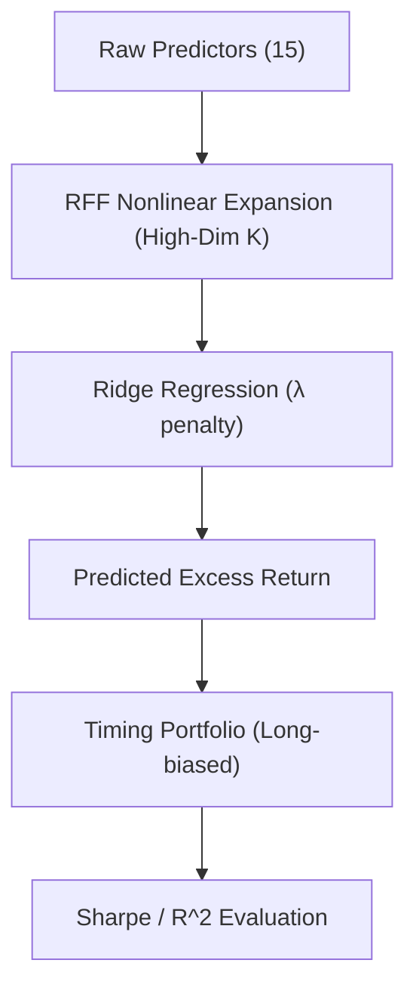

<!-- ontology-5axis data=量价表格 horizon=中长周期 paradigm=监督回归 alpha=风险择时 autonomy=人机协同可解释 -->

# RFF+岭回归 解構

> **發布**：2025-10-25 · （無 venue）
> **QuantML 導讀**：[耶鲁 x AQR ｜ 模型越复杂，效果越好？](https://mp.weixin.qq.com/s?__biz=Mzg2MzAwNzM0NQ==&mid=2247492112&idx=1&sn=0755e79d8a46b26e0047db1eb02e49c2&chksm=ce7d850ef90a0c18b98127b41ce5a5f1ab08a594fb7389d9a2a06802d2021ecc5eaf508876a3#rd)
> **核心定位**：落點於長週期量價監督回歸，解決傳統金融「奧卡姆剃刀」偏好低維線性模型導致的設定偏誤（misspecification）與經濟價值低估問題。

**五軸座標**

| 數據模態 | 時間尺度 | 學習範式 | Alpha機制 | 人機協作 |
|:-:|:-:|:-:|:-:|:-:|
| `量价表格` | `中长周期` | `监督回归` | `风险择时` | `人机协同可解释` |

**Status:** v0.5 — 基於 QuantML 導讀 + 原論文（如有）。benchmark 細節待升 v1。
**TL;DR:** ① 證明在適當正則化下，高維複雜模型（參數量 >> 樣本數）的樣本外預測與擇時夏普率嚴格單調遞增。② 核心 trick 結合隨機傅里葉特徵（RFF）展開非線性空間與顯式嶺回歸（Ridge）控制估計方差。③ 對「風險擇時」軸★：打破 $R^2$ 必須為正才有經濟價值的迷思，將評估重心轉向組合層面的夏普率與期望收益。④ 導讀給出高複雜度設定下年化夏普率提升 `0.47`、alpha t值接近 `3.0`。

**X-Ray.** 放回五軸 Pareto，該框架在「監督回歸」與「風險擇時」的交叉點，用隨機矩陣理論（RMT）嚴謹推導了高維漸近行為下的偏差-方差權衡。它解了舊工程坑：因子研究員常因樣本外 $R^2$ 為負而棄用非線性模型，或盲目追求稀疏性導致欠擬合。本方法指出，只要正則化強度匹配維度，複雜度本身就是對未知 DGP 非線性的最佳近似。預測其打不開的 envelope：理論依賴「信號充分混合」與「最優正則化」的漸近假設，實盤中若面臨 regime shift 或流動性衝擊，高維特徵的協方差結構會劇烈漂移，嶺回歸的固定收縮可能失效。對量化讀者的意義在於，應將模型複雜度視為可調參數而非懲罰項，並建立以組合經濟效益（Sharpe/IR）為目標的正則化搜索，而非單純優化預測精度。

## §1 · 架構 / Core Mechanism
| 維度 | 傳統金融建模 (Prior) | RFF+嶺回歸 (本法) |
|:---|:---|:---|
| **特徵空間** | 低維線性 / 稀疏回歸 (Lasso) | 高維非線性展開 (RFF Kernel Expansion) |
| **正則化哲學** | 追求參數稀疏，懲罰複雜度 | 顯式嶺回歸 (Ridge) 匹配維度，以偏差換方差 |
| **評估錨點** | 樣本外 $R^2$ 統計精度 | 擇時組合夏普率 / 期望收益經濟價值 |

**⚡ Eureka:** 複雜度提升帶來的「近似收益」嚴格壓倒「估計方差」，正則化是將雙降/雙升曲線平滑為永久上升的關鍵閾值。

**信息流 ASCII:**

## §2 · 數學層
📌 **Napkin Formula:** 
$\hat{\beta}_{ridge} = (X^TX + \lambda I)^{-1}X^y$
高維漸近: $K \to \infty, N \to \infty, K/N \to \gamma$。RMT 刻畫樣本協方差與真實協方差特徵值分布的系統性偏移。

**直覺:** 嶺回歸透過 $L_2$ 懲罰項壓縮係數範數，犧牲部分偏差以大幅降低高維下的估計方差。在模型必然存在設定偏誤時，增加 $K$ 能更精確逼近真實 DGP，配合最優 $\lambda$ 可使夏普率單調遞增。
**Loss/訓練:** 標準 MSE Loss + $L_2$ 正則化。採用滾動窗口遞迴進行樣本外預測與組合權重重估。

## §3 · 數據層
- **資料規模/頻率/市場/時段:** 美國股市 (CRSP VW 指數)，月度頻率，時段 `1926` 至 `2020`。
- **來源:** Goyal and Welch (2008) 整理的 `15` 個經典宏觀與市場預測變量。
- **樣本外與容量假設:** 嚴格遞迴/滾動窗口預測（窗口長度 TBD）。低頻月度調倉，理論容量較高，但未建模交易成本與流動性摩擦。

## §4 · 代碼層
| Repo | Checkpoint | License | 複現難度 | 數據可得性 |
|:---|:---|:---|:---|:---|
| TBD | TBD | TBD | 中 (需實現 RFF 展開與滾動嶺回歸矩陣求逆) | 高 (GW2008 數據集公開) |

## §5 · 評測 / Benchmark
| 數據集/市場 | Metric | 前SOTA | 本方法 | Δ |
|:---|:---|:---|:---|:---|
| US Equity (CRSP VW) | Annualized Sharpe | 線性模型(嶺回歸) `0.46` | 高複雜度RFF+嶺回歸 `0.47` | `0.01` |
| US Equity (CRSP VW) | Alpha t-value | 未披露 | 高複雜度RFF+嶺回歸 `3.0` | 未披露 |
| US Equity (CRSP VW) | Information Ratio (vs Linear) | 未披露 | 高複雜度RFF+嶺回歸 `0.26` | 未披露 |
| US Equity (CRSP VW) | IR t-value | 未披露 | 高複雜度RFF+嶺回歸 `2.5` | 未披露 |

**解讀:** $\Delta$ `0.01` 在夏普率上看似微小，但結合 alpha t值 `3.0` 與 IR `0.26` (t=`2.5`)，證明增益來自非線性結構捕捉而非過擬合。需警惕：實盤未計交易成本與滑點，且理論依賴「最優正則化」，實戰中 $\lambda$ 的跨週期穩定性決定真實 $\Delta$。若正則化不足，夏普率會退化為「雙升」形態而非「永久上升」。

## §6 · 失效與隱含假設
**6.1 論文自述 limitations:** 理論假設信號充分混合與漸近狀態；實證僅限美國股市月度數據；未建模交易成本與流動性限制；$R^2$ 為負時仍具經濟價值的結論依賴組合層面驗證，單一資產預測可能失效。
**6.2 推斷的隱含假設:** 
- **Regime 依賴:** 宏觀變量協方差結構需保持相對穩定，RMT 漸近推導在結構斷點（如貨幣政策急轉）下可能失效。
- **容量/成本:** 低頻月度調倉適合大資金，但高維特徵展開與月度矩陣求逆帶來算力開銷，未計入實盤滑點與衝擊成本。
- **數據泄漏:** GW2008 數據集經學術界多次挖掘，存在潛在數據礦藏偏差（data mining bias）。
- **正則化匹配:** $\lambda$ 必須動態匹配維度 $K$，固定 $\lambda$ 會導致方差控制失靈。

## §7 · 對比 & 面試 Tip
| 同軸對手 | 關鍵差異軸 | Open? | Status |
|:---|:---|:---|:---|
| 傳統線性因子模型 / Lasso | 維度處理哲學與正則化強度搜索路徑 | 是 | 廣泛使用但易欠擬合 |
| 深度神經網絡 (MLP/Transformer) | 可解釋性與漸近理論保證 (RMT vs 黑盒) | 是 | 實盤穩定性待驗證 |

🎤 **Interview Tip:** 
- **正確答:** 「複雜度本身不是問題，問題是正則化是否匹配維度。在設定偏誤下，高維+嶺回歸能單調提升夏普率，$R^2$ 為負不影響經濟價值。實盤應以組合 Sharpe/IR 為目標搜索 $\lambda$，而非優化預測精度。」
- **錯答:** 「模型越複雜越好，不需要正則化，只要 $R^2$ 高就行。複雜模型必然過擬合，實盤不能用。」

**7.1 可證偽預測帶日期:** 若 `2026-12-31` 前，在納入流動性成本與跨市場（如新興市場或商品）驗證中，高維 RFF+嶺回歸的樣本外夏普率未能嚴格單調遞增，或正則化搜索無法覆蓋 $K/N \to \gamma$ 的漸近區間，則該理論的實盤普適性存疑。

## §8 · For the Reader
- **因子研究員:** 停止因樣本外 $R^2$ 為負而剔除非線性特徵，改用組合層面 Sharpe/IR 進行正則化強度搜索，將複雜度視為信號提取的放大器。
- **組合配置/風控:** 高維模型自學到的「近乎只做多」與衰退減倉特徵，可作為宏觀風險預算的輔助信號，但需獨立驗證其週期穩定性與尾部風險暴露。
- **高頻執行/系統架構:** 該框架為低頻月度調倉，RFF 特徵展開計算量隨 $K$ 線性增長，實盤需預留矩陣求逆 $(X^TX+\lambda I)^{-1}$ 的算力預算，避免月度重估時延遲與數據延遲誤差。

## References
- Kelly, B., et al. "The Virtue of Complexity in Return Prediction." (無 venue)
- Goyal, A., & Welch, I. (2008). A Comprehensive Look at the Empirical Performance of Equity Premium Prediction. *Review of Financial Studies*.
- QuantML 導讀: [耶鲁 x AQR ｜ 模型越复杂，效果越好？](https://mp.weixin.qq.com/s?__biz=Mzg2MzAwNzM0NQ==&mid=2247492112&idx=1&sn=0755e79d8a46b26e0047db1eb02e49c2&chksm=ce7d850ef90a0c18b98127b41ce5a5f1ab08a594fb7389d9a2a06802d2021ecc5eaf508876a3#rd)