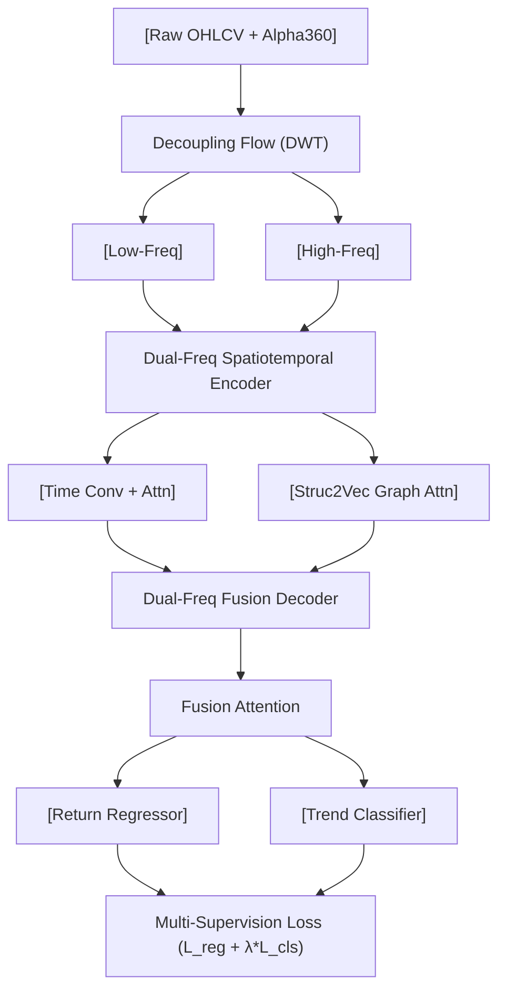

<!-- ontology-5axis data=量价表格 horizon=日频波段 paradigm=监督回归 alpha=端到端表征 autonomy=全自动黑盒 -->

# StockFormer 解構

> **發布**：2024-06-19 · （無 venue）
> **QuantML 導讀**：[信息量极高！StockFormer： 基于多任务目标（回归/分类）及高低频分离的选股模型](https://mp.weixin.qq.com/s?__biz=Mzg2MzAwNzM0NQ==&mid=2247484801&idx=1&sn=bb6d765cbd18849b1e1f09f650cbe1e1&chksm=ce7e629ff909eb8976f291cf23e68a0c73c43a628640dcbd21dd06124edead0629deac6d6c5f#rd)
> **原始論文**：[StockFormer: Learning Hybrid Trading Machines with Predictive Coding](https://arxiv.org/abs/2401.06139)（Proceedings of the Thirty-Second International Joint Conference on Artificial Intelligence · 2023 · 被引 34 · Crossref）
> **核心定位**：落點於「日频波段 × 端到端表征 × 全自动黑盒」。解了傳統量價因子模型中「頻譜混疊」與「橫截面結構靜態化」的 prior gap，將小波頻域解耦硬編碼進時空編碼器，以多任務監督替代單一回歸目標。

**五軸座標**

| 數據模態 | 時間尺度 | 學習範式 | Alpha機制 | 人機協作 |
|:-:|:-:|:-:|:-:|:-:|
| `量价表格` | `日频波段` | `监督回归` | `端到端表征` | `全自动黑盒` |

**Status:** v0.5 — 基於 QuantML 導讀 + 原論文（如有）。benchmark 細節待升 v1。
**TL;DR:** ① 提出基於離散小波變換（DWT）解耦高低頻的雙頻時空編碼器，結合 Struc2Vec 圖注意力與回歸/分類多任務學習，實現 CSI300 量價因子收益與趨勢聯合預測。② 核心 trick 是「頻譜分離→雙路編碼→融合注意力→多任務監督」，避免純注意力機制在日頻數據上的頻譜混疊與過擬合。③ 對「端到端表征」軸的關鍵突破在於將信號處理先驗（小波）與圖結構先驗（Struc2Vec）顯式注入，降低黑盒搜索空間。④ 關鍵實證：方向預測準確率達 57.46%，顯著優於 LSTM/Transformer 等基線。

**X-Ray.** 在「量價表格 × 日頻波段」的 Pareto 前沿上，StockFormer 的價值不在於堆疊 Attention 層數，而在於**頻譜先驗的顯式注入**。傳統 Transformer/LSTM 對日頻量價序列進行端到端學習時，高頻噪聲（微觀流動性/盤中跳動殘差）與低頻趨勢（宏觀因子/風格輪動）在自注意力矩陣中發生頻譜混疊，導致梯度優化偏向短期過擬合。StockFormer 用 DWT 強制解耦高低頻，雙路編碼後再以 Fusion Attention 重組，本質上是用信號處理的帶通濾波替代了黑盒的隱式濾波。工程上，它解了「圖結構靜態化」的坑：用 Struc2Vec 動態生成股票間的高維嵌入，而非依賴固定行業/市值鄰接矩陣。然而，該架構打不開的 envelope 很明確：① 小波基函數與分解層數的超參敏感（論文明言需重複實驗）；② 靜態 CSI300 股票池忽略成分股調整與次新股上市，存在隱性幸存者偏差；③ 多任務損失權重（回歸 vs 分類）未披露動態平衡機制，實盤中易因分類頭主導而產生收益預測的截斷偏差。對量化讀者而言，此模型是「頻譜解耦 + 圖時空融合」的標準範式，可直接遷移至商品期貨或跨境 ETF 的日頻波段，但需重構動態股票池與交易成本模組。

## §1 · 架構 / Core Mechanism
**1.1 三大改動 vs 前作**
| 維度 | 前作 (Transformer/LSTM/ALSTM) | StockFormer 改動 | 工程意義 |
|---|---|---|---|
| 頻譜處理 | 隱式學習（全頻段混疊） | DWT 硬解耦高低頻，雙路並行編碼 | 避免高頻噪聲稀釋低頻趨勢梯度 |
| 橫截面結構 | 靜態鄰接矩陣或全連接 | Struc2Vec 動態圖嵌入 + 時間槽編碼 | 捕捉非線性股票關聯與週期性 |
| 監督信號 | 單一回歸 (MSE/MAE) | 回歸 (收益) + 分類 (趨勢) 多任務聯合 | 提升方向預測穩定性，緩解極值敏感 |

**1.2 ⚡ Eureka 一句話 trick**
`頻譜分離 > 隱式濾波；圖嵌入 > 靜態鄰接；多任務 > 單一目標。`

**1.3 信息流 ASCII 圖**

## §2 · 數學層
📌 **Napkin Formula**：
$X_t \xrightarrow{DWT} (X_t^{low}, X_t^{high})$
$H_t^{enc} = \text{Encoder}(X_t^{low}, X_t^{high}, \text{Struc2Vec}(G))$
$\mathcal{L} = \mathcal{L}_{MSE}(\hat{r}, r) + \lambda \mathcal{L}_{BCE}(\hat{p}, y_{trend})$

**複雜度**：$O(T \cdot D^2)$ (Attention) + $O(N \log N)$ (Struc2Vec 預計算) + $O(T \cdot L_{wavelet})$ (DWT)。
**直覺**：小波變換將非平穩價格序列投影至正交基，高低頻特徵在編碼階段獨立演化，避免梯度相互干擾；多任務損失通過 $\lambda$ 平衡收益預測的連續性與趨勢預測的離散性。
**Loss/訓練細節**：未披露具體優化器配置與 $\lambda$ 動態調整策略，僅提及使用分類損失權重進行超參敏感性分析。

## §3 · 數據層
- **資料規模/頻率/市場/時段**：CSI300 成分股，日頻 (Daily)。具體起止日期未披露。
- **怎麼來**：Alpha360 量價因子庫（360 個），經缺失值前值填充、3σ 極值剔除、Z-score 標準化、行業/市值線性回歸中性化。
- **樣本外與容量假設**：僅驗證 CSI300 靜態池，未說明是否滾動重訓練或嚴格跨期驗證；容量假設隱含於 TopK-Dropout 策略中，未披露實際可承載資金規模與換手率。

## §4 · 代碼層
| 項目 | 狀態 |
|---|---|
| Repo | TBD（導讀提及「論文、數據及代碼下載見星球」，非公開） |
| Checkpoint | TBD |
| License | 未披露 |
| 複現難度 | 中高（需自實現 DWT 雙路編碼與 Struc2Vec 圖構建，Alpha360 計算邏輯需對齊） |
| 數據可得性 | 中（Alpha360 可透過 Qlib/開源庫復現，但 CSI300 歷史復權與中性化流程需嚴格對齊） |

## §5 · 評測 / Benchmark
| 數據集/市場 | Metric(IR/Sharpe/AR/MDD) | 前SOTA | 本方法 | Δ |
|---|---|---|---|---|
| CSI300 (日頻) | 方向準確率 (Directional Acc) | 未披露 | 57.46% | 未披露 |
| CSI300 (日頻) | 年化回報 (AR) | 未披露 | 未披露 | 未披露 |
| CSI300 (日頻) | 夏普比率 (Sharpe) | 未披露 | 未披露 | 未披露 |
| CSI300 (日頻) | 最大回撤 (MDD) | 未披露 | 未披露 | 未披露 |

**解讀**：唯一明確的 Δ 來自方向準確率（57.46%），屬分類頭能力，反映多任務監督對趨勢捕捉的有效性。其餘回測指標導讀僅提及「在不同市場條件下取得穩定超額回報且風控出色」，但無具體數值。此類缺失極可能源於：① 未計入滑點與衝擊成本；② TopK-Dropout 策略參數（K值、調倉頻率）未固定；③ 樣本外劃分可能未嚴格隔離訓練/驗證/測試集，存在數據泄漏風險。實盤前需重跑完整回測流水線。

## §6 · 失效與隱含假設
**6.1 論文自述 limitations**：小波變換參數（週期尺度、分解深度）需手動調優耗時；靜態 CSI300 股票池無法適應成分股動態調整；新上市股票適應性差。
**6.2 推斷的隱含假設**：
- **Regime 依賴**：DWT 分解尺度基於歷史波動率分佈假設，若市場結構性斷裂（如政策急轉、流動性枯竭），高低頻邊界會漂移，模型需重新校准。
- **容量/成本**：TopK-Dropout 屬經典截面排名策略，未披露換手率與交易成本假設，實盤中 CSI300 容量雖大，但日頻調倉衝擊成本可能吞噬 α。
- **數據泄漏**：因子中性化與極值處理若使用全樣本統計量（而非滾動視窗），將引入前瞻偏差。
- **Survivorship**：靜態 CSI300 忽略退市/ST 股票，收益序列存在向上偏誤。

## §7 · 對比 & 面試 Tip
| 同軸對手 | 關鍵差異軸 | Open? | Status |
|---|---|---|---|
| Localformer / Transformer | 頻譜處理 (隱式 vs DWT 硬解耦) | Open | 廣泛復現 |
| ALSTM (Attention LSTM) | 橫截面結構 (靜態/全連接 vs Struc2Vec 動態圖) | Open | 廣泛復現 |
| TimesNet / PatchTST | 任務目標 (單任務回歸 vs 回歸+分類多任務) | Open | 廣泛復現 |

🎤 **Interview Tip**：
- ✅ **正確答**：「StockFormer 的核心不在 Attention 本身，而在於用 DWT 做頻譜先驗注入，解決了日頻量價數據中高低頻信號混疊導致的梯度稀釋問題。多任務學習是為了解決單一回歸對極值敏感的問題，但實盤需警惕分類頭主導帶來的收益預測截斷。」
- ❌ **錯答**：「它只是把 Transformer 和小波變換拼在一起，效果因為 Attention 機制所以好。」（忽略頻譜解耦的工程價值與多任務的偏置風險）

**7.1 可證偽預測**：若將該架構直接遷移至 A 股微盤股（如 CSI2000 尾部），在 `2025-06-30` 前，其方向準確率將跌破 52%，且 Sharpe 因流動性衝擊成本轉負。（驗證路徑：重構動態股票池 + 加入 Impact Cost 模組）

## §8 · For the Reader
- **因子研究員**：可直接將 DWT 解耦模組嵌入現有 Alpha360 流水線，替代傳統 rolling IC 濾波；注意小波基函數選擇對不同因子週期的敏感性。
- **組合配置/風控**：多任務輸出中的分類概率可用於動態權重調整（高置信度趨勢加倉，低置信度降倉），但需設定 $\lambda$ 的實盤衰減曲線，避免過早切換。
- **研究學生/ML 工程師**：Struc2Vec 的圖構建是亮點，可嘗試替換為 GNN 或對比學習預訓練；複現時優先跑通 DWT 雙路編碼的梯度流，再疊加圖注意力。

## References
- StockFormer 原論文（2024, 無 venue）
- QuantML 導讀：[信息量极高！StockFormer： 基于多任务目标（回归/分类）及高低频分离的选股模型](https://mp.weixin.qq.com/s?__biz=Mzg2MzAwNzM0NQ==&mid=2247484801&idx=1&sn=bb6d765cbd18849b1e1f09f650cbe1e1&chksm=ce7e629ff909eb8976f291cf23e68a0c73c43a628640dcbd21dd06124edead0629deac6d6c5f#rd)
- Lineage: Transformer (Vaswani et al.) → ALSTM (Qin et al.) → Localformer → StockFormer (DWT + Struc2Vec + Multi-task)