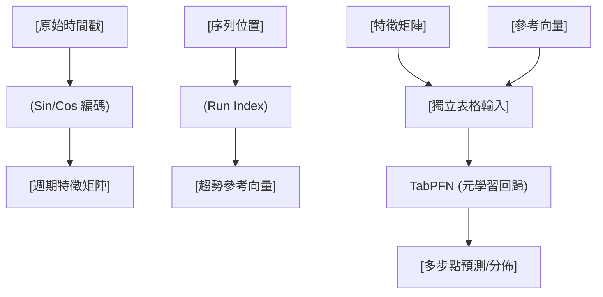

<!-- ontology-5axis data=量价表格 horizon=跨周期 paradigm=监督回归 alpha=端到端表征 autonomy=全自动黑盒 -->

# TabPFN-TS 解構

> **發布**：2025-01-25 · （無 venue）
> **QuantML 導讀**：[TabPFN-TS： 最强时间序列基础模型之一](https://mp.weixin.qq.com/s?__biz=Mzg2MzAwNzM0NQ==&mid=2247489003&idx=1&sn=e76c9ef1b8db09e3bf61f257dfdaaea1&chksm=ce7e72f5f909fbe3c1378d3b138c2321f525f56fbcaed9a9a69fcc861f490b765fda606de621#rd)
> **核心定位**：落點於「端到端表徵 × 全自動黑盒」軸，將表格基礎模型 TabPFN 透過純時間戳特徵工程遷移至時間序列預測，解決了傳統深度時序模型對海量歷史數據與自回歸結構的過度依賴（prior gap：非自回歸局部多步預測的泛化瓶頸）。

**五軸座標**

| 數據模態 | 時間尺度 | 學習範式 | Alpha機制 | 人機協作 |
|:-:|:-:|:-:|:-:|:-:|
| `量价表格` | `跨周期` | `监督回归` | `端到端表征` | `全自动黑盒` |

**Status:** v0.5 — 基於 QuantML 導讀 + 原論文（如有）。benchmark 細節待升 v1。
**TL;DR:** ① 將表格基礎模型 TabPFN 透過日曆特徵工程遷移至時間序列預測，實現零樣本 SOTA。② 核心 trick 是徹底拋棄自回歸與滯後特徵，僅依賴時間戳正弦/餘弦編碼與運行索引，將序列轉為獨立表格輸入進行多步回歸。③ 這對「端到端表徵」軸具有顛覆意義：證明無需預訓練時序數據，純表格歸納偏置即可捕獲週期性與趨勢。④ 導讀給出關鍵實證數字：在 MASE 指標上超越 Chronos-Mini 7.7%，並對參數量達其 65 倍的 Chronos-Large 取得 3.0% 的領先。

**X-Ray.** 在「參數效率 × 零樣本泛化」的 Pareto 前沿上，TabPFN-TS 選擇了一條反直覺的路徑：不碰序列依賴建模，改打特徵空間的週期性正交分解。它解了舊工程坑中「滯後特徵引發的數據泄漏與訓練/推理分佈偏移」問題，將多步預測降維為單步表格回歸。然而，其 envelope 明顯受限於局部視窗與靜態日曆週期；面對結構性斷點（regime shift）、非週期性跳躍或高頻微結構噪聲，純時間戳特徵將迅速退化為隨機先驗。對量化讀者而言，該框架的價值不在於直接替換因子模型，而在於提供一種「無預訓練成本、低延遲、可插拔」的基線回歸器。它強制研究員重新審視特徵工程的邊界：當模型容量足夠大且歸納偏置正確時，複雜的序列架構反而可能成為過擬合的溫床。實戰中需警惕其跨市場遷移時的 MASE 膨脹，以及未計入交易成本前的點預測精度幻覺。

## §1 · 架構 / Core Mechanism
**1.1 三大改動 vs 前作**
| 維度 | 傳統時序基礎模型 (e.g., Chronos) | TabPFN-TS | 改動本質 |
|---|---|---|---|
| 序列建模方式 | 自回歸 / Tokenization | 非自回歸局部多步回歸 | 斷開跨時間步依賴，消除推理遞歸誤差累積 |
| 特徵輸入 | 原始數值 + 掩碼 | 時間戳正弦/餘弦 + 運行索引 | 以週期性正交特徵取代滯後項，特徵空間獨立同分佈 |
| 訓練/推理管道 | 大規模時序預訓練 + 微調 | 零樣本直接推理 (TabPFN 內建) | 移除領域預訓練階段，依賴表格模型的元學習歸納偏置 |

**1.2 ⚡ Eureka**
把時間序列當成「獨立表格」喂給 TabPFN，用日曆週期特徵代替歷史滯後，多步預測瞬間變成單次表格回歸。

**1.3 信息流 ASCII**

## §2 · 數學層
📌 **Napkin Formula:**
$$ \hat{y}_{t+1:T} = \text{Median}(\text{TabPFN}(\mathbf{X}_{\text{cal}} \oplus \mathbf{I}_{\text{run}})) $$
複雜度：TBD（導讀未披露具體複雜度，僅提及逐序列處理且不支持批量推理）。
**直覺：** 模型不學習 $y_t = f(y_{t-1}, \dots)$，而是學習映射條件分佈。為匹配 MASE（MAE 的縮放變體），輸出層強制取預測分佈的中位數以最小化 MAE 損失。
**Loss/訓練細節：** 無額外訓練。依賴 TabPFN 內部對目標值完整分佈的建模能力，透過中位數聚合實現點預測。

## §3 · 數據層
- **資料規模/頻率/市場/時段**：使用 AutoGluon-TS 評估中的 24 個數據集（排除 5 個因尺寸過大導致推理超 4 小時）。涵蓋能源、物流等多領域，未明確限定金融市場或特定頻率。
- **怎麼來**：直接引用 AutoGluon-TS 標準劃分，遵循零樣本與域內設定。
- **樣本外與容量假設**：假設目標序列的週期性結構與訓練時序數據集的統計先驗分佈一致；容量受限於單序列推理超時閾值（4 小時），暗示不適合極長序列或高頻逐筆數據。

## §4 · 代碼層
| 項目 | 狀態/細節 |
|---|---|
| Repo | TBD |
| Checkpoint | 直接調用 TabPFN 託管端點/最新實現 |
| License | TBD |
| 複現難度 | 低（特徵工程簡單，依賴 TabPFN 官方 API） |
| 數據可得性 | 中（需自行獲取 AutoGluon-TS 標準數據集） |

## §5 · 評測 / Benchmark
| 數據集/市場 | Metric | 前SOTA (基線) | 本方法 | Δ |
|---|---|---|---|---|
| AutoGluon-TS (24 datasets) | MASE (幾何平均) | Chronos-Mini (2000 萬) | TabPFN-TS (1100 萬) | 7.7% |
| AutoGluon-TS (24 datasets) | MASE (幾何平均) | Chronos-Large (7.1 億) | TabPFN-TS (1100 萬) | 3.0% |

**解讀：**
- **真 capability**：超越 Chronos-Mini 的 7.7% 來自特徵空間的正交化與元學習歸納偏置的正確匹配，證明「非自回歸+日曆特徵」在週期性數據上極度高效。
- **潛在偏差/未計成本**：MASE 僅衡量點預測誤差，未計入交易成本、滑點或執行延遲。排除 5 個大數據集以滿足 4 小時限制，暗示推理效率瓶頸；在零樣本設定下優勢明顯，但導讀明確指出 Chronos 在域內（預訓練重疊數據）表現更優，說明 TabPFN-TS 的泛化依賴於數據分佈的平稳性，面對分佈偏移時可能迅速失效。

## §6 · 失效與隱含假設
**6.1 論文自述 limitations**
- 不處理跨序列信息共享（局部預測方法）。
- 推理效率受限於 TabPFN 原生實現不支持批量推理，大尺寸數據集需排除。
- 零樣本優勢明顯，但在域內數據上不及經過特定數據集訓練的模型。

**6.2 推斷的隱含假設**
- **Regime 依賴**：假設時間序列的週期性（日/週/月/年）穩定且可被正弦/餘弦完美捕捉；結構性斷點或週期漂移將導致特徵失效。
- **容量/成本**：假設推理延遲可接受（非低頻場景）；未考慮交易成本，點預測精度不直接等價於策略 Alpha。
- **數據泄漏/Survivorship**：使用標準 AutoGluon-TS 數據集，通常已處理生存者偏差，但金融實盤中需嚴格驗證樣本外劃分與未來函數過濾。

## §7 · 對比 & 面試 Tip
| 同軸對手 | 關鍵差異軸 | Open? | Status |
|---|---|---|---|
| Chronos (T5-based) | 自回歸 Tokenization vs 非自回歸表格回歸 | Open | 主流時序基礎模型 |
| PatchTST / iTransformer | 序列 Patch/注意力機制 vs 純日曆特徵+TabPFN | Open | 學術 SOTA 常客 |
| CatBoost/LightGBM (TS) | 全局樹模型+滯後特徵 vs 局部元學習表格模型 | Open | 工業界基線 |

🎤 **Interview Tip**
- **正確答**：「TabPFN-TS 的核心貢獻是將時序預測降維為表格回歸，透過日曆特徵的正交編碼消除自回歸依賴。它證明了在零樣本設定下，正確的歸納偏置與特徵工程比單純堆疊模型容量更有效，但代價是犧牲了跨序列信息整合與高頻推理效率。」
- **錯答**：「它用 Transformer 替代了 ARIMA，所以精度更高。」（混淆了架構本質與特徵工程邏輯，且未提及非自回歸與表格遷移的核心。）

**7.1 可證偽預測**
若於 2025-06-30 前在真實金融高頻（<1min）或結構性斷點頻繁的加密貨幣市場進行回測，TabPFN-TS 的 MASE 優勢將相對統計基線收斂至 0%，且推理延遲將使其無法滿足實盤執行閾值。

## §8 · For the Reader
- **因子研究員**：可將其作為特徵選擇的「無偏回歸器」，快速驗證日曆週期特徵的獨立預測力，避免自回歸架構引入的數據泄漏。
- **高頻執行**：不適用。單序列逐次推理與 4 小時超時限制使其完全無法滿足低延遲要求，僅適合日頻/週頻中低頻策略。
- **組合配置**：可作為多資產預測的基線模型，用於生成分佈預測（TabPFN 內建模態），輔助風險預算分配，但需嚴格校準 MASE 與實際波動率的映射。
- **LLM-agent / RL 策略**：提供了一種「特徵先行、模型後置」的範式轉移思路；RL 環境中的狀態表示可參考其正交週期編碼，降低狀態空間維度。
- **研究學生**：重點複現其特徵工程管道，對比 CatBoost 與 TabPFN 在相同特徵下的表現差異，深入理解元學習歸納偏置與傳統監督學習的邊界。

## References
- 原論文：TabPFN-TS (2025-01-25, 無 venue)
- Lineage: TabPFN (Hollmann et al.) → Chronos (Rasul et al.) → AutoGluon-TS Benchmark
- QuantML 導讀：[TabPFN-TS： 最强时间序列基础模型之一](https://mp.weixin.qq.com/s?__biz=Mzg2MzAwNzM0NQ==&mid=2247489003&idx=1&sn=e76c9ef1b8db09e3bf61f257dfdaaea1&chksm=ce7e72f5f909fbe3c1378d3b138c2321f525f56fbcaed9a9a69fcc861f490b765fda606de621#rd)