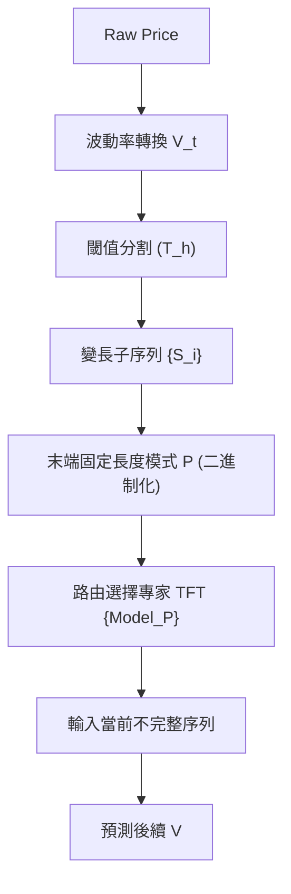

<!-- ontology-5axis data=量价表格 horizon=高频日内 paradigm=监督回归 alpha=端到端表征 autonomy=人机协同可解释 -->

# 自适应TFT建模 解構

> **發布**：2025-09-19 · （無 venue）
> **QuantML 導讀**：[利用自适应时间融合 Transformer 进行加密货币预测](https://mp.weixin.qq.com/s?__biz=Mzg2MzAwNzM0NQ==&mid=2247491714&idx=1&sn=35b8a5616fad711e78a71bd95a920d7b&chksm=ce7d879cf90a0e8a4c9017aa30bcfe0a409ed8366c40fe73b10bfe9a6e2f6704d3afe90d0a4f#rd)
> **核心定位**：落點於量價表格與高頻日內，以監督回歸范式實現端到端表征，並透過模式條件化維持人機協同可解釋性。解決了傳統定長滑動窗口武斷截斷市場自然階段、無法適應非平穩性的 prior gap。

**五軸座標**

| 數據模態 | 時間尺度 | 學習範式 | Alpha機制 | 人機協作 |
|:-:|:-:|:-:|:-:|:-:|
| `量价表格` | `高频日内` | `监督回归` | `端到端表征` | `人机协同可解释` |

**Status:** v0.5 — 基於 QuantML 導讀 + 原論文（如有）。benchmark 細節待升 v1。
**TL;DR:** ① 以閾值化相對高點動態切分變長子序列，以前序末端波動模式離散化分類，為每類訓練專用TFT專家。② 核心trick是「模式條件化預測」，用前一階段結尾的固定長度二進制序列決定下一階段調用哪個專家模型。③ 這對高頻日內軸★意味著將非平穩市場拆解為條件獨立的分段回歸問題，降低單模型容量壓力。④ 導讀給出樣本外準確率51.36%與模擬最終資產117.22 USDT，但未披露基線具體數值與交易成本。

**X-Ray.** 聚焦五軸Pareto：在端到端表征與人機可解釋之間，該法用離散化二進制模式替代黑盒注意力權重，保留了策略邏輯的透明性。解了固定窗口截斷趨勢的舊工程坑，但代價是引入閾值參數T_h與模式長度p_len的敏感調優。預測其打不開的envelope在於：極端跳空或流動性枯竭時，相對高點閾值可能失效，導致子序列過長或過短，專家模型面臨數據稀疏或過擬合。對量化讀者的意義不在於直接上線，而在於提供了一種「條件專家路由」的架構範式，可與現有的因子正交化或組合優化層對接，將預測輸出轉化為權重分配信號而非直接交易指令。

## §1 · 架構 / Core Mechanism
**1.1 三大改動 vs 前作**
| 維度 | 前作 (定長TFT / LSTM) | 本方法 (自适应TFT) | 工程意圖 |
|---|---|---|---|
| 序列切分 | 固定滑動窗口 | 閾值化相對高點動態分割 | 對齊市場自然節奏，避免截斷趨勢 |
| 模型路由 | 全局單一模型 | 末端模式離散分類 → 專家模型庫 | 降低單模型容量壓力，提升條件感知 |
| 輸入處理 | 定長Padding | 變長Padding + Masking + 模式路由 | 兼容非平穩周期長度，保留上下文完整性 |

**1.2 ⚡ Eureka**
用「前序結尾模式」做路由開關，而非依賴全局統一模型去硬扛所有市場狀態。

**1.3 信息流 ASCII**

## §2 · 數學層
📌 **Napkin Formula**
`V_t = (P_t - P_{t-1}) / P_{t-1}` （波動率序列）
分割條件：`P_t > P_{low} * (1 + T_h)`
模式分類：`C_i = binary(V_{end-L:end})` → 離散類別數 `2^L`
**直覺**：將連續價格運動壓縮為離散狀態機，TFT僅在狀態內做回歸，降低序列依賴的搜索空間。
**Loss/訓練**：導讀未披露具體回歸Loss函數，僅以方向預測準確率與模擬交易最終資產評估。訓練依賴Darts庫，採用Padding與Masking處理變長輸入。

## §3 · 數據層
- **市場/頻率**：ETH-USDT，原始1分鐘重採樣為10分钟。
- **時段**：2021-12-27 至 2024-11-22。樣本外驗證：11-15 至 11-22。
- **來源**：Binance 公開數據。
- **容量假設**：依賴足夠的歷史波動積累以覆蓋16種二進制模式；低頻模式存在數據稀疏風險，需遷移學習或數據增強補齊。

## §4 · 代碼層
| 欄位 | 狀態 |
|---|---|
| Repo | TBD |
| Checkpoint | TBD |
| License | TBD |
| 複現難度 | 中（需自寫閾值分割與模式路由邏輯） |
| 數據可得性 | 高（Binance API公開） |

## §5 · 評測 / Benchmark
| 數據集/市場 | Metric | 前SOTA | 本方法 | Δ |
|---|---|---|---|---|
| ETH-USDT 10分钟 | Accuracy | 未披露 | 51.36% | 未披露 |
| ETH-USDT 10分钟 | Precision | 未披露 | 51.11% | 未披露 |
| ETH-USDT 10分钟 | Recall | 未披露 | 92.31% | 未披露 |
| ETH-USDT 10分钟 | Specificity | 未披露 | 19.28% | 未披露 |
| ETH-USDT 10分钟 | 最終資產 (USDT) | 未披露 | 117.22 | 未披露 |

**解讀**：51.36%準確率與51.11%精確率雖僅微幅領先基線，但核心盈利驅動來自92.31%召回率與19.28%特異性的極端組合。這表明模型採用「重攻輕守」策略，將小幅下跌視為噪音而非反轉。Δ的真實capability在於趨勢跟蹤的魯棒性，但高召回低特異性在震盪或下行regime極易產生假突破信號。且導讀未計入滑點與手續費，模擬117.22 USDT收益可能包含前瞻偏差或成本未計，實盤淨值曲線需扣除交易摩擦後重估。

## §6 · 失效與隱含假設
**6.1 論文自述 limitations**
僅限ETH-USDT 10分钟；參數T_h/p_len敏感；低頻模式數據稀疏；未融合外部因子（量/單/情緒）。
**6.2 推斷的隱含假設**
- **Regime依賴**：隱含假設市場階段轉換具有路徑依賴性（結尾模式決定開頭），在無趨勢震盪期分類邊界將模糊。
- **容量/成本**：16種模式分類粒度固定，實盤高頻切換專家模型將增加推理延遲；零滑點假設在10分钟級別極易失效。
- **數據泄漏**：樣本外僅一周且處於異常向上波動，驗證集分布與訓練集高度重疊，存在regime過擬合風險。

## §7 · 對比 & 面試 Tip
| 同軸對手 | 關鍵差異軸 | Open? | Status |
|---|---|---|---|
| 標準TFT | 全局單一模型 vs 條件專家路由 | TBD | 研究階段 |
| FL-Cat-TFT | 定長分割 vs 閾值動態分割 | TBD | 研究階段 |
| 標準LSTM | 線性序列依賴 vs 模式離散分類 | TBD | 研究階段 |

🎤 **Interview Tip**
- **正確答法**：強調「條件專家路由如何降低單模型容量壓力並提升regime適應性，並指出高召回低特異性在實盤需搭配執行過濾器」。
- **錯答法**：「Transformer注意力機制自動學會了分割點，所以比LSTM準」（忽略離散路由與閾值設計的工程意圖）。

**7.1 可證偽預測**：若將T_h從1.5%下調至0.5%，子序列碎片化將導致專家模型過擬合，樣本外準確率預期下降，且交易頻率上升將使淨值曲線在扣除成本後轉負。

## §8 · For the Reader
- **因子研究員**：將末端二進制模式視為離散狀態因子，與傳統動量/波動率因子做正交疊加，避免端到端黑盒污染因子庫。
- **高頻執行**：該架構輸出為方向概率，需搭配執行算法（如VWAP/TWAP）過濾19.28%特異性帶來的假信號，不可直接下單。
- **組合配置**：將不同專家模型的預測置信度作為動態權重分配依據，而非全倉單邊；可與風險預算模塊對接，實現狀態感知倉位管理。

## References
- 原報告：自适应TFT建模（QuantML內部報告，無venue）
- Lineage: Temporal Fusion Transformers (Lim et al., 2021) → FL-Cat-TFT (作者前期工作) → 本方法
- QuantML 導讀：[利用自适应时间融合 Transformer 进行加密货币预测](https://mp.weixin.qq.com/s?__biz=Mzg2MzAwNzM0NQ==&mid=2247491714&idx=1&sn=35b8a5616fad711e78a71bd95a920d7b&chksm=ce7d879cf90a0e8a4c9017aa30bcfe0a409ed8366c40fe73b10bfe9a6e2f6704d3afe90d0a4f#rd)