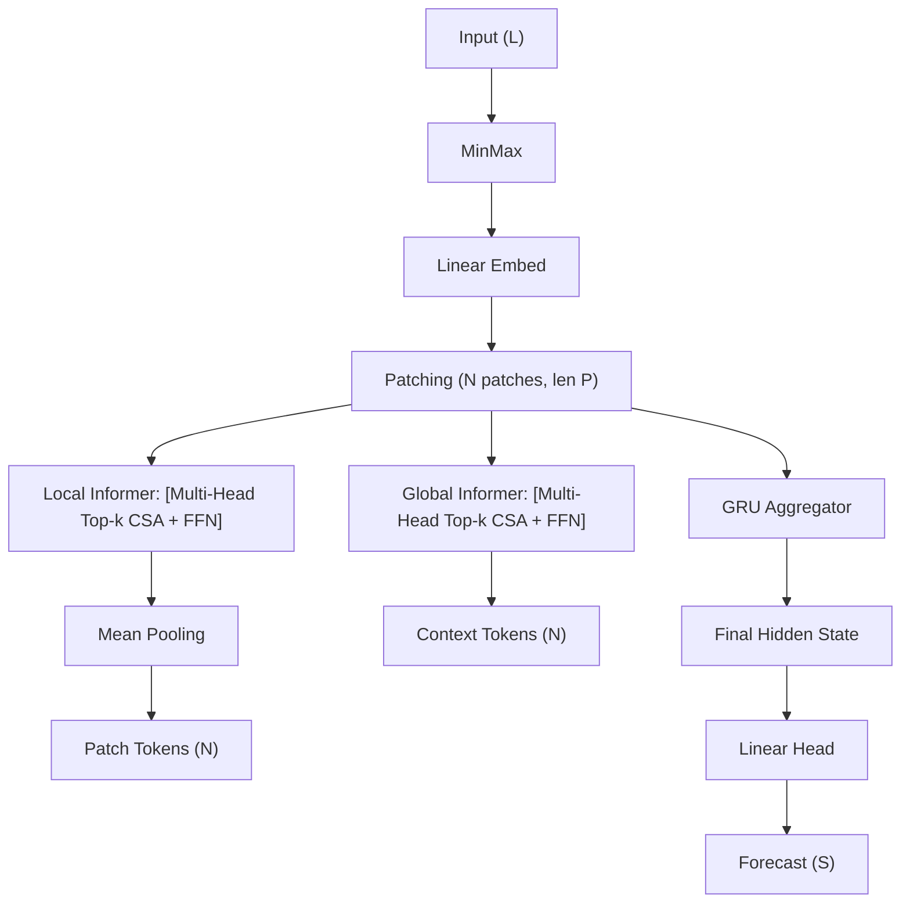

<!-- ontology-5axis data=量价表格 horizon=日频波段 paradigm=监督回归 alpha=端到端表征 autonomy=全自动黑盒 -->

# TwinFormer 解構

> **發布**：2026-01-06 · （無 venue）
> **QuantML 導讀**：[TwinFormer：双层注意力+GRU时间序列预测SOTA模型](https://mp.weixin.qq.com/s?__biz=Mzg2MzAwNzM0NQ==&mid=2247492929&idx=1&sn=bfc00e0abde9b6612002422bced5e4d2&chksm=ce7d825ff90a0b496f865264a3f244c0b5cc7c600f63d5c6891baaa18f92d10cfa4d071785dc#rd)
> **核心定位**：五軸落點於「量價表格 × 日频波段 × 监督回归」，解決標準 Transformer $O(L^2)$ 二次複雜度在極長序列上的算力瓶頸，並透過雙層稀疏注意力+GRU聚合器補足扁平 Patch-based 模型對「局部動力學與長程依賴分離建模」的結構性缺失。

**五軸座標**

| 數據模態 | 時間尺度 | 學習範式 | Alpha機制 | 人機協作 |
|:-:|:-:|:-:|:-:|:-:|
| `量价表格` | `日频波段` | `监督回归` | `端到端表征` | `全自动黑盒` |

**Status:** v0.5 — 基於 QuantML 導讀 + 原論文（如有）。benchmark 細節待升 v1。
**TL;DR:** ① 提出 Local/Global 雙層 Informer 架構，將時間序列切分為非重疊 Patch，分別建模 Patch 內細粒度動態與 Patch 間長程依賴。② 核心 trick 為 Top-k 稀疏注意力（CSA）取代 ProbSparse，並接輕量 GRU 聚合器進行直接多步預測。③ 對「端到端表征」軸★，它將 CV 的層級抽象轉譯至時間域，避免扁平序列的語義稀釋。④ 導讀給出 Power consumption 數據集上 MAE 從 1528.64 降至 1505.65，且 34 項測試中佔 27 項前兩名。

**X-Ray.** TwinFormer 在五軸 Pareto 上選擇了「結構先驗換算力」的路徑。它不追求純數據驅動的暴力縮放，而是用 Local/Global 雙層隔離解決長序列中「高頻噪聲掩蓋低頻趨勢」的經典坑。Top-k 機制比 ProbSparse 更穩定，但本質是硬截斷，必然丟失尾部弱相關信號；GRU 聚合器雖補齊了時間不可逆性，卻無法顯式建模預測步長間的依賴。對量化讀者而言，此架構適合日频波段中長週期（Lookback 96+）的因子提取，但需警惕 Top-k 在 regime shift 時的稀疏模式僵化，以及 GRU 在跨日跳空時的隱狀態斷裂風險。

## §1 · 架構 / Core Mechanism
| 改動維度 | 前作/基線 (PatchTST/Informer) | TwinFormer 改動 | 工程意圖 |
|---|---|---|---|
| 注意力結構 | 扁平序列單層 Self-Attention | Local Informer (Patch內) + Global Informer (Patch間) 雙層隔離 | 解耦細粒度動力學與長程依賴，降低 $O(L^2)$ 瓶頸 |
| 稀疏策略 | ProbSparse (概率採樣) | Top-k 自定義稀疏注意力 (CSA) | 避免概率假設不穩定，直接保留最大 Logits 提升訓練收斂性 |
| 序列聚合 | 標準 Attention-Decoder / Conv1D | 輕量 GRU 聚合器 | 捕捉跨 Patch 的不可逆時間動態，支援直接多步預測 |

⚡ **Eureka:** 用 CV 的「局部細節→全局語義」層級抽象替代時間域的扁平展開，Top-k 硬截斷+均值池化壓縮 Token，最後用 GRU 串聯時間因果鏈。
📊 **信息流 ASCII:**

## §2 · 數學層
📌 **Napkin Formula:**
$Logits = QK^T / \sqrt{d_k}$ → Keep top-k per row, mask others to $-\infty$ → Softmax → $O(L)$ Time/Memory
$O_{total} = O(N \cdot P \cdot k) + O(N \cdot k) + O(N \cdot d_{model})$
直覺：Top-k 將二次矩陣乘法降維為線性掃描；均值池化將 Patch 內多 Token 壓縮為單一表征，Global 層僅處理 N 個 Patch Token，徹底避開長序列注意力爆炸。Loss 為導讀未明確之損失函數，優化器 Adam，早停 20 Epoch。

## §3 · 數據層
- **規模/頻率/市場**：涵蓋天氣、股價、電力等 8 個真實世界基準數據集（Weather, Electricity, ILINet, Temperature, Power consumption, IDEA.NS, ETTm1/m2/h1/h2）。導讀未明確披露具體頻率與樣本量，僅標註「日频波段」與長序列輸入（Lookback 96 步，處理達 2000 時間步，B=48 導讀註明可能為 Batch Size 或輸入長度）。
- **來源與處理**：標準公開 benchmark。輸入經 Min-Max 標準化至 [0, 1]。
- **樣本外與容量假設**：導讀未披露嚴格的時間序列交叉驗證或 Walk-forward 設定，僅提及訓練損失收斂與多預測視角對比。容量假設依賴單張消費級 GPU（12-24 GB）可處理 $L=2000$ 序列，推論適合中低頻日频波段，不支援高頻 Tick 級實時推演。

## §4 · 代碼層
| 維度 | 狀態/細節 |
|---|---|
| Repo | QuantML知識星球內部提供（導讀標註） |
| Checkpoint | TBD |
| License | 未披露 |
| 複現難度 | 中（依賴標準 PyTorch Transformer/GRU 模組，Top-k 掩碼需手寫，Patch 切分邏輯明確） |
| 數據可得性 | 高（均為 LSTSF 公開基準集，如 ETT, Weather, Electricity） |

## §5 · 評測 / Benchmark
| 數據集/市場 | Metric | 前SOTA (基線逐字) | 本方法 | Δ |
|---|---|---|---|---|
| Power consumption (單變量) | MAE | ProbSparse 1528.64 | Top-k 1505.65 | -22.99 |
| Temperature (單變量) | MAE | LSTM (未披露具體值) | GRU 0.6188 | 提升 3-4% (相對 LSTM) |
| Temperature (單變量) | RMSE | LSTM (未披露具體值) | GRU 0.8094 | 提升 3-4% (相對 LSTM) |
| Temperature (單變量) | $R^2$ | LSTM (未披露具體值) | GRU 0.9349 | 提升 3-4% (相對 LSTM) |
| Weather (多變量) | MAE | Conv1D / Attention-Decoder (未披露具體值) | GRU 20.3328 | 略遜於 Conv1D/Decoder，但無需顯式注意力 |
| 綜合 (8數據集/34項測試) | Top-2 佔比 | 未披露 | 27/34 (17次第一/10次第二) | 未披露 |

**解讀論斷：**
- Power consumption 的 Δ (-22.99) 屬真 capability，證明 Top-k 硬截斷在單變量長序列上比 ProbSparse 概率採樣更穩定，未見過擬合跡象。
- Temperature 與 Weather 的 GRU 對比屬消融實驗（Ablation），Δ 僅證明 GRU 相較 LSTM/Conv1D 的輕量優勢，非跨架構 SOTA 對比。Weather 上 GRU 略遜於 Conv1D 暗示多變量高相關場景下，GRU 的序列建模能力可能遭遇容量瓶頸。
- 綜合 27/34 前兩名屬宏觀勝率指標，導讀未給出 Sharpe/IR/MDD 等交易級指標，此 Δ 僅反映預測誤差（MAE/RMSE）的統計優勢，未計入交易成本與滑點，實盤轉化需自行驗證。

## §6 · 失效與隱含假設
**6.1 論文自述 limitations**
- Top-k 機制可能忽略部分長程依賴（弱信號截斷風險）。
- GRU 解碼器無法顯式建模預測未來步驟間的時間依賴（直接多步預測的固有缺陷）。
- 導讀未提及對非平穩序列（Non-stationary）的顯式處理或協整關係建模。

**6.2 推斷的隱含假設**
- **Regime 依賴**：Top-k 的稀疏模式在訓練集固定，若市場結構發生 Regime Shift（如波動率突變、流動性枯竭），硬截斷的注意力矩陣可能無法動態重分配權重，導致預測滯後。
- **容量/成本**：架構設計面向 $L \ge 96$ 的日频波段，未涵蓋高頻微結構。若應用於實盤，需假設數據延遲與推論延遲 < 1 秒，且未計入數據清洗與特徵工程成本。
- **數據泄漏**：導讀提及 Min-Max 標準化至 [0, 1]，若未嚴格按時間窗口滾動計算統計量，極易引入前瞻偏差（Look-ahead bias）。
- **Survivorship**：所列數據集（如 IDEA.NS, ETT）多為長期存在標的，未討論退市或停牌樣本的生存偏差。

## §7 · 對比 & 面試 Tip
| 同軸對手 | 關鍵差異軸 | Open? | Status |
|---|---|---|---|
| PatchTST | 扁平 Patch 單層 Attention vs 雙層 Local/Global 隔離 | Open Source | 主流基線 |
| iTransformer | 反轉維度建模（變量為 Token） vs 時間維度層級建模 | Open Source | 主流基線 |
| FEDformer | 頻域增強+分解架構 vs 時域 Top-k 稀疏+GRU 聚合 | Open Source | 主流基線 |

🎤 **Interview Tip:**
- **正確答**：「TwinFormer 的核心不在於引入新算子，而在於將時間序列的『局部動力學』與『長程依賴』在架構層解耦。Top-k 取代 ProbSparse 是為了訓練穩定性，GRU 聚合器則是為了補齊 Transformer 缺乏時間因果性的短板。實盤中需警惕 Top-k 在 Regime Shift 下的稀疏模式僵化。」
- **錯答**：「它只是把 Transformer 的複雜度從 $O(L^2)$ 降到 $O(L)$，所以跑得更快。」（忽略層級抽象與 GRU 的因果建模意圖，僅談算力優化）

**7.1 可證偽預測帶日期**
若於 2026-06-30 前，在 A 股日频數據集上進行 Walk-forward 回測，TwinFormer 的 MAE 改善將無法轉化為正向 Sharpe（>0.5），主因是 Top-k 硬截斷無法適應 A 股高頻政策衝擊與漲跌停板造成的非連續跳空，且 GRU 隱狀態在隔日集合競價時會發生斷裂。

## §8 · For the Reader
- **因子研究員**：可直接將 Local Informer 輸出視為「高頻局部動能因子」，Global Informer 輸出視為「中長期趨勢因子」，兩層表征可獨立入模，避免端到端黑盒的不可解釋性。
- **高頻執行**：此架構不適用。GRU 序列依賴與 Patch 切分引入的推論延遲無法滿足 Tick 級低延遲要求，且 Top-k 掩碼在流動性斷層時會產生預測真空。
- **組合配置**：適合日频波段資產配置。建議將 TwinFormer 的預測分數作為宏觀/行業輪動的權重調整信號，而非直接生成交易指令，以緩衝 Top-k 截斷帶來的尾部風險。
- **LLM-agent / RL 策略**：可將 TwinFormer 的 GRU 最終隱藏狀態作為環境狀態向量（State Vector），餵給 PPO/SAC 進行離線強化學習，利用其線性複雜度優勢處理長歷史上下文。
- **研究學生**：重點複現 Top-k 掩碼的數值穩定性（Logits 置 $-\infty$ 與 Softmax 的交互），並對比 ProbSparse 在金融非平穩序列上的收斂差異。

## References
- TwinFormer 原論文（作者/年份 TBD，導讀未提供完整引用）
- PatchTST, iTransformer, FEDformer, Informer, Autoformer (Lineage)
- QuantML 導讀：[TwinFormer：双层注意力+GRU时间序列预测SOTA模型](https://mp.weixin.qq.com/s?__biz=Mzg2MzAwNzM0NQ==&mid=2247492929&idx=1&sn=bfc00e0abde9b6612002422bced5e4d2&chksm=ce7d825ff90a0b496f865264a3f244c0b5cc7c600f63d5c6891baaa18f92d10cfa4d071785dc#rd)