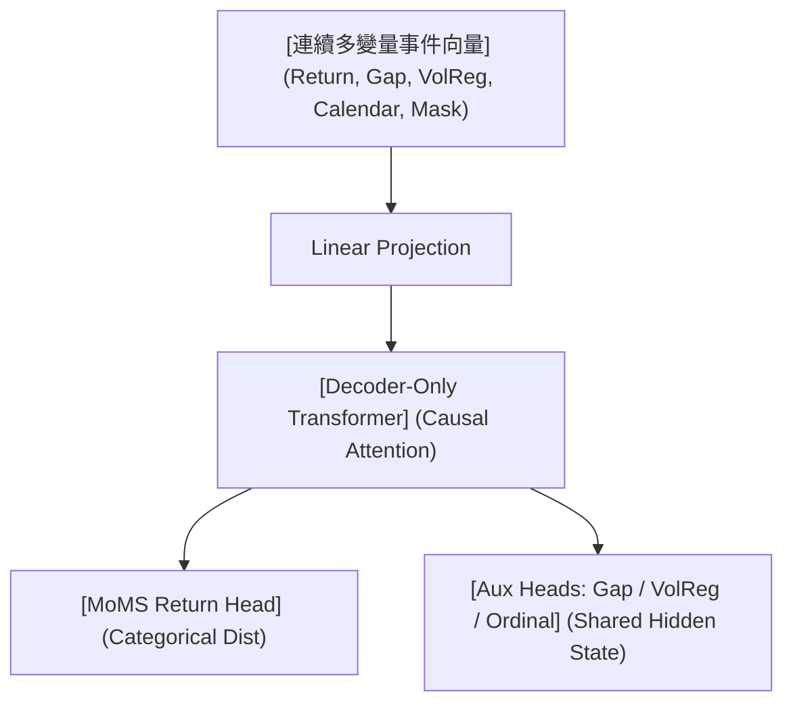

<!-- ontology-5axis data=量价表格 horizon=高频日内 paradigm=生成式大模型 alpha=端到端表征 autonomy=全自动黑盒 -->

# VAIOM 解構（VAIOM）

> **發布**：2026-07-15 · （無 venue） · arXiv [2607.13929](https://arxiv.org/abs/2607.13929)
> **arXiv 原文**：[VAIOM: Continuous-Input, Discrete-Output Decoder-Only Financial Sequence Modeling](https://arxiv.org/abs/2607.13929v1) · _本頁由 arXiv 原文一手自主解構_
> **核心定位**：落點於「生成式大模型 × 高頻日內」軸，解構了金融序列建模中「連續數值幾何保留」與「離散類別預測」的表徵對立。不強求全連續回歸或全離散分桶，而是將輸入幾何與輸出似然解耦，為 Decoder-Only 架構在量價數據上提供可計算 NLL 的標準化路徑。

**五軸座標**

| 數據模態 | 時間尺度 | 學習範式 | Alpha機制 | 人機協作 |
|:-:|:-:|:-:|:-:|:-:|
| `量价表格` | `高频日内` | `生成式大模型` | `端到端表征` | `全自动黑盒` |

**Status:** v0.5 — 基於arXiv 原文（有原文則以原文為準）。細節待升 v1。
**TL;DR:** ① 提出 VAIOM 架構，以 Decoder-Only Transformer 對 1H 外匯序列進行概率化下一期收益預測。② 核心 trick 在於輸入端保留連續多變量金融事件向量，輸出端預測波動率標準化後的收益分桶類別分佈。③ 此設計對「端到端表徵」軸★ 的關鍵意義在於：避免傳統全離散化對局部數值幾何的破壞，同時維持交叉熵訓練與 bits/event 的壓縮評估紀律。④ 關鍵實證：在兩個 2025 Test 區間，對固定 LightGBM 基線的成對增益約為 0.029–0.043 bits per event。

**X-Ray.** VAIOM 的本質是「表徵解耦」的 Pareto 最優嘗試。傳統金融 Transformer 常陷入兩難：全離散分桶抹平價差幾何，全連續回歸喪失語言模型式的似然評估。VAIOM 將連續輸入與離散輸出切割，配合 FullSeq 監督與 MoMS 混合頭，直接修復了 Decoder-Only 在量價序列上的「分桶信息損耗」工程坑。然而，其 envelope 仍受限於 1H FX 的弱可預測性與容量天花板（0.9M 參數即達 Validation 頂峰，更大模型無法轉化參數為壓縮率）。對量化讀者而言，此架構不直接產出 Alpha，而是提供一套可嚴格比較 NLL 的序列壓縮基準；實戰需警惕其對 VolReg 與 Gap 輔助目標的依賴，若市場微結構斷裂，輔助表徵可能反向加劇過擬合。

## §1 · 架構 / Core Mechanism
**1.1 三大改動 vs 前作**
| 維度 | 傳統 Decoder-Only 金融建模 | VAIOM (HybridContIn) | 解構意義 |
|---|---|---|---|
| 輸入表徵 | 全離散化 Token 或純連續回歸向量 | 連續多變量事件向量 + 類別資產元數據 | 保留局部數值幾何，避免同桶內信息抹平 |
| 輸出目標 | 點預測或連續密度假設 | 波動率標準化收益分桶的類別分佈 | 維持交叉熵訓練與 bits/event 壓縮評估紀律 |
| 監督機制 | Last-position 或局部視窗 | FullSeq 全序列自回歸監督 + Gap/VolReg/Ordinal 輔助目標 | 強化序列依賴建模，輔助目標約束隱空間幾何 |

**1.2 ⚡ Eureka**
輸入不 Tokenize，輸出不回歸；用連續幾何餵 Transformer，用類別分桶收 Cross-Entropy。

**1.3 信息流 ASCII**

## §2 · 數學層
**📌 Napkin Formula**
$$ \mathcal{L}_{total} = \mathcal{L}_{NLL}(y_{t+1}^{bucket} | \mathbf{x}_{1:t}) + \lambda_1 \mathcal{L}_{Gap} + \lambda_2 \mathcal{L}_{VolReg} + \lambda_3 \mathcal{L}_{Ordinal} $$
複雜度：標準 Decoder-Only $O(T^2 d)$，因 FullSeq 監督與輔助頭並行，前向計算無額外漸進開銷，僅後向傳播梯度累加。
**直覺**：主損失負責預測下一期收益分桶的負對數似然（NLL），輔助損失強制隱空間表徵對 Gap、波動率狀態與序數關係保持幾何敏感度。MoMS 頭通過市場狀態混合權重動態調整分桶邊界響應，避免單一線性映射無法捕捉 regime 切換。
**訓練細節**：Bucket 邊界與預處理參數僅在 Train 期估計；EWMA 等遞歸規則狀態因果更新；模型在 2024H2 Validation 選型，2025 Test 期不重擬。

## §2.5 · 帶數字走一遍（Worked Example）
**（以下為假設/示意玩具數字，僅演示機制，非論文實證結果）**
1. **輸入**：假設 $t$ 時刻 1H 條形數據為連續向量 $\mathbf{x}_t = [0.0012, 0.0005, 1.2, 14, 1.0]$（分別代表標準化收益、Gap、VolReg 狀態、日曆位置、數據掩碼）。
2. **投影與編碼**：向量經 Linear Projection 映射至 hidden dim，進入 Transformer 進行因果自注意力計算，輸出隱狀態 $\mathbf{h}_t$。
3. **輔助約束**：$\mathbf{h}_t$ 同時輸入 Gap/VolReg/Ordinal 輔助頭，計算輔助損失，強制 $\mathbf{h}_t$ 保留價差與波動率幾何。
4. **MoMS 輸出**：$\mathbf{h}_t$ 進入 MoMS Return Head，根據當前 VolReg 狀態分配混合權重，輸出下一期收益分桶的類別概率分佈 $P(\hat{y}_{t+1}^{bucket})$。假設分桶為 \$[-0.5, -0.2, 0.0, 0.2, 0.5]\$，模型輸出概率為 \$[0.1, 0.2, 0.4, 0.2, 0.1]\$。
5. **損失計算**：若真實下一期收益落入 $0.0$ 桶，主損失 $\mathcal{L}_{NLL} = -\log(0.4) \approx 0.737$ nats（約 1.06 bits）。FullSeq 監督將此計算擴展至序列所有位置。

## §3 · 數據層
- **市場/頻率**：1H 外匯（FX）條形數據。
- **來源/時段**：Train 期 fitted before 2024；Validation 為 2024H2；Test 為兩個 2025 區間（不重擬）。
- **樣本/容量假設**：具體樣本量與資產覆蓋範圍未披露。架構評估涵蓋 0.9M、5M、15M 參數階梯，但數據語料庫容量假設未明確給出。
- **預處理**：Bucket 邊界、類別映射與 EWMA 跨期等參數僅在 Train 期估計，Test 期嚴格因果遞歸更新，無前瞻泄漏。

## §4 · 代碼層
| 欄位 | 狀態 |
|---|---|
| Repo | TBD |
| Checkpoint | TBD |
| License | 未披露 |
| 複現難度 | 中高（需自構 1H FX 連續事件向量與 VolReg/Gap 輔助目標） |
| 數據可得性 | 未披露（依賴自備 FX 1H 數據與自定義分桶邏輯） |

## §5 · 評測 / Benchmark
| 數據集/市場 | Metric | 前SOTA | 本方法 | Δ |
|---|---|---|---|---|
| 1H FX (2025 Test) | NLL (bits/event) | LightGBM (train-fitted) | VAIOM (0.9M) | +0.029–0.043 bits/event |
| 1H FX (2025 Test) | NLL (bits/event) | Frequency / Markov | VAIOM (0.9M) | 未披露具體數值，僅述 outperforms |

**解讀**：Δ 欄的 0.029–0.043 bits per event 是真實的壓縮能力提升，反映模型在序列依賴與輔助表徵上的有效學習，非單純類別不平衡複製。然而，NLL 改善不直接等同交易 Alpha；若未計入交易成本、滑點與 VolReg 狀態切換延遲，此增益在實盤可能迅速被摩擦成本吞噬。此外，0.9M 參數即達 Validation 頂峰，暗示數據語料存在信息容量瓶頸，更大模型可能僅在訓練集過擬合，而非捕捉真實市場結構。

## §6 · 失效與隱含假設
**6.1 論文自述 limitations**
- 容量研究顯示更大參數階梯無法轉化為更好壓縮，暗示當前語料庫可能已達信息極限。
- 未將結果推廣為通用縮放閾值，僅針對當前評估協議有效。
- 收益可預測性弱、非平穩且易被高估，模型可能僅學習到一階轉移持續性或淺層特徵規則。

**6.2 推斷的隱含假設**
- **Regime 依賴**：高度依賴 VolReg 與 Gap 輔助目標的穩定性；若外匯市場微結構或波動率聚類特徵發生結構性斷裂，輔助表徵可能失效。
- **容量/成本**：假設 1H 頻率下交易成本與延遲可忽略，未評估高頻執行層面的滑點與訂單簿深度。
- **數據泄漏/倖存者偏差**：預處理參數僅在 Train 期估計，但 FX 市場通常具備較強倖存者偏差（主流貨幣對），未明確說明是否涵蓋已退市或流動性枯竭品種。

## §7 · 對比 & 面試 Tip
| 同軸對手 | 關鍵差異軸 | Open? | Status |
|---|---|---|---|
| 傳統 LightGBM/Markov | 序列依賴建模 vs 獨立/低階轉移 | 開源基線易得 | 強基線，但缺乏長程幾何表徵 |
| 全離散化金融 Transformer | 輸入 Token 化 vs 連續幾何保留 | 架構開源 | 信息損耗高，NLL 評估易失真 |
| 連續回歸 Transformer | 點預測/密度假設 vs 類別分桶交叉熵 | 架構開源 | 喪失語言模型式壓縮紀律，難比對 |

🎤 **Interview Tip**
- **正確答**：「VAIOM 的核心不在於預測絕對收益，而在於用連續輸入保留數值幾何、離散輸出維持交叉熵壓縮紀律。NLL 改善反映序列表徵能力，但實盤需驗證 VolReg 輔助目標在 regime 切換時的穩健性與交易成本覆蓋。」
- **錯答**：「它比 LightGBM 準 40%，所以可以直接上線跑外匯高頻。」（混淆 NLL 壓縮率與交易勝率，無視成本與過擬合風險）

**7.1 可證偽預測**
若 2026H1 外匯市場波動率結構發生劇變（如主要央行政策轉向導致 VolReg 分佈偏移），VAIOM 的 VolReg 輔助目標與 MoMS 混合頭將出現 NLL 顯著劣化，且 0.9M 模型無法通過參數擴展修復，需重新估計 Train 期預處理參數。

## §8 · For the Reader
- **因子研究員**：將 VAIOM 的隱狀態 $\mathbf{h}_t$ 視為端到端表徵因子源，提取 MoMS 頭前的中間層輸出，與傳統動量/波動率因子做正交化測試。
- **高頻執行**：NLL 改善不直接轉化為執行優勢；需將類別分桶概率映射為訂單簿深度預期，並結合 1H 頻率下的滑點模型評估真實邊際收益。
- **LLM-Agent / 序列建模**：借鑒「輸入連續幾何 + 輸出類別分桶」的解耦設計，處理其他非文本序列（如傳感器數據、供應鏈事件），避免全離散化導致的局部信息抹平。

## References
- Ma, Y., & Chen, X. (2026). *VAIOM: Continuous-Input, Discrete-Output Decoder-Only Financial Sequence Modeling*. arXiv:2607.13929v1.
- Vaswani, A., et al. (2017). *Attention Is All You Need*. NeurIPS.
- 相關序列建模基線：Frequency / Markov / LightGBM (原文提及，未給具體引用鏈接)。
- 來源鏈接：[arXiv 原文](https://arxiv.org/abs/2607.13929)